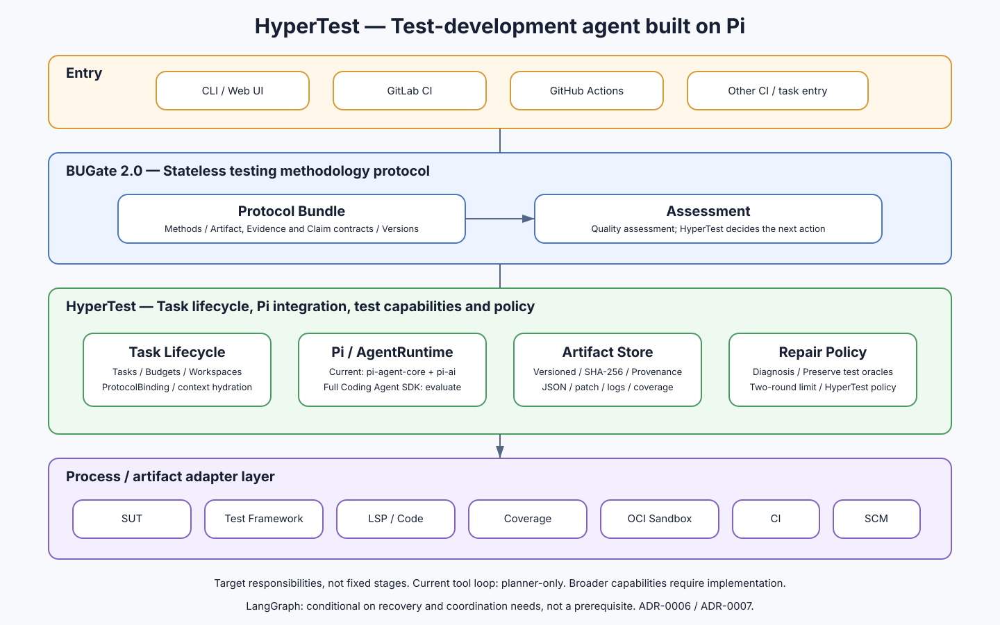

# HyperTest

[](https://github.com/ZhangLiangchen/hypertest/actions/workflows/ci.yml)

HyperTest is a general-purpose, cross-language test-development control plane
governed by [BUGate](https://github.com/ZhangLiangchen/BUGate). It keeps the
system under test, programming language, test framework, code-intelligence
tool, coverage format, CI provider, and SCM provider behind explicit
process/artifact contracts.

## Goals

1. Generate framework-neutral test analysis and executable test cases.
2. Diagnose failed tests from structured evidence and perform only
   policy-approved repairs.
3. Preserve deterministic authority over state, budgets, artifacts, quality
   decisions, and all mutation or publication.

White-box source-symbol exploration and coverage-guided exploratory testing are
roadmap items; they are not capabilities of the current release.

## Architecture

```text
BUGate PDP/PEP    quality policy and protected-action authority
HyperTest Core    deterministic run state, budgets, artifacts, diagnosis and repair policy
pi-agent-core     only SDK-level agent-loop dependency
Adapters          replaceable process-level SUT, test, LSP, coverage, sandbox, CI and SCM providers
Artifacts         versioned, hashed portability and audit boundary
```



The concise component model is in [docs/architecture.md](docs/architecture.md).
The real planner model/tool boundary is documented in
[docs/model-runtime.md](docs/model-runtime.md). The broader design baseline is
indexed by [docs/implementation-plan.md](docs/implementation-plan.md).

## Current executable slices

**v0.1 deterministic baseline**

- deterministic workflow from contract import through test planning, gate
  decisions, rendering, isolated execution, diagnosis, repair safety checks,
  verification, and optional draft-change publication;
- HyperTest-owned runtime contracts plus fake/scripted runtimes for deterministic
  tests;
- OpenAPI/HTTP and command/CLI SUT adapters;
- pytest/JUnit and `go test -json` framework adapters;
- coverage.py JSON, LCOV, Cobertura, and Go coverprofile normalization;
- LSP JSON-RPC, local/OCI sandbox, GitLab CI, and GitLab draft-MR adapters;
- BUGate-compatible fail-closed process gates and two cross-language
  conformance scenarios.

**v0.2 runtime vertical slice**

- statically typed `pi-agent-core` adapter confined to `src/runtime/pi/**`;
- real-time streaming, single-terminal semantics, cancellation, deadline,
  output, turn, tool, repetition, and token limits;
- OpenAI-compatible Provider activation from profile/environment without
  silent deterministic fallback;
- a fixed planner-only read-only tool loop over the in-memory `SutContract`;
- fail-closed JSON parsing, JSON Schema validation, deterministic planner
  semantic validation, and TestPlan merge;
- per-call usage, cached-token accounting, retry telemetry, endpoint
  fingerprinting, and a persisted run ledger;
- real local HTTP/SSE and CLI integration tests with no credentials or cost.

The model does not receive shell, arbitrary file, write/edit, arbitrary network,
BUGate, state-machine, repair, or publication tools.

## Quick start

Requirements: Node.js 22.19+, Python 3 with pytest/coverage for the Python
example, and Go 1.23+ for the Go example.

```bash
npm ci
npm run ci
npm run test:examples
```

Run a deterministic scenario:

```bash
npm run build
node dist/src/cli.js run \
  --profile profiles/python-http-pytest.example.json \
  --workspace . \
  --mode execute
```

Switching to Go/CLI changes only the profile and adapter-owned fixtures:

```bash
node dist/src/cli.js run \
  --profile profiles/go-cli-go-test.example.json \
  --workspace . \
  --mode execute
```

## Model planner activation

Keep the profile deterministic for offline operation, or set
`runtime.provider` to `openai-compatible`. Environment variables may override
the non-secret profile settings:

```bash
export HYPERTEST_MODEL_PROVIDER=openai-compatible
export HYPERTEST_MODEL_ID=provider-model-exact-id
export HYPERTEST_MODEL_BASE_URL=https://provider.example/v1
export HYPERTEST_MODEL_API_KEY='...'
export HYPERTEST_MODEL_TIMEOUT_MS=30000
export HYPERTEST_MODEL_MAX_RETRIES=2
export HYPERTEST_MODEL_MAX_OUTPUT_TOKENS=2048

node dist/src/cli.js plan \
  --profile profiles/python-http-pytest.example.json \
  --workspace .
```

The API key is environment-only and must not be committed. A selected model
Provider that is missing or invalid fails explicitly; HyperTest does not fall
back to deterministic planning.

An optional live compatibility check is available:

```bash
npm run test:model:live
```

It skips with exit code 0 when variables are missing. When enabled, it sends one
small read-only planner request to the configured Provider, may incur cost, and
prints only redacted telemetry. It is not part of default CI. See
[docs/model-runtime.md](docs/model-runtime.md) before enabling it.

## Portability invariant

A new language, framework, SUT shape, CI provider, or SCM provider must not
require changes to the deterministic core or common schemas. The permanent
conformance pair is:

| Scenario | SUT | Language | Framework | Interface |
|---|---|---|---|---|
| A | HTTP API service | Python | pytest | OpenAPI/HTTP |
| B | CLI tool | Go | go test | command contract/stdout/exit code |

CI enforces that ecosystem-specific terms and the Pi SDK do not leak across the
accepted boundaries.

## Project status

v0.2 retains the deterministic v0.1 control plane and cross-language baseline,
and adds the first bounded real model/tool Agent runtime vertical slice.

Diagnosis remains deterministic, exploratory testing is not implemented, and
no live paid Provider or production Pilot is exercised by default CI.
