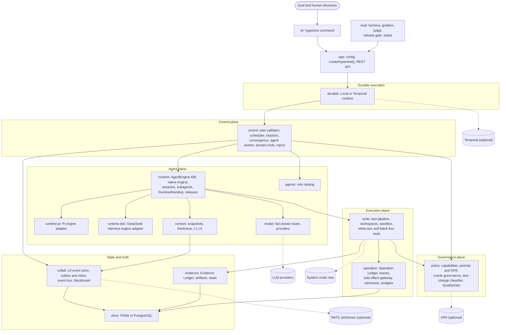

# Hypertest

English | [简体中文](README.zh-CN.md)

[](https://github.com/ZhangLiangchen/hypertest/actions/workflows/ci.yml)

> **Hypertest is a versioned, multi-model, durable and evidence-verifiable autonomous testing agent. Its agents
> explore freely; truth, side effects and quality decisions are governed outside the model.**

## What it is

You give Hypertest a **testing goal** ("Is this change releasable?") and a target: a repository at a commit, the URL
of a running system, or a registered environment. You do not give it a workflow. Hypertest then:

1. **Plans.** A lead agent proposes a typed plan (Plan IR, never code). Deterministic code validates it, and the
   scheduler admits its work items within budgets. The plan is revised as findings arrive.
2. **Delegates.** Role agents (analysts, test designer, executor, RCA, fixer, reviewer, metrics analyst,
   environment operator, condenser, a vision/GUI tester and a local/private analyst) run on the model routes their
   policies allow, with capabilities that only shrink from parent to child. Roles also react to blackboard events
   without the lead, for example RCA waking on `finding.created`.
3. **Acts through governed tools.** White-box tools (git, fs, shell, test runners, coverage, mutation) and black-box
   tools (HTTP, metrics, load, environment control, browser, MCP) all run through one pipeline. Every result is
   recorded as evidence.
4. **Hands over to a deterministic QualityGate.** The gate reads evidence, oracles, findings, risks and independent
   reviews, and signs a `QualityDecision` bound to the sealed evidence root.

| Verdict | Meaning | `hypertest run` exit code |
|---|---|---|
| `pass` | every gate criterion satisfied | 0 |
| `fail` | a fail-type criterion violated (e.g. an unresolved P0/P1 finding, a violated oracle) | 3 |
| `conditional` | releasable with conditions (e.g. no independent review, open risks) | 4 |
| `inconclusive` | evidence or an oracle is missing: never reported as `pass` | 5 |

Three things are **never decided by a model**:

1. **What is correct.** Versioned oracles (`OracleSpec`) are established by a named human. Agents may only
   propose changes, and a proposing agent can never approve its own. A run with no oracle in force is at best
   `inconclusive` (gate criterion C0).
2. **What happened in the external world.** The Operation Ledger records every side effect under a stable
   operation id, with fencing and reconciliation of unknown outcomes (never a blind retry). The Evidence Ledger is
   append-only and hash-chained.
3. **Whether a pass may be claimed.** Only the QualityGate produces verdicts. Missing evidence yields
   `inconclusive`, never `pass`.

Hypertest consumes the [BUGate](https://github.com/ZhangLiangchen/BUGate) testing-methodology protocol (an embedded
copy is used when no checkout is configured). The normative design is the [blueprint](docs/architecture/BLUEPRINT.md);
[CONFORMANCE.md](docs/architecture/CONFORMANCE.md) records how far the code conforms to it today.

## Architecture

Twenty npm workspaces under `packages/`, TypeScript run directly by Node (no build step). Each package's
`src/contracts.ts` is its binding ABI. The dependency DAG is enforced by `npm run check:boundaries`.


```mermaid
flowchart TB
  human(["Goal and human decisions"]) --> cli["cli: hypertest command"]
  cli --> app["app: config, createHypertest(), REST API"]
  eval["eval: harness, graders, judge,<br/>release gate, suites"] --> app
  app --> durable
  subgraph DUR["Durable execution"]
    durable["durable: Local or Temporal runtime"]
  end
  subgraph CTL["Control plane"]
    control["control: plan validator, scheduler, reactors,<br/>convergence, agent worker, domain tools, report"]
  end
  subgraph AGT["Agent plane"]
    runtime["runtime: AgentEngine ABI, native engine,<br/>sessions, subagents, RuntimeManifest, releases"]
    pi["runtime-pi: Pi engine adapter"]
    dsh["runtime-dsh: DeepSeek Harness engine adapter"]
    agents["agents: role catalog"]
    model["model: fail-closed router, providers"]
    context["context: snapshots, freshness, L1-L5"]
  end
  subgraph EXE["Execution plane"]
    tools["tools: tool pipeline, workspaces, sandbox,<br/>white-box and black-box tools"]
    operation["operation: Operation Ledger, leases,<br/>side-effect gateway, admission, budgets"]
  end
  subgraph GOV["Governance plane"]
    policy["policy: capabilities, permits and OPA,<br/>oracle governance, test-change classifier, QualityGate"]
  end
  subgraph TRU["State and truth"]
    collab["collab: L0 event store, outbox and inbox,<br/>event bus, blackboard"]
    evidence["evidence: Evidence Ledger, artifacts, seals"]
    store["store: PGlite or PostgreSQL"]
  end
  durable --> control
  control --> runtime
  control --> agents
  control --> policy
  control --> collab
  runtime --> pi
  runtime --> dsh
  runtime --> model
  runtime --> context
  runtime --> tools
  tools --> policy
  tools --> operation
  tools --> evidence
  context --> collab
  collab --> store
  evidence --> store
  operation --> store
  model -.-> llm[("LLM providers")]
  tools -.-> sut[("System under test")]
  collab -.-> nats[("NATS JetStream (optional)")]
  durable -.-> temporal[("Temporal (optional)")]
  policy -.-> opa[("OPA (optional)")]
```

`core` (ids, clock, errors, hashing, schema validation, ports) and `domain` (types, event catalog, state machines)
sit under every package; `testkit` holds test helpers. Every tool call follows one pipeline:
**validate → capability → policy permit → freshness (mutating calls) → Operation Ledger (side effects) → execute →
offload large output → evidence → L0 events**.

| Package | Responsibility |
|---|---|
| [core](packages/core), [domain](packages/domain), [store](packages/store), [testkit](packages/testkit) | foundations: ids, errors, hashing, schemas, SQL and bus ports; domain types and state machines; PGlite/PostgreSQL and migrations; test helpers |
| [collab](packages/collab) | L0 event store (append-only triggers), transactional outbox, inbox dedupe, in-process and NATS buses, blackboard |
| [evidence](packages/evidence) | content-addressed artifacts (fs, S3), hash-chained Evidence Ledger, Merkle root, Ed25519 seals |
| [operation](packages/operation) | Operation Ledger, leases with fencing tokens, side-effect gateway, reconciliation, admission, budgets |
| [policy](packages/policy) | capability attenuation, permits (built-in rules, OPA), oracle governance, test-change classifier, QualityGate |
| [model](packages/model) | model catalog, fail-closed router with per-route circuit breaker, providers (OpenAI-compatible, Anthropic, pi-ai, scripted) |
| [context](packages/context) | context snapshots, observed read sets, freshness guard, working context (HARD/SOFT condensation), hybrid retrieval, experience memory, provenance |
| [tools](packages/tools) | tool runtime, workspaces, local and OCI sandboxes, white-box and black-box tools |
| [runtime](packages/runtime), [runtime-pi](packages/runtime-pi), [runtime-dsh](packages/runtime-dsh) | AgentEngine ABI, native engine, sessions, subagents, manifest, runtime release registry; Pi engine adapter; DeepSeek Harness engine adapter (pin + adapter, experimental) |
| [agents](packages/agents) | 14 roles: prompts, model policies, tool allowlists, output schemas, subscriptions |
| [control](packages/control) | plan validation, scheduler, reactors, convergence, agent worker, BUGate phases, experiment isolation and budget leases, domain tools, report |
| [durable](packages/durable) | local and Temporal durable runtimes |
| [app](packages/app) | configuration, composition root, runtime release service (admission, quarantine, migration), REST API, `doctor` diagnostics |
| [eval](packages/eval) | eval harness, versioned graders, independent LLM judge, statistics, release gate, PoC and core suites |
| [cli](packages/cli) | the `hypertest` command |

## Invariants

The blueprint's hard invariants and where the code enforces them. The status column is taken from
[CONFORMANCE.md](docs/architecture/CONFORMANCE.md).

| # | Invariant | Enforced by | Status |
|---|---|---|---|
| I1 | Models propose, deterministic code disposes: no tool runs without a capability check and a policy permit, plus a freshness check when it mutates | tools runtime pipeline, policy engine | implemented |
| I2 | Child capability = parent ∩ role ∩ work item ∩ environment policy, never amplified | policy `attenuateCapability`, control capability grant and worker | implemented; unmet work-item requirements are reported to the agent |
| I3 | Model switches only at safe turn boundaries (new `ModelEpoch`); fail-closed fallback; routing order security → capability → role → quality → latency → cost | model router (circuit-breaker `availability` stage after quality), runtime invoker and epochs | implemented |
| I4 | Every external or destructive call has a stable `operationId`; unknown outcomes are reconciled; stale fencing tokens are refused | operation gateway and leases; record-only adapters for http, browser and mcp | implemented |
| I5 | At-least-once delivery; every consumer dedupes by `eventId`; duplicates never duplicate work or side effects | collab inbox, reactor fingerprints | implemented |
| I6 | Evidence is append-only: SHA-256 artifacts, per-run hash chain, Merkle root | evidence ledger, database triggers | implemented; the default fs artifact store is not WORM |
| I7 | P0/P1 gates never rest on LLM-only judgement; missing evidence ⇒ `inconclusive` | QualityGate criteria C0–C9 | implemented |
| I8 | Agents never weaken an oracle, assertion or threshold, or skip/delete a failing test, to get green | classifier, drift quarantine, oracle governance, flip detector | implemented; the local sandbox still shares the OS user |
| I9 | Large tool outputs are offloaded; only bounded digests reach the model | tools runtime | implemented |
| I10 | Routes, tool calls, permits, gate evaluations and transitions emit L0 events with run, work, agent, correlation and causation ids | all emitters | implemented; no `traceId` or OpenTelemetry |
| I11 | A run is pinned to its `RuntimeManifest`; upgrades never hot-swap a live run | app composition, control `assertRunPinned`, manifest-scoped Temporal queues, runtime release registry, explicit migration (`RuntimeEpoch`) | implemented |
| I12 | The scheduler enforces concurrency, depth, agent, token, cost, tool-call and wall-clock budgets and keeps convergence authority | control scheduler and convergence | implemented |

## Quick start

Requirements: Node.js ≥ 22.18 and git. The default sandbox also needs Linux with unprivileged user namespaces
(util-linux `unshare`) and python3; `hypertest doctor` checks this. On other hosts use `sandbox.kind: oci` (docker) or
set `sandbox.network: open` explicitly. No infrastructure is needed: the defaults are embedded PGlite, an in-process
bus and the local durable runtime. PostgreSQL, NATS, Temporal and OPA are optional
([OPERATIONS.md](docs/architecture/OPERATIONS.md)).

```bash
# in the Hypertest checkout
npm ci
npm link                                   # optional: puts `hypertest` on PATH (otherwise: node bin/hypertest.js …)

# in the repository you want to test
hypertest init                             # writes a commented hypertest.config.yaml; adds .hypertest/ to .gitignore
export DEEPSEEK_API_KEY=… ANTHROPIC_API_KEY=…   # the variables the providers' apiKeyEnv fields name
# edit hypertest.config.yaml: uncomment and adapt the `oracles:` example (what "correct" means, and who says so)
hypertest doctor                           # configuration, key variables (names only), routes per role, sandbox, storage
hypertest run "Is this change releasable?" --repo . --commit HEAD
hypertest report <runId>                   # markdown report: verdict, reasons, findings, plan evolution, routes, evidence
hypertest evidence verify <runId>          # hash chain, artifacts, seal and the signed verdict
```

- Keys are never written in the configuration: `apiKeyEnv` names the environment variable.
- A run pins the oracles of the `oracles:` section. `hypertest oracle establish <file> --by <name>` records an
  oracle too, but `hypertest run` has no option to pin it; add the same oracle to `oracles:` (or pass `oracleIds` to
  `POST /runs`).
- `--follow` streams the run's events. After an interruption (exit 130) `hypertest resume` continues the run.
- Human decisions: `hypertest approve`, `oracle establish`, `oracle decide`, `waive` and `experience review` (list
  with `approvals`, `oracle proposals`, `experience list`). The deciding commands are refused inside the agent
  sandbox.

### Runtime releases

Each combination of code and configuration is a content-addressed `RuntimeManifest`, and every run is pinned to one.
Until a release is activated the installation is unmanaged (any runtime may start runs). Once one is active, new runs
start only under the active release or a canary that selects them:

```bash
hypertest runtime register --by alice                      # this installation's manifest becomes a candidate
hypertest runtime record-suite current --kind engine_contract --suite agent-engine-contract --passed --total <n> --by ci:github
hypertest eval run core --arms scripted-multi-llm --out core.json
hypertest runtime record-suite current --kind replay --from-eval core.json --by ci:github
hypertest runtime promote current --by alice --reason "suites green"                    # candidate → shadow
hypertest runtime promote current --by alice --reason "shadow ok" --canary-percent 10  # shadow → canary
hypertest runtime promote current --by alice --reason "canary ok"                       # canary → active
hypertest runtime list                                      # states, active pointer, canary, live runs per release
hypertest runtime rollback --by alice --reason "canary regressed"   # stop the canary, or roll the active release back
hypertest runtime migrate <runId> --to current --by alice --reason "…"   # move one live run explicitly
```

`rollback` quarantines the live runs of the rolled-back release (paused until migrated or cancelled). Runs of other
releases keep running on their own manifest. The full runbook is in
[OPERATIONS.md §5](docs/architecture/OPERATIONS.md#5-upgrades-runtime-releases-and-manifest-pinning).

## PoCs and evaluation

The PoC suites run the whole stack with deterministic scripted brains, so they need no API key. Each trial gets a
fresh directory and database.

| Command | What it shows | Time* |
|---|---|---|
| `hypertest eval run poc-a-whitebox --arms scripted-multi-llm` | PoC A: white-box regression; dynamic plan, parallel analysts, 3 routes, seeded defect ⇒ `fail` | ~15 s |
| `hypertest eval run poc-c-durable-load --arms scripted-multi-llm --mode child-process` | PoC C: load and fault recovery with a real SIGKILL of the Hypertest process | ~30 s |
| `hypertest eval run poc-all --arms scripted-multi-llm,scripted-single` | every PoC task (A, B, C, C-insufficient, oracle-robustness, recovery-chaos); paired McNemar comparison of the arms | ~2–3 min |
| `hypertest eval run core --arms scripted-multi-llm --out core.json` | the core suites: test generation (known-good and known-bad checks), context freshness, mid-run model switch, security injection; `--out` saves the SuiteResult | ~70 s |
| `hypertest eval gate --baseline packages/eval/baselines/core-scripted-multi-llm.json --candidate core.json` | the release gate: comparable results; critical false release not worse; defect recall not significantly lower; security violations and duplicate side effects = 0; evidence complete (exit 0 pass, 1 fail) | ~2 s |
| `npm run eval:gate` | both of the above, as CI runs them (outputs in `.hypertest-eval/`) | ~75 s |
| `node scripts/run-tests.mjs --package eval` | the eval platform's unit and e2e tests, PoCs included | ~4 min |

\* measured on the development host.

`--judge scripted` adds the independent LLM judge (last, after every deterministic grader) with the calibrated
scripted judge that CI uses. The baseline must be regenerated when a suite, grader or eval-harness revision changes;
otherwise the gate reports the results as not comparable.

`poc-all` exits 1: the single-model arm is expected to fail the tasks that need an independent reviewer, and that
difference is what the comparison measures. The opt-in live arm uses a real provider:
`HYPERTEST_EVAL_LIVE=1 HYPERTEST_EVAL_LIVE_KIND=anthropic|openai-compatible HYPERTEST_EVAL_LIVE_MODEL=…
HYPERTEST_EVAL_LIVE_API_KEY=…` (plus `HYPERTEST_EVAL_LIVE_BASE_URL` for openai-compatible), then `--arms live`.

## Configuration

`hypertest.config.yaml` (from `hypertest init`) is validated at load; every problem is reported at once. Full
references: [app README](packages/app/README.md) (configuration, composition, REST API) and
[CLI README](packages/cli/README.md) (commands, exit codes, operational notes). Deployment profiles are in
[OPERATIONS.md](docs/architecture/OPERATIONS.md).

| Section | Default | Purpose |
|---|---|---|
| `project` | `{ name, dataDir: .hypertest }` | data directory: database, artifacts, keys, workspaces |
| `store` | `pglite` | or `postgres` with `urlEnv` and `schema` |
| `bus` | `inprocess` | or `nats` (JetStream) |
| `durable` | `local` (`maxConcurrentTurns: 4`) | or `temporal` (`workerMode: embedded` or `external`) |
| `artifacts` | `fs` | or `s3` (optional Object Lock `objectLockDays`) |
| `models` | none | `providers` (`openai-compatible`, `anthropic`, `pi-ai`, `scripted`; keys via `apiKeyEnv`) and `routes` (capabilities, quality, costs) |
| `roles` | built-in catalog | per-role `defaultModelPolicy` (preferred routes, required capabilities, independence, fallback) |
| `budget`, `gate` | see app README | run limits; gate switches (`requireIndependentReview`, `failOnUnresolvedSeverity`, `requireOracle`, `minCoverage`, …) |
| `oracles` | none | oracles established at startup by the named human `establishedBy` |
| `policy` | built-in rules | extra rules, `opa: { url, path }`, `capabilitySecretEnv` |
| `sandbox` | `local`, `network: loopback` | or `oci` (docker); `envAllowlist` |
| `environments`, `tools` | none | black-box targets (`control.tokenEnv`), `httpAllowlist`, `enableBrowser` |
| `runtime` | unmanaged until a release is active | `requireActiveRelease: true` refuses new runs while no runtime release is active |
| `bugate`, `engines`, `memory`, `signing`, `observability` | embedded, `native`, `sql`, generated key, `info` | protocol checkout, agent engine (`native`, `pi`, or the experimental `dsh`), PowerContext memory, signing key file, log level |

## Status and limitations

Of 164 design requirements, 132 are implemented, 29 partial, 1 missing and 2 deferred; all twelve invariants are
implemented ([CONFORMANCE.md](docs/architecture/CONFORMANCE.md) has every row). The main gaps:

| Area | Current limitation |
|---|---|
| Sandbox | The local sandbox isolates network, processes and secret paths with Linux namespaces, but commands run as the same OS user and can see the rest of the host file system. Use the OCI sandbox for untrusted models. The OCI sandbox, docker and kubectl adapters were not exercised against a live daemon or cluster in development. |
| Privacy | The `local_private` role runs only on restricted (local) routes, but evidence its tools record is stored as `internal`, and `evidence.get` shows a preview to any agent of the run. Only the role's prompt keeps restricted values out of that evidence. |
| Context | The symbol graph is regex-based (no tree-sitter/LSP/SCIP); the vector leg uses feature-hashing embeddings, not a semantic model. Files changed by `shell.exec` or `test.run` are not observed, so the agent must re-read them before its next write. After another agent supersedes a finding, or an environment is redeployed, that the agent observed, its mutating actions are refused until it observes that resource again. |
| Experiments and budgets | An experiment has no budget of its own (run and work budgets apply), and the QualityGate does not judge experiment validity yet. A time-boxed fault can outlive the claims of its experiment. Artifact writes outside tool calls (condensation, reports) are not charged. |
| Models | The circuit breaker keeps its state per process, and the app configures no price ceiling. When every route's breaker is open, the work item fails with `model_unavailable`. Live providers are implemented, but CI uses scripted brains and the live eval arm is opt-in. |
| Release management | Suite results are attested by CI or a human (`record-suite`). `promote` accepts any passing replay suite, not the core eval in particular. An installation that never activated a release is ungated unless `runtime.requireActiveRelease: true`. Migration was not exercised against a live Temporal server. |
| Governance | A phase permit of `approval_required` is treated as a refusal. A per-run gate weakening needs a recorded human authority, which the REST API does not accept yet, so weakening a gate over HTTP is refused. There is no dedicated environment-validity gate criterion and no skill registry for the learning loop. |
| Evidence and audit | No per-record signatures (a signed seal instead), no WORM by default, no `traceId`/OpenTelemetry. |
| Eval | The API/UI, Performance, Evidence and MultiAgent suites are missing. The 14 judge calibration labels still need confirmation by a human QA lead. Trials do not record an environment image digest. |
| Supply chain | SBOM, license policy and an informational `npm audit` run in CI. Fork patch tracking and package signature/provenance attestation are missing. |
| Engines | The DeepSeek Harness (DSH) adapter is experimental: it is pinned to one Developer Preview train (0.1.0-rc.6) and registered only when `engines.default: dsh`. Every DSH turn rebuilds its seed from the whole transcript, so turn cost grows with the transcript. |

## Development

```bash
npm ci
npm run check                               # typecheck + package boundaries
npm test                                    # unit + integration + e2e (+ the scripts' own tests)
npm run infra:fetch && npm run infra:up     # optional local PostgreSQL, NATS, Temporal, OPA (writes .infra/env)
HYPERTEST_TEST_DB=postgres npm test         # the whole suite on PostgreSQL (needs HYPERTEST_TEST_PG_URL)
node scripts/run-tests.mjs --package tools  # one package; also --unit | --integration | --e2e
npm run eval:gate                           # core eval suites gated against the committed baseline
npm run license:check                       # license policy over package-lock.json (exit 1 on a violation)
npm run sbom                                # CycloneDX SBOM → .hypertest-sbom.json (--out <file> to choose)
npm run test:scripts                        # tests of the supply-chain scripts
```

Integration tests skip with an explicit reason when their infrastructure is absent. Result of this round on the
development host, the same on PGlite and on PostgreSQL: 2210 tests, 2202 pass, 5 skipped (no pgvector, no S3 endpoint,
opt-in live LLM arm, two docker tests) and 3 fail. The three failures are stale expectations in tests outside the changed code: the role list in
`packages/control/test/robustness.test.ts` (it predates `vision_gui` and `local_private`) and the unregistered-engine
example in `packages/eval/test/harness.test.ts` (`dsh` is now registered). See [CONTRIBUTING.md](CONTRIBUTING.md) for
the rules and [AGENTS.md](AGENTS.md) for agent instructions.

## Repository layout

| Path | Contents |
|---|---|
| `packages/<name>/` | `src/contracts.ts` (ABI), `src/index.ts`, `test/*.test.ts` (unit), `*.int.test.ts` (integration), `*.e2e.test.ts` (end-to-end), `README.md` |
| `bin/hypertest.js` | CLI entry point |
| `scripts/` | `run-tests.mjs`, `check-boundaries.mjs`, `infra.mjs`; supply chain: `sbom.mjs`, `license-check.mjs`, `license-exceptions.json` (reviewed exceptions), `test/` |
| `docs/architecture/` | [BLUEPRINT](docs/architecture/BLUEPRINT.md), [CONFORMANCE](docs/architecture/CONFORMANCE.md), [OPERATIONS](docs/architecture/OPERATIONS.md) |
| `docs/adr/` | [ADR-0008](docs/adr/0008-autonomous-testing-agent-rebuild.md): the rebuild decision |
| `docs/design/` | design sources (Chinese): technology selection, architecture improvements |
| `docs/archive/v0.2/` | the previous generation, kept for history |
| `.github/workflows/ci.yml` | CI: checks, the full suite on PGlite and on PostgreSQL, the core eval gate, and the supply-chain job (license policy, SBOM, informational `npm audit`) |
