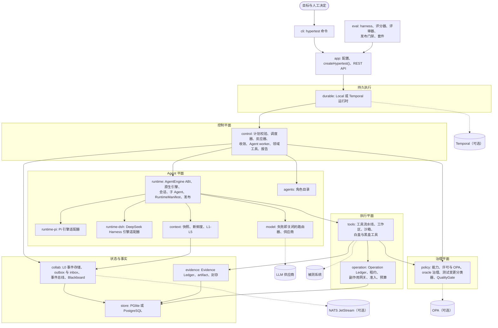

# Hypertest

[English](README.md) | 简体中文

[](https://github.com/ZhangLiangchen/hypertest/actions/workflows/ci.yml)

> **Hypertest 是一个带版本、多模型、可持久运行、证据可验证的自主测试 Agent。其中的 Agent 可以自由探索；
> 事实、副作用与质量决定则在模型之外受治理。**

## 它是什么

你交给 Hypertest 的是一个**测试目标**（“这个变更可以发布吗？”）和一个目标对象：某个提交上的代码仓库、一个运行中
系统的 URL，或一个已注册的环境。你不需要提供工作流。随后 Hypertest 会：

1. **规划。** Lead Agent 提出类型化的计划（Plan IR，绝不是代码）。确定性代码校验计划，调度器在预算内准入其中的
   工作项。计划会随着新发现不断修订。
2. **委派。** 各角色 Agent（分析者、测试设计者、执行者、RCA、修复者、评审者、指标分析者、环境操作者、上下文压缩器、
   视觉/GUI 测试者与本地/私有分析者）运行在其策略允许的模型路由上，能力从父到子只会收缩。角色也可以不经 Lead
   直接响应 Blackboard 事件，例如 RCA 被 `finding.created` 唤醒。
3. **通过受治理的工具行动。** 白盒工具（git、fs、shell、测试运行器、覆盖率、变异）与黑盒工具（HTTP、指标、压测、
   环境控制、浏览器、MCP）都经过同一条流水线。每个结果都被记录为证据。
4. **交给确定性的 QualityGate。** 门禁读取证据、oracle、finding、风险与独立评审，并签署一个绑定到已封存证据根的
   `QualityDecision`。

| 结论 | 含义 | `hypertest run` 退出码 |
|---|---|---|
| `pass` | 所有门禁准则均满足 | 0 |
| `fail` | 违反了失败类准则（例如未解决的 P0/P1 finding、被违反的 oracle） | 3 |
| `conditional` | 可有条件地发布（例如缺少独立评审、存在未决风险） | 4 |
| `inconclusive` | 缺少证据或 oracle：绝不会报告为 `pass` | 5 |

有三件事**绝不由模型决定**：

1. **什么是正确的。** 带版本的 oracle（`OracleSpec`）由具名的人建立。Agent 只能提议修改，且提议的 Agent 永远不能
   批准自己的提议。没有生效 oracle 的运行最多为 `inconclusive`（门禁准则 C0）。
2. **外部世界实际发生了什么。** Operation Ledger 以稳定的 operation id 记录每个副作用，带有 fencing，并对未知结果
   进行对账（绝不盲目重试）。Evidence Ledger 仅追加且带哈希链。
3. **能否声称通过。** 只有 QualityGate 产出结论。证据缺失得到 `inconclusive`，绝不是 `pass`。

Hypertest 使用 [BUGate](https://github.com/ZhangLiangchen/BUGate) 测试方法论协议（未配置 checkout 时使用内置副本）。
规范性设计见[实施蓝图](docs/architecture/BLUEPRINT.md)；[CONFORMANCE.zh-CN.md](docs/architecture/CONFORMANCE.zh-CN.md)
记录了当前代码对设计的符合程度。

## 架构

`packages/` 下共有 20 个 npm workspace，TypeScript 由 Node 直接运行（无构建步骤）。每个包的 `src/contracts.ts`
是其有约束力的 ABI。依赖 DAG 由 `npm run check:boundaries` 强制执行。



`core`（id、时钟、错误、哈希、模式校验、端口）与 `domain`（类型、事件目录、状态机）位于所有包之下；`testkit` 提供
测试辅助。每次工具调用都遵循同一条流水线：
**校验 → 能力 → 策略许可 → 新鲜度（变更类调用）→ Operation Ledger（副作用）→ 执行 → 卸载大输出 → 证据 → L0 事件**。

| 包 | 职责 |
|---|---|
| [core](packages/core)、[domain](packages/domain)、[store](packages/store)、[testkit](packages/testkit) | 基础：id、错误、哈希、模式、SQL 与总线端口；领域类型与状态机；PGlite/PostgreSQL 与迁移；测试辅助 |
| [collab](packages/collab) | L0 事件存储（仅追加触发器）、事务性 outbox、inbox 去重、进程内与 NATS 总线、Blackboard |
| [evidence](packages/evidence) | 内容寻址的 artifact（fs、S3）、带哈希链的 Evidence Ledger、Merkle 根、Ed25519 封存 |
| [operation](packages/operation) | Operation Ledger、带 fencing token 的租约、副作用网关、对账、准入、预算 |
| [policy](packages/policy) | 能力衰减、许可（内置规则、OPA）、oracle 治理、测试变更分类器、QualityGate |
| [model](packages/model) | 模型目录、带按路由熔断器的失败即关闭路由器、供应商（OpenAI 兼容、Anthropic、pi-ai、scripted） |
| [context](packages/context) | 上下文快照、观察到的读取集、新鲜度守卫、工作上下文（HARD/SOFT 压缩）、混合检索、经验记忆、溯源 |
| [tools](packages/tools) | 工具运行时、工作区、本地与 OCI 沙箱、白盒与黑盒工具 |
| [runtime](packages/runtime)、[runtime-pi](packages/runtime-pi)、[runtime-dsh](packages/runtime-dsh) | AgentEngine ABI、原生引擎、会话、子 Agent、清单、运行时发布注册表；Pi 引擎适配器；DeepSeek Harness 引擎适配器（pin + adapter，实验性） |
| [agents](packages/agents) | 14 个角色：提示词、模型策略、工具白名单、输出模式、订阅 |
| [control](packages/control) | 计划校验、调度器、反应器、收敛、Agent worker、BUGate 各阶段、实验隔离与预算租约、领域工具、报告 |
| [durable](packages/durable) | 本地与 Temporal 持久运行时 |
| [app](packages/app) | 配置、组合根、运行时发布服务（准入、隔离、迁移）、REST API、`doctor` 诊断 |
| [eval](packages/eval) | 评测 harness、版本化评分器、独立 LLM 评审器、统计、发布门禁、PoC 与核心套件 |
| [cli](packages/cli) | `hypertest` 命令 |

## 不变量

蓝图中的硬性不变量及其在代码中的执行位置。状态列取自 [CONFORMANCE.zh-CN.md](docs/architecture/CONFORMANCE.zh-CN.md)。

| # | 不变量 | 执行者 | 状态 |
|---|---|---|---|
| I1 | 模型提议，确定性代码处置：没有能力检查与策略许可的工具不会运行，变更类工具还需新鲜度检查 | tools 运行时流水线、policy 引擎 | 已实现 |
| I2 | 子能力 = 父 ∩ 角色 ∩ 工作项 ∩ 环境策略，绝不放大 | policy `attenuateCapability`、control 能力授予与 worker | 已实现；未满足的工作项需求会报告给 Agent |
| I3 | 只在安全回合边界切换模型（新 `ModelEpoch`）；失败即关闭的回退；路由顺序 安全 → 能力 → 角色 → 质量 → 延迟 → 成本 | model 路由器（熔断器的 `availability` 阶段位于质量之后）、runtime invoker 与纪元 | 已实现 |
| I4 | 每个外部或破坏性调用都有稳定的 `operationId`；未知结果会被对账；过期 fencing token 被拒绝 | operation 网关与租约；http、browser、mcp 的仅记录适配器 | 已实现 |
| I5 | 至少一次投递；每个消费者按 `eventId` 去重；重复投递绝不重复工作或副作用 | collab inbox、反应器指纹 | 已实现 |
| I6 | 证据仅追加：SHA-256 artifact、每个运行的哈希链、Merkle 根 | evidence ledger、数据库触发器 | 已实现；默认 fs artifact 存储不是 WORM |
| I7 | P0/P1 门禁绝不只依赖 LLM 判断；证据缺失 ⇒ `inconclusive` | QualityGate 准则 C0–C9 | 已实现 |
| I8 | Agent 绝不能为了变绿而放宽 oracle、断言或阈值，或跳过/删除失败的测试 | 分类器、漂移隔离、oracle 治理、翻转检测 | 已实现；本地沙箱仍共享 OS 用户 |
| I9 | 大型工具输出被卸载；只有有界摘要进入模型 | tools 运行时 | 已实现 |
| I10 | 路由、工具调用、许可、门禁评估与状态转换都发出带 run、work、agent、correlation、causation id 的 L0 事件 | 所有事件发出方 | 已实现；没有 `traceId` 或 OpenTelemetry |
| I11 | 运行固定到其 `RuntimeManifest`；升级绝不热替换运行中的任务 | app 组合、control `assertRunPinned`、按清单划分的 Temporal 队列、运行时发布注册表、显式迁移（`RuntimeEpoch`） | 已实现 |
| I12 | 调度器强制执行并发、深度、Agent 数、token、成本、工具调用与墙钟预算，并保持收敛权 | control 调度器与收敛监视器 | 已实现 |

## 快速开始

要求：Node.js ≥ 22.18 与 git。默认沙箱还需要支持非特权用户命名空间的 Linux（util-linux `unshare`）以及 python3；
`hypertest doctor` 会检查这些条件。其他主机请使用 `sandbox.kind: oci`（docker），或显式设置 `sandbox.network: open`。
不需要任何基础设施：默认使用内嵌的 PGlite、进程内总线与本地持久运行时。PostgreSQL、NATS、Temporal 与 OPA 都是可选的
（见 [OPERATIONS.zh-CN.md](docs/architecture/OPERATIONS.zh-CN.md)）。

```bash
# 在 Hypertest 仓库中
npm ci
npm link                                   # 可选：把 `hypertest` 放到 PATH 上（否则使用 node bin/hypertest.js …）

# 在要测试的仓库中
hypertest init                             # 生成带注释的 hypertest.config.yaml；把 .hypertest/ 加入 .gitignore
export DEEPSEEK_API_KEY=… ANTHROPIC_API_KEY=…   # 供应商 apiKeyEnv 字段所指定的变量
# 编辑 hypertest.config.yaml：取消注释并修改 `oracles:` 示例（什么是“正确”，由谁决定）
hypertest doctor                           # 配置、密钥变量（只显示名称）、各角色的路由、沙箱、存储
hypertest run "Is this change releasable?" --repo . --commit HEAD
hypertest report <runId>                   # markdown 报告：结论、原因、finding、计划演进、路由、证据
hypertest evidence verify <runId>          # 哈希链、artifact、封存与已签名的结论
```

- 密钥从不写入配置：`apiKeyEnv` 指定的是环境变量名。
- 运行会固定 `oracles:` 配置段中的 oracle。`hypertest oracle establish <file> --by <name>` 同样可以记录 oracle，
  但 `hypertest run` 没有固定它的选项；请把同一个 oracle 加入 `oracles:`（或在 `POST /runs` 中传入 `oracleIds`）。
- `--follow` 会流式输出运行事件。中断后（退出码 130）用 `hypertest resume` 继续运行。
- 人工决定：`hypertest approve`、`oracle establish`、`oracle decide`、`waive` 与 `experience review`（用
  `approvals`、`oracle proposals`、`experience list` 列出待办）。这些决定类命令在 Agent 沙箱内会被拒绝。

### 运行时发布

代码与配置的每种组合都是一个按内容寻址的 `RuntimeManifest`，每个运行都固定到其中一个。在激活第一个发布之前，安装处于
非受管状态（任何运行时都可以启动运行）。一旦有发布处于 active，新运行只会在 active 发布或选中它们的 canary 下启动：

```bash
hypertest runtime register --by alice                      # 本安装的清单成为候选
hypertest runtime record-suite current --kind engine_contract --suite agent-engine-contract --passed --total <n> --by ci:github
hypertest eval run core --arms scripted-multi-llm --out core.json
hypertest runtime record-suite current --kind replay --from-eval core.json --by ci:github
hypertest runtime promote current --by alice --reason "suites green"                    # candidate → shadow
hypertest runtime promote current --by alice --reason "shadow ok" --canary-percent 10  # shadow → canary
hypertest runtime promote current --by alice --reason "canary ok"                       # canary → active
hypertest runtime list                                      # 各发布的状态、active 指针、canary、存活运行
hypertest runtime rollback --by alice --reason "canary regressed"   # 停止 canary，或回滚 active 发布
hypertest runtime migrate <runId> --to current --by alice --reason "…"   # 显式迁移一个存活运行
```

`rollback` 会隔离被回滚发布上的存活运行（暂停，直到被迁移或取消）。其他发布的运行继续使用各自的清单。完整操作手册见
[OPERATIONS.zh-CN.md §5](docs/architecture/OPERATIONS.zh-CN.md#5-升级运行时发布与清单固定)。

## PoC 与评测

PoC 套件使用确定性的脚本化大脑运行完整技术栈，因此不需要 API 密钥。每次试验都使用全新的目录与数据库。

| 命令 | 展示内容 | 耗时* |
|---|---|---|
| `hypertest eval run poc-a-whitebox --arms scripted-multi-llm` | PoC A：白盒回归；动态计划、并行分析者、3 条路由、植入缺陷 ⇒ `fail` | 约 15 秒 |
| `hypertest eval run poc-c-durable-load --arms scripted-multi-llm --mode child-process` | PoC C：压测与故障恢复，真实 SIGKILL Hypertest 进程 | 约 30 秒 |
| `hypertest eval run poc-all --arms scripted-multi-llm,scripted-single` | 全部 PoC 任务（A、B、C、C-insufficient、oracle-robustness、recovery-chaos）；两组的配对 McNemar 比较 | 约 2–3 分钟 |
| `hypertest eval run core --arms scripted-multi-llm --out core.json` | 核心套件：测试生成（已知正确与已知错误的检查）、上下文新鲜度、运行中切换模型、安全注入；`--out` 保存 SuiteResult | 约 70 秒 |
| `hypertest eval gate --baseline packages/eval/baselines/core-scripted-multi-llm.json --candidate core.json` | 发布门禁：结果可比；严重误放行不恶化；缺陷召回不显著下降；安全违规与重复副作用 = 0；证据完整（通过退出 0，失败退出 1） | 约 2 秒 |
| `npm run eval:gate` | 以上两步，与 CI 相同（输出位于 `.hypertest-eval/`） | 约 75 秒 |
| `node scripts/run-tests.mjs --package eval` | 评测平台的单元与 e2e 测试，包括各 PoC | 约 4 分钟 |

\* 在开发主机上测得。

`--judge scripted` 会加入独立的 LLM 评审器（在所有确定性评分器之后最后运行），使用 CI 所用的已校准脚本化评审器。套件、
评分器或评测 harness 的修订变化后必须重新生成基线，否则门禁会报告结果不可比。

`poc-all` 的退出码为 1：单模型分组预期会在需要独立评审者的任务上失败，而这个差异正是比较所要度量的。可选的真实模型
分组使用真实供应商：`HYPERTEST_EVAL_LIVE=1 HYPERTEST_EVAL_LIVE_KIND=anthropic|openai-compatible
HYPERTEST_EVAL_LIVE_MODEL=… HYPERTEST_EVAL_LIVE_API_KEY=…`（openai-compatible 还需 `HYPERTEST_EVAL_LIVE_BASE_URL`），
然后使用 `--arms live`。

## 配置

`hypertest.config.yaml`（由 `hypertest init` 生成）在加载时校验，所有问题一次性报告。完整参考：
[app README](packages/app/README.md)（配置、组合、REST API）与 [CLI README](packages/cli/README.md)（命令、退出码、
运维说明）。部署配置见 [OPERATIONS.zh-CN.md](docs/architecture/OPERATIONS.zh-CN.md)。

| 配置段 | 默认值 | 用途 |
|---|---|---|
| `project` | `{ name, dataDir: .hypertest }` | 数据目录：数据库、artifact、密钥、工作区 |
| `store` | `pglite` | 或 `postgres`，配合 `urlEnv` 与 `schema` |
| `bus` | `inprocess` | 或 `nats`（JetStream） |
| `durable` | `local`（`maxConcurrentTurns: 4`） | 或 `temporal`（`workerMode: embedded` 或 `external`） |
| `artifacts` | `fs` | 或 `s3`（可选 Object Lock `objectLockDays`） |
| `models` | 无 | `providers`（`openai-compatible`、`anthropic`、`pi-ai`、`scripted`；密钥通过 `apiKeyEnv`）与 `routes`（能力、质量、成本） |
| `roles` | 内置目录 | 各角色的 `defaultModelPolicy`（首选路由、必需能力、独立性、回退） |
| `budget`、`gate` | 见 app README | 运行限制；门禁开关（`requireIndependentReview`、`failOnUnresolvedSeverity`、`requireOracle`、`minCoverage` 等） |
| `oracles` | 无 | 启动时由具名的人 `establishedBy` 建立的 oracle |
| `policy` | 内置规则 | 额外规则、`opa: { url, path }`、`capabilitySecretEnv` |
| `sandbox` | `local`，`network: loopback` | 或 `oci`（docker）；`envAllowlist` |
| `environments`、`tools` | 无 | 黑盒目标（`control.tokenEnv`）、`httpAllowlist`、`enableBrowser` |
| `runtime` | 在有发布处于 active 之前为非受管 | `requireActiveRelease: true`：没有 active 运行时发布时拒绝新运行 |
| `bugate`、`engines`、`memory`、`signing`、`observability` | 内置、`native`、`sql`、自动生成的密钥、`info` | 协议 checkout、Agent 引擎（`native`、`pi` 或实验性的 `dsh`）、PowerContext 记忆、签名密钥文件、日志级别 |

## 状态与限制

在 164 条设计需求中，132 条已实现、29 条部分实现、1 条缺失、2 条延后；全部十二条不变量均已实现
（[CONFORMANCE.zh-CN.md](docs/architecture/CONFORMANCE.zh-CN.md) 列出每一行）。主要缺口：

| 领域 | 当前限制 |
|---|---|
| 沙箱 | 本地沙箱用 Linux 命名空间隔离网络、进程与敏感路径，但命令以同一 OS 用户运行，并能看到主机其余文件系统。不受信任的模型请使用 OCI 沙箱。OCI 沙箱、docker 与 kubectl 适配器在开发中未在真实守护进程或集群上运行过。 |
| 隐私 | `local_private` 角色只运行在 restricted（本地）路由上，但其工具记录的证据以 `internal` 级别存储，而 `evidence.get` 会向本运行的任何 Agent 显示预览。目前只有该角色的提示词在阻止受限值进入这些证据。 |
| 上下文 | 符号图基于正则表达式（没有 tree-sitter/LSP/SCIP）；向量检索使用特征哈希嵌入，而不是语义模型。`shell.exec` 或 `test.run` 修改的文件不会被观察到，因此 Agent 在下一次写入前必须重新读取。另一个 Agent 取代了该 Agent 观察过的 finding，或重新部署了它观察过的环境之后，在它重新观察该资源之前，其变更类操作都会被拒绝。 |
| 实验与预算 | 实验没有自己的预算（适用运行与工作项预算），QualityGate 也尚未判断实验效度。限时故障可能比其实验的 claim 存活更久。工具调用之外的 artifact 写入（压缩、报告）不计费。 |
| 模型 | 熔断器按进程保存状态，app 未配置价格上限。所有路由的熔断器都打开时，工作项以 `model_unavailable` 失败。真实供应商已实现，但 CI 使用脚本化大脑，真实模型评测分组为可选。 |
| 发布管理 | 套件结果由 CI 或人工证明（`record-suite`）。`promote` 接受任何通过的回放套件，而不特别要求核心评测。从未激活过发布的安装不受门禁约束，除非设置 `runtime.requireActiveRelease: true`。迁移未在真实 Temporal 服务上验证。 |
| 治理 | 阶段许可为 `approval_required` 时按拒绝处理。按运行放宽门禁需要记录人工授权，而 REST API 尚不接受该授权，因此通过 HTTP 放宽门禁会被拒绝。没有专门的环境有效性门禁准则，学习闭环也没有技能注册表。 |
| 证据与审计 | 没有逐条签名（改为签名封存），默认不是 WORM，没有 `traceId`/OpenTelemetry。 |
| 评测 | 缺少 API/UI、Performance、Evidence 与 MultiAgent 套件。评审器的 14 个校准标签仍需人工 QA 负责人确认。试验不记录环境镜像摘要。 |
| 供应链 | CI 中运行 SBOM、许可证策略以及仅供参考的 `npm audit`。仍缺少 fork 补丁跟踪与包签名/来源证明。 |
| 引擎 | DeepSeek Harness（DSH）适配器为实验性：钉定在单一 Developer Preview 版本列车（0.1.0-rc.6），仅在 `engines.default: dsh` 时注册。DSH 的每个回合都从完整对话记录重建种子，因此回合成本随记录增长。 |

## 开发

```bash
npm ci
npm run check                               # 类型检查 + 包边界
npm test                                    # 单元 + 集成 + e2e（以及脚本自身的测试）
npm run infra:fetch && npm run infra:up     # 可选的本地 PostgreSQL、NATS、Temporal、OPA（写入 .infra/env）
HYPERTEST_TEST_DB=postgres npm test         # 在 PostgreSQL 上运行整个套件（需要 HYPERTEST_TEST_PG_URL）
node scripts/run-tests.mjs --package tools  # 单个包；也可用 --unit | --integration | --e2e
npm run eval:gate                           # 核心评测套件，并与已提交的基线比较
npm run license:check                       # 基于 package-lock.json 的许可证策略（违规时退出 1）
npm run sbom                                # CycloneDX SBOM → .hypertest-sbom.json（可用 --out <file> 指定）
npm run test:scripts                        # 供应链脚本的测试
```

集成测试在缺少基础设施时会带明确原因跳过。本轮在开发主机上的结果（PGlite 与 PostgreSQL 上相同）：2210 个测试，
2202 个通过，5 个跳过（无 pgvector、无 S3 端点、可选的真实 LLM 分组、两个 docker 测试），3 个失败。这 3 个失败是已变更代码之外的测试中
过时的预期：`packages/control/test/robustness.test.ts` 中的角色列表（早于 `vision_gui` 与 `local_private`），以及
`packages/eval/test/harness.test.ts` 中“未注册引擎”的示例（`dsh` 现已注册）。规则见
[CONTRIBUTING.zh-CN.md](CONTRIBUTING.zh-CN.md)，Agent 指令见 [AGENTS.md](AGENTS.md)。

## 仓库结构

| 路径 | 内容 |
|---|---|
| `packages/<name>/` | `src/contracts.ts`（ABI）、`src/index.ts`、`test/*.test.ts`（单元）、`*.int.test.ts`（集成）、`*.e2e.test.ts`（端到端）、`README.md` |
| `bin/hypertest.js` | CLI 入口 |
| `scripts/` | `run-tests.mjs`、`check-boundaries.mjs`、`infra.mjs`；供应链：`sbom.mjs`、`license-check.mjs`、`license-exceptions.json`（已评审的例外）、`test/` |
| `docs/architecture/` | [BLUEPRINT](docs/architecture/BLUEPRINT.md)、[CONFORMANCE](docs/architecture/CONFORMANCE.zh-CN.md)、[OPERATIONS](docs/architecture/OPERATIONS.zh-CN.md) |
| `docs/adr/` | [ADR-0008](docs/adr/0008-autonomous-testing-agent-rebuild.md)：重建决策 |
| `docs/design/` | 设计来源（中文）：技术选型、架构改进 |
| `docs/archive/v0.2/` | 上一代实现，仅作历史保留 |
| `.github/workflows/ci.yml` | CI：检查、在 PGlite 与 PostgreSQL 上运行完整套件、核心评测门禁，以及供应链任务（许可证策略、SBOM、仅供参考的 `npm audit`） |
