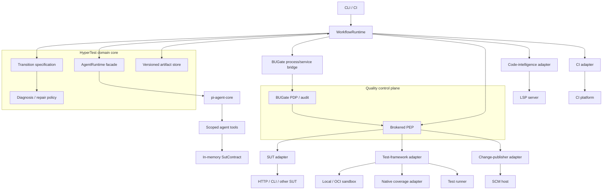

# HyperTest architecture

## Authority model

HyperTest deliberately separates strategy, execution durability, domain
semantics, and authorization:

| Concern | Authority |
|---|---|
| Strategy, local planning, tool use, reflection, and subtask choice | `AgentRuntime`; Pi is the only SDK-level agent harness |
| Legal workflow transitions, retry/budget rules, diagnosis/repair safety, and conformance | HyperTest deterministic domain core |
| Checkpoint/resume, scheduling, interrupt, parallelism, and generic execution recovery | replaceable `WorkflowRuntime`; LangGraph is the current preferred implementation |
| Quality policy, evidence acceptance, and permission to mutate/publish | BUGate PDP/audit kernel plus a host PEP |

The governing rule is `execution state != authorization state`. A workflow
checkpoint can say that a run reached implementation, but only a valid BUGate
decision bound to the current source and evidence can unlock the protected
action. A model, adapter, CI platform, workflow runtime, or hub cannot override
a BUGate denial.

BUGate unavailability permits read-only analysis but fails closed for applying
a governed patch or publishing a change. LangGraph is not an agent harness and
does not weaken the rule that Pi is the only SDK-level agent-runtime
dependency; LangGraph-specific types stay behind `src/workflow/langgraph/**`.

See [ADR-0005](adr/0005-durable-workflow-runtime-and-bugate-boundary.md) for
the target boundary and migration plan.

## Topology



The first implementation slice remains planner-only. Its tool allowlist is
`contract.list_operations` and `contract.get_operation`; both read only the
current in-memory contract. As autonomy grows, tools remain scoped capabilities
and protected mutations are never exposed as a parallel raw path around the
PEP.

## State separation

HyperTest persists four related but non-substitutable forms of state:

| State | Purpose | Source of truth |
|---|---|---|
| Workflow checkpoint | resume execution without repeating completed generic work | `WorkflowRuntime` checkpoint store |
| Domain transition ledger/specification | prove that the path is legal and policy/budget rules were followed | HyperTest deterministic core |
| Governance receipt/evidence chain | prove why a protected action was authorized and whether that authorization was consumed | BUGate |
| Product artifacts | plans, patches, test runs, diagnoses, reports, and immutable hashes | HyperTest artifact store |

Workflow checkpoints reference immutable artifact and receipt IDs/hashes; they
do not embed a second mutable copy of BUGate history. Restoring a checkpoint
must revalidate expiry, evidence/source drift, obligations, and authorization
consumption before attempting a protected side effect.

## Core pipeline

```text
raw interface definition
  -> sut-contract.v1
  -> deterministic plan + optional validated model augmentation
  -> test-plan.v1
  -> BUGate enter-implementation decision
  -> brokered framework-owned patch
  -> validation and BUGate apply-patch decision
  -> isolated test-run.v1 + coverage-map.v1
  -> deterministic diagnosis.v1
  -> optional safety-checked repair loop
  -> verification
  -> BUGate publish-change decision
  -> optional idempotent draft MR/PR
```

The model augmentation cannot bypass deterministic planning, semantic checks,
artifact generation, or BUGate. At each protected side effect, the PEP builds a
fresh gate request, validates and atomically consumes a narrowly scoped receipt,
executes the exact effect, and records an outcome attestation. A decision
receipt proves permission; the outcome attestation proves what actually ran.

Runtime events, validation, retry, usage, budget, and tool security are
specified in [model-runtime.md](model-runtime.md). Workflow-runtime placement
and the BUGate boundary are specified in [ADR-0005](adr/0005-durable-workflow-runtime-and-bugate-boundary.md).

## Portability boundary

The common core has no pytest, Go, HTTP, OpenAPI, JUnit, LCOV, GitLab, GitHub,
Pi, or LangGraph domain types. Adapters receive JSON requests and return
versioned JSON/file artifacts with explicit status, timeout, retry, and
domain-failure semantics. Pi types stay under `src/runtime/pi/**`; LangGraph
types stay under `src/workflow/langgraph/**`.

Coverage is normalized to source regions with a capabilities object. Missing
branch, condition, function, or per-test information remains unknown; it is
never coerced to zero. LSP results likewise carry capabilities and completeness
because language servers do not provide identical semantics.

## Failure model

An assertion failure is a successfully completed adapter call whose `TestRun`
outcome failed. It is not a transport failure. Adapter failures are separately
classified as unsupported, transient, permanent, cancelled, or timed out.

Model runtime failures are also separate from adapter and test failures. They
are classified as cancellation/deadline, provider transport/protocol/rate
limit, model parse/schema, tool input/execution/loop, output limit, or budget
exhaustion. Workflow-runtime failures add checkpoint, lease, duplicate-delivery,
and resume conflicts; they never authorize a retry of a protected effect by
themselves.

Only `TEST_DEFECT`, `FIXTURE_DEFECT`, selected generated-code `BUILD` failures,
and `ADAPTER_CONFIG` diagnoses may enter automatic repair. SUT defects,
contract drift, environment failures, flaky behavior, and unknown causes
require evidence or human review rather than weakened tests.

