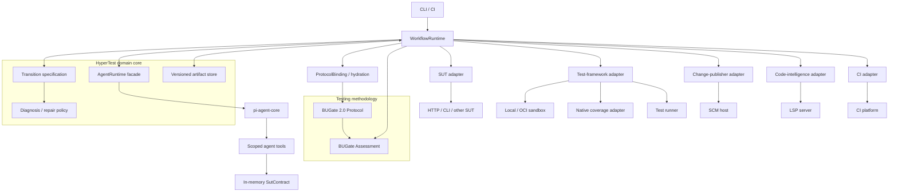

# HyperTest architecture

> Target architecture under ADR-0005 plus the BUGate 2.0 integration correction in ADR-0006; not a claim that every component below is already implemented. For current source status, ordered work packages and acceptance/rollback criteria, see the [refactoring guide](governance-runtime-refactor-guide.md).

## Authority model

HyperTest deliberately separates strategy, execution durability, domain
semantics, and authorization:

| Concern | Authority |
|---|---|
| Strategy, local planning, tool use, reflection, and subtask choice | `AgentRuntime`; Pi is the only SDK-level agent harness |
| Legal workflow transitions, retry/budget rules, diagnosis/repair safety, and conformance | HyperTest deterministic domain core |
| Checkpoint/resume, scheduling, interrupt, parallelism, and generic execution recovery | replaceable `WorkflowRuntime`; LangGraph is the current preferred implementation |
| Testing methodology, Artifact/Evidence contracts, Claim semantics, and quality assessment | BUGate 2.0 Protocol |
| Protocol pinning, context hydration, and the decision to continue/rework/escalate | HyperTest runtime/domain policy |

The governing rule is now `methodology state != execution state`. BUGate 2.0 does not authorize tools or workflow transitions; it evaluates structured Claims against a pinned testing methodology Protocol. HyperTest owns `ProtocolBinding`, context hydration, and the runtime decision to continue, rework, escalate, or stop.

LangGraph is not an agent harness and does not weaken the rule that Pi is the only SDK-level agent-runtime dependency; LangGraph-specific types stay behind `src/workflow/langgraph/**`.

See [ADR-0005](adr/0005-durable-workflow-runtime-and-bugate-boundary.md) for the durable runtime decision and [ADR-0006](adr/0006-bugate-protocol-binding.md) for the corrected BUGate 2.0 integration boundary.

## Topology



The first implementation slice remains planner-only. Its tool allowlist is
`contract.list_operations` and `contract.get_operation`; both read only the
current in-memory contract. As autonomy grows, tools remain scoped capabilities. Any mutation restrictions belong to HyperTest/runtime policy rather than BUGate Protocol semantics.

## State separation

HyperTest persists four related but non-substitutable forms of state:

| State | Purpose | Source of truth |
|---|---|---|
| Workflow checkpoint | resume execution without repeating completed generic work | `WorkflowRuntime` checkpoint store |
| Domain transition ledger/specification | prove that the path is legal and policy/budget rules were followed | HyperTest deterministic core |
| Protocol binding | pin exact BUGate protocol/profile versions and digests for the run | HyperTest |
| BUGate assessment provenance | prove why a quality conclusion was produced for a Claim | BUGate |
| Product artifacts | plans, patches, test runs, diagnoses, reports, and immutable hashes | HyperTest artifact store |

Workflow checkpoints reference immutable artifacts plus the ProtocolBinding id/version/digest; they do not embed a mutable copy of the BUGate protocol. Restoring a checkpoint resolves the exact pinned bundle, verifies its digest, recompiles the task-scoped Protocol Context Capsule, and rehydrates the agent before execution resumes.

## Core pipeline

```text
raw interface definition
  -> sut-contract.v1
  -> deterministic plan + optional validated model augmentation
  -> test-plan.v1
  -> BUGate assessment of the current Claim
  -> HyperTest decides continue/rework/escalate
  -> framework-owned patch
  -> validation and another BUGate assessment
  -> isolated test-run.v1 + coverage-map.v1
  -> deterministic diagnosis.v1
  -> optional safety-checked repair loop
  -> verification
  -> final BUGate assessment
  -> HyperTest publication policy
  -> optional idempotent draft MR/PR
```

The model augmentation cannot bypass deterministic planning, semantic checks, artifact generation, or BUGate assessment. BUGate assessment does not itself authorize a side effect; HyperTest owns any runtime policy that chooses to prevent, delay, or escalate a mutation based on AssessmentResult.

Runtime events, validation, retry, usage, budget, and tool security are
specified in [model-runtime.md](model-runtime.md). Workflow-runtime placement is specified in [ADR-0005](adr/0005-durable-workflow-runtime-and-bugate-boundary.md); BUGate Protocol binding and hydration are specified in [ADR-0006](adr/0006-bugate-protocol-binding.md).

## Portability boundary

The common core has no pytest, Go, HTTP, OpenAPI, JUnit, LCOV, GitLab, GitHub,
Pi, or LangGraph domain types. Adapters receive JSON requests and return
versioned JSON/file artifacts with explicit status, timeout, retry, and
domain-failure semantics. Pi types stay under `src/runtime/pi/**`; LangGraph
types stay under `src/workflow/langgraph/**`.

Coverage is normalized to source regions with a capabilities object. Missing
branch, condition, function, or per-test information remains unknown; it is
never coerced to zero. LSP results likewise carry capabilities and completeness
because language servers do not provide identical semantics.

## Failure model

An assertion failure is a successfully completed adapter call whose `TestRun`
outcome failed. It is not a transport failure. Adapter failures are separately
classified as unsupported, transient, permanent, cancelled, or timed out.

Model runtime failures are also separate from adapter and test failures. They
are classified as cancellation/deadline, provider transport/protocol/rate
limit, model parse/schema, tool input/execution/loop, output limit, or budget
exhaustion. Workflow-runtime failures add checkpoint, lease, duplicate-delivery,
and resume conflicts; they never authorize a retry of a protected effect by
themselves.

Only `TEST_DEFECT`, `FIXTURE_DEFECT`, selected generated-code `BUILD` failures,
and `ADAPTER_CONFIG` diagnoses may enter automatic repair. SUT defects,
contract drift, environment failures, flaky behavior, and unknown causes
require evidence or human review rather than weakened tests.

