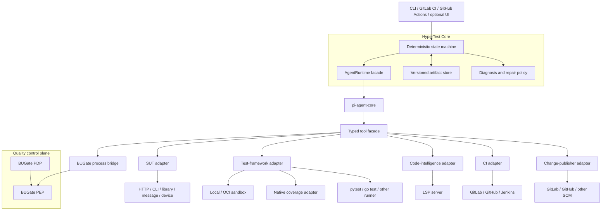

# HyperTest architecture

## Authority model

HyperTest deliberately has three non-overlapping authorities:

| Concern | Authority |
|---|---|
| Next computational step, retry, timeout and budget | HyperTest deterministic core |
| Model/tool-loop mechanics | `AgentRuntime`; pi is the only SDK implementation |
| Quality policy and permission to mutate/publish | BUGate PDP/PEP |

A model, adapter, CI platform, or hub cannot override a BUGate denial. BUGate unavailability permits read-only analysis but fails closed for applying a governed patch or publishing a change.

## Topology



## Core pipeline

```text
raw interface definition
  -> sut-contract.v1
  -> test-plan.v1
  -> BUGate enter-implementation decision
  -> framework-owned patch
  -> validation and BUGate apply-patch decision
  -> isolated test-run.v1 + coverage-map.v1
  -> diagnosis.v1
  -> optional safety-checked repair loop (maximum two rounds)
  -> verification
  -> BUGate publish-change decision
  -> optional idempotent draft MR/PR
```

## Portability boundary

The common core has no pytest, Go, HTTP, OpenAPI, JUnit, LCOV, GitLab, or GitHub domain types. Adapters receive JSON requests and return versioned JSON/file artifacts with explicit status, timeout, retry, and domain-failure semantics.

Coverage is normalized to source regions with a capabilities object. Missing branch, condition, function, or per-test information remains unknown; it is never coerced to zero. LSP results likewise carry capabilities and completeness because language servers do not provide identical semantics.

## Failure model

An assertion failure is a successfully completed adapter call whose `TestRun` outcome failed. It is not a transport failure. Adapter failures are separately classified as unsupported, transient, permanent, cancelled, or timed out.

Only `TEST_DEFECT`, `FIXTURE_DEFECT`, selected generated-code `BUILD` failures, and `ADAPTER_CONFIG` diagnoses may enter automatic repair. SUT defects, contract drift, environment failures, flaky behavior, and unknown causes require evidence or human review rather than weakened tests.
