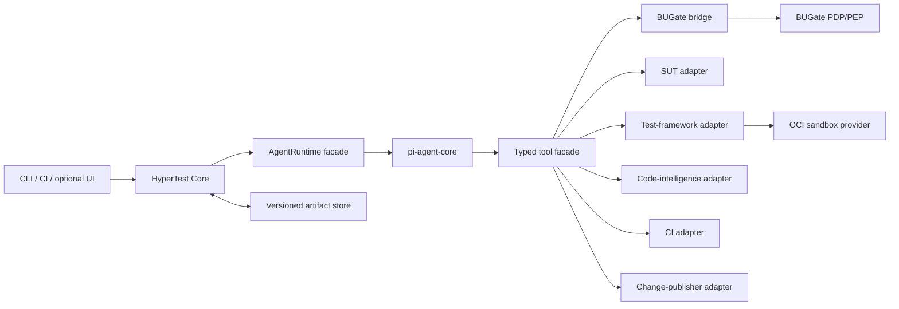

# HyperTest architecture baseline

## Decision summary

HyperTest uses one deterministic core, one policy authority, and one SDK-level runtime seam:

- **HyperTest Core** owns run state, budgets, artifacts, diagnosis, repair policy, and adapter capability negotiation.
- **BUGate PDP/PEP** owns quality decisions and enforcement receipts.
- **pi-agent-core** supplies the programmable model/tool loop behind a HyperTest-owned `AgentRuntime` interface.
- **Adapters** isolate the SUT, test framework, code intelligence, coverage, sandbox, CI, SCM, and domain knowledge.

## Component topology

## Authority split

| Concern | Authority |
|---|---|
| Next computational step | HyperTest deterministic state machine |
| Model/tool execution mechanics | AgentRuntime implementation |
| Quality policy and write/publish permission | BUGate PDP/PEP |
| Ecosystem-specific behavior | Selected adapter |
| Durable evidence | Versioned artifact store |

No model, adapter, CI platform, or hub may override a BUGate denial.

## Initial implementation slice

The repository starts with:

1. capability-neutral adapter contracts;
2. a deterministic state machine with pre-code, repair, and publish gates;
3. an atomic SHA-256 file artifact store;
4. a fake runtime for model-independent tests;
5. architecture boundary checks in CI.

The first two conformance scenarios will be Python/pytest/HTTP and Go/go test/CLI. A switch between them is accepted only when common core and schema changes are zero.
