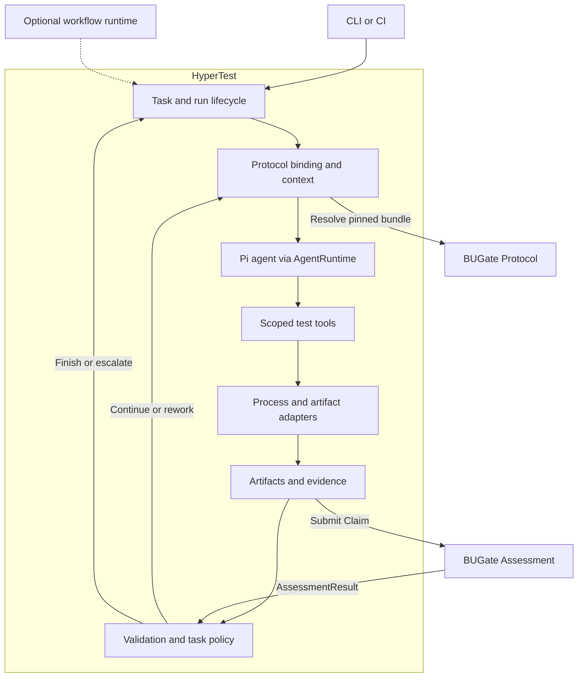

# HyperTest architecture

> Target responsibility model under [ADR-0007](adr/0007-pi-first-test-agent.md)
> and [ADR-0006](adr/0006-bugate-protocol-binding.md), not a shipped-capability claim.
> Start implementation with the [Pi-based development guide](pi-agent-development-guide.zh-CN.md).

## Product model

HyperTest is a specialized test-development agent built on Pi. It reuses a
generic agent foundation and adds test-domain tools, task context, evidence,
and deterministic product rules. A separate workflow framework is conditional
on demonstrated recovery or coordination needs.

| Concern | Owner |
|---|---|
| Strategy and local tool choice within granted capabilities | The agent running through Pi |
| Model interaction, agent-loop mechanics and supported session facilities | Pi behind HyperTest's `AgentRuntime` |
| Task/run state, workspaces, budgets, repair safety and publication policy | HyperTest deterministic code |
| Test-domain execution and ecosystem integration | HyperTest process/artifact adapters |
| Testing methodology, Artifact/Evidence/Claim contracts and quality assessment | Stateless BUGate 2.0 Protocol |
| Exact protocol pinning, context hydration, assessment submission and next action | HyperTest |
| Optional durable coordination across work packages | A runtime selected through a future needs-based decision |

BUGate assesses results; HyperTest decides continue, rework, retry, escalate or
stop. Assessment does not confer tool permissions. Pi packages stay under
`src/runtime/pi/**`; the current approved agent SDK is `pi-agent-core`.
Evaluating the full Coding Agent SDK does not authorize a dependency switch.

## Target interactions

These are component interactions, not mandatory sequential reasoning stages.
Pi chooses work within the current task and tool scope. HyperTest validates
artifacts, invokes adapters, records actual outcomes and enforces its policies.
An optional runtime would coordinate task boundaries, not duplicate Pi turns.

## Current implementation boundary

The v0.2 model tool loop is planner-only. Its tool allowlist is
`contract.list_operations` and `contract.get_operation`, both read-only over the
in-memory SutContract. The orchestrator also supports constrained repair-patch
requests without model tools; diagnosis and acceptance remain deterministic.
The current package/lockfile contains `pi-agent-core` and `pi-ai`, not the full
Coding Agent SDK or LangGraph.

Full test-agent autonomy, BUGate 2.0 consumption and durable resume are targets.
The existing orchestrator, state-machine checks and v1 BUGate fail-closed gates
remain the compatibility baseline until separately migrated and tested. See
[model-runtime.md](model-runtime.md) for implemented model behavior.

## State separation

| State | Purpose | Owner |
|---|---|---|
| Agent session | Conversation and tool interactions; compaction/continuation when supported | Selected Pi integration, with one session owner |
| Task/run record | Identity, source/configuration versions, budgets, attempts, status and session/artifact references | HyperTest |
| Operation record | Stable effect identity, intent, outcome and unresolved-result reconciliation | HyperTest execution/adapter boundary, when implemented |
| ProtocolBinding | Exact protocol/profile versions and digests | HyperTest |
| Artifacts and assessment results | Immutable plans, patches, execution evidence, Claims and returned assessments | HyperTest storage; BUGate defines assessment semantics |
| Optional workflow checkpoint | Progress of separately coordinated work packages | Selected runtime, only if introduced |

BUGate does not store HyperTest host state or manage sessions/workers. Protocol
bindings are resolved and verified before context is rehydrated, including after
compaction or resume. Missing exact bundles fail explicitly rather than silently
upgrading the run.

Session history, run records and checkpoints do not prove that an external
effect completed. Recovery must declare its granularity, retain consumed budgets
and repair counts, and reconcile unknown outcomes before any replay. An optional
runtime stores references, not another mutable copy of protocol or artifact truth.

## Test-task completion

A target task fixes its inputs and capabilities, lets the Pi agent analyze and
select tools, validates structured test intent, executes through adapters,
collects evidence, and diagnoses or safely repairs where appropriate. Reports
bind findings to actual source and execution evidence. Publication is a separate
HyperTest policy decision through the SCM adapter.

Not every task needs every action. Successful tests need no forced repair;
verified SUT defects can terminate with a defect report. Insufficient evidence,
budget exhaustion and human-review requirements are explicit outcomes. A model
Claim or successful tool transport must not be treated as a passing test.

## Portability and failure boundaries

The common core has no pytest, Go, HTTP, OpenAPI, JUnit, LCOV, GitLab, GitHub or
Pi-specific domain types. Adapters exchange versioned JSON/file artifacts with
explicit capability, timeout and failure semantics. If a workflow runtime is
later selected, its types also stay behind its adapter boundary.

Coverage and LSP completeness remain capability-aware; unknown information is
not zero or complete. Assertion failures are successful adapter calls with a
failed test outcome, distinct from transport, timeout and cancellation failures.
Model parse/schema, tool-loop and budget failures retain separate classifications.

Only `TEST_DEFECT`, `FIXTURE_DEFECT`, selected generated-code `BUILD` failures,
and `ADAPTER_CONFIG` diagnoses may enter automatic repair. Preserve the existing
two-round limit and prohibition on skipped tests, weakened oracles or swallowed
exceptions. SUT defects, contract drift, environment issues, flaky behavior and
unknown causes require evidence or review.

External effects, including tests that mutate the SUT, need appropriate capability
checks and outcome handling. Framework installation does not supply those
guarantees. LangGraph admission criteria and the implementation order are defined
in [ADR-0007](adr/0007-pi-first-test-agent.md), not the superseded ADR-0005 rollout.
