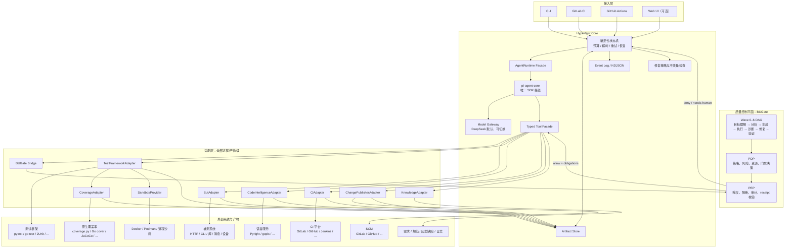
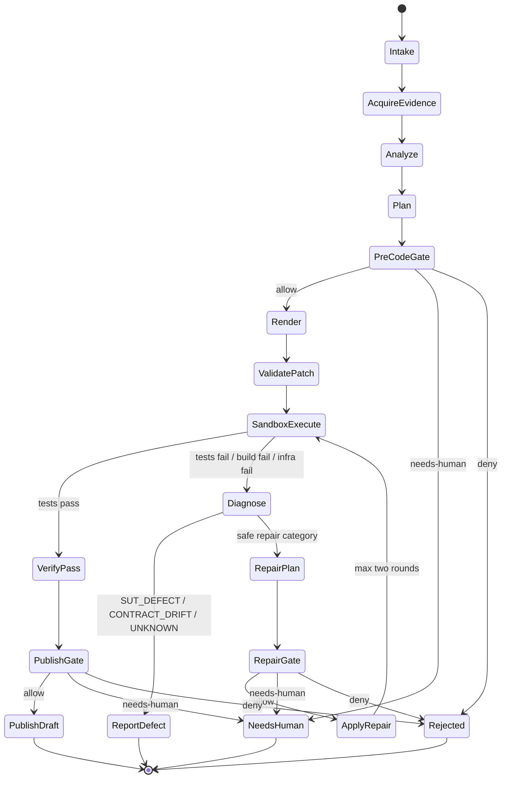

## 7. 系统架构

### 7.1 总体架构图



### 7.2 层次职责

| 层 | 责任 | 不得承担 |
|---|---|---|
| 接入层 | 触发 run、传 profile、展示状态 | 测试语义、平台特有逻辑 |
| BUGate 控制平面 | 策略决策、门禁、写保护、审计 | agent loop、runner、代码索引 |
| HyperTest Core | 工作流、产物、诊断、修复策略、预算 | 语言/框架/CI/SUT 细节 |
| Agent Runtime | 模型调用、tool loop、streaming | 工作流权威、门禁权威 |
| Adapter | 生态差异、命令、解析和平台 API | 全局策略、跨 adapter 状态机 |
| 外部系统 | SUT、测试工具、CI/SCM、语言服务 | HyperTest 核心状态 |

### 7.3 运行状态机



### 7.4 Wave 0–6 映射

| BUGate Wave | HyperTest 阶段 | 主要产物 |
|---|---|---|
| Wave 0 | 目标理解与输入健康检查 | `run-request`、需求缺口、SUT contract 健康度 |
| Wave 1 | 测试分析 | 风险、边界、状态、oracle、已有覆盖 |
| Wave 2 | 用例生成 | `test-plan.v1` |
| Wave 3 | 执行探索 | patch、sandbox run、`test-run.v1`、coverage |
| Wave 4 | 诊断归因 | `diagnosis.v1` |
| Wave 5 | 自修复 | `repair-proposal.v1`、修复 patch |
| Wave 6 | 验证与收敛 | 回归结果、非退化证明、gate decision、change proposal |

Core 的状态机负责“下一步做什么”；BUGate 负责“是否允许进入下一步”。二者不能互相替代。

---

## 8. 核心与适配层边界

### 8.1 必须留在核心

- 确定性 run state machine；
- token、成本、工具调用和 wall-clock 预算；
- cancellation、resume 和 run ledger；
- `SutContract`、`TestPlan`、`TestRun`、`CoverageMap`、`Diagnosis`；
- 模型路由和结构化输出校验；
- 失败分类；
- 自动修复允许矩阵；
- oracle weakening 检查；
- patch transaction；
- artifact hashing 和 provenance；
- BUGate decision 调用和 PEP enforcement；
- adapter capability negotiation；
- idempotency key；
- 运行结果聚合和最终结论。

### 8.2 必须下沉为 adapter

- SUT 启停、连接、认证、reset、seed、probe；
- OpenAPI、CLI schema、protobuf、GraphQL 等接口导入；
- 测试目录、fixture、代码模板、runner 命令；
- pytest/go test/JUnit 等结果解析；
- coverage 原生格式解析；
- LSP server 启动参数和安装方式；
- GitLab/GitHub/Jenkins API；
- MR/PR 创建和更新；
- 产品需求、历史故障、日志、领域规则；
- 路径、命令、环境、资源和平台配置。

### 8.3 首场景污染检查

| 污染假设 | 检测方式 | 正确放置位置 |
|---|---|---|
| OpenAPI 是唯一接口定义 | Core 出现 `path/method/statusCode` 专用类型 | HTTP SutAdapter extension |
| pytest 是测试模型 | Core 出现 fixture/nodeid/marker | pytest adapter |
| JUnit 是统一结果 | Core 直接消费 XML testcase | adapter 转 `test-run.v1` |
| GitLab 同时是 CI 与 SCM | 一个 adapter 同时 create pipeline 和 MR | 拆为 CI/SCM 两个 adapter |
| coverage 一定有 branch | Core 用 branch=0 表示未知 | capability=false/unknown |
| 测试目录固定 | Core 存在 `tests/**` | profile + framework adapter |
| 失败必须修测试 | 每个失败都进入 repair | failure classifier + policy |
| 源码与测试同仓 | 使用单一 repo root | `SourceSnapshot` 独立 revision |

---

## 9. Adapter 进程协议

### 9.1 调用方式

adapter 可以由任意语言实现，但必须支持统一 CLI：

```bash
<adapter> describe --response manifest.json

<adapter> invoke \
  --operation <name> \
  --request request.json \
  --response response.json
```

规则：

- stdin 不承载大对象；
- 大对象通过 `ArtifactRef`；
- response 使用临时文件后原子 rename；
- adapter 不得访问未声明路径；
- adapter 不得直接更新 Core 状态；
- 所有调用都有 request id 和 deadline；
- operation 必须声明是否幂等。

### 9.2 公共类型

```ts
type Json =
  | null
  | boolean
  | number
  | string
  | Json[]
  | { [key: string]: Json };

interface ArtifactRef<K extends string = string> {
  kind: K;
  schema: string;
  uri: string;
  mediaType: string;
  sha256: string;
  sizeBytes?: number;
}

interface CallContext {
  runId: string;
  requestId: string;
  workspace: ArtifactRef<"workspace">;
  sourceRevision: string;
  deadlineEpochMs: number;
  attempt: number;
}

type AdapterStatus =
  | "ok"
  | "unsupported"
  | "transient_error"
  | "permanent_error"
  | "cancelled";

interface AdapterResponse<T> {
  schema: "hypertest.adapter-response/v1";
  requestId: string;
  adapter: {
    name: string;
    version: string;
  };
  status: AdapterStatus;
  outcome?: T;
  artifacts: ArtifactRef[];
  diagnostics: Array<{
    code: string;
    message: string;
    detail?: Json;
  }>;
  retry?: {
    safe: boolean;
    afterMs?: number;
  };
}
```

领域失败与 adapter 失败必须分离：

- 测试 assertion fail：`status = ok`，写入 `TestRun.outcome`；
- SUT 返回非预期状态：`status = ok`，写入 observation；
- adapter 无法启动 runner：`permanent_error` 或 `transient_error`；
- operation 不支持：`unsupported`。

### 9.3 退出码

| 退出码 | 含义 |
|---:|---|
| 0 | 已成功写出合法 response，包括领域失败 |
| 64 | 请求/schema 无效 |
| 69 | operation/capability 不支持 |
| 70 | 永久性 adapter 内部错误 |
| 75 | 可重试临时错误 |
| 124 | 外部沙箱强制超时 |
| 130 | 取消 |

---

## 10. Adapter 接口草案

### 10.1 被测系统 adapter

```ts
interface SutAdapter {
  describe(
    ctx: CallContext
  ): Promise<AdapterResponse<SutCapabilities>>;

  importContract(
    ctx: CallContext,
    request: {
      source: ArtifactRef<"raw-sut-contract">;
      sourceKind: string;
    }
  ): Promise<AdapterResponse<ArtifactRef<"sut-contract">>>;

  acquire(
    ctx: CallContext,
    request: {
      mode: string;
      revision?: string;
      configuration?: ArtifactRef<"sut-config">;
    }
  ): Promise<AdapterResponse<SutLease>>;

  reset(
    ctx: CallContext,
    request: {
      lease: SutLease;
      strategy: string;
      seed?: ArtifactRef<"seed-data">;
    }
  ): Promise<AdapterResponse<ResetResult>>;

  probe(
    ctx: CallContext,
    request: {
      lease: SutLease;
      operationId: string;
      input: Json;
    }
  ): Promise<AdapterResponse<SutObservation>>;

  release(
    ctx: CallContext,
    request: {
      lease: SutLease;
    }
  ): Promise<AdapterResponse<{ released: boolean }>>;
}
```

框架无关 operation：

```ts
interface SutOperation {
  id: string;
  interactionKind: string;
  inputSchema: ArtifactRef<"json-schema">;
  observationSchema: ArtifactRef<"json-schema">;
  effects: "none" | "read" | "write" | "destructive" | "unknown";
  preconditions?: string[];
  oracleHints?: Json[];
  extensionSchema?: string;
  extension?: Json;
}
```

HTTP adapter 的 observation 可为：

```json
{"status": 200, "headers": {}, "body": {}}
```

CLI adapter 的 observation 可为：

```json
{"exitCode": 0, "stdout": "...", "stderr": "", "files": []}
```

Core 只消费 observation schema，不直接识别 HTTP 或 CLI 字段。

### 10.2 测试框架 adapter

```ts
interface TestFrameworkAdapter {
  describe(
    ctx: CallContext
  ): Promise<AdapterResponse<TestFrameworkCapabilities>>;

  discover(
    ctx: CallContext,
    request: {
      workspace: ArtifactRef<"workspace">;
    }
  ): Promise<AdapterResponse<ArtifactRef<"test-inventory">>>;

  render(
    ctx: CallContext,
    request: {
      plan: ArtifactRef<"test-plan">;
      inventory: ArtifactRef<"test-inventory">;
      frameworkGuide?: ArtifactRef<"framework-guide">;
    }
  ): Promise<AdapterResponse<ArtifactRef<"patch">>>;

  validate(
    ctx: CallContext,
    request: {
      patch: ArtifactRef<"patch">;
    }
  ): Promise<AdapterResponse<ArtifactRef<"validation-report">>>;

  run(
    ctx: CallContext,
    request: {
      patch?: ArtifactRef<"patch">;
      selector?: Json;
      environment: ArtifactRef<"test-environment">;
      collectCoverage: boolean;
    }
  ): Promise<AdapterResponse<ArtifactRef<"test-run">>>;

  normalizeCoverage(
    ctx: CallContext,
    request: {
      rawCoverage: ArtifactRef[];
      sourceSnapshot: ArtifactRef<"source-snapshot">;
    }
  ): Promise<AdapterResponse<ArtifactRef<"coverage-map">>>;
}
```

`render()` 只输出 patch，不直接写宿主工作区。`run()` 在 sandbox 副本中应用 patch。

### 10.3 CI adapter

```ts
interface CiAdapter {
  describe(
    ctx: CallContext
  ): Promise<AdapterResponse<CiCapabilities>>;

  currentContext(
    ctx: CallContext
  ): Promise<AdapterResponse<CiRunContext | null>>;

  submit(
    ctx: CallContext,
    request: {
      revision: string;
      profile: ArtifactRef<"hypertest-profile">;
      inputs?: Json;
    }
  ): Promise<AdapterResponse<CiRunHandle>>;

  get(
    ctx: CallContext,
    request: {
      run: CiRunHandle;
    }
  ): Promise<AdapterResponse<CiRunStatus>>;

  cancel(
    ctx: CallContext,
    request: {
      run: CiRunHandle;
    }
  ): Promise<AdapterResponse<{ cancelled: boolean }>>;

  fetchArtifacts(
    ctx: CallContext,
    request: {
      run: CiRunHandle;
      selectors: string[];
    }
  ): Promise<AdapterResponse<ArtifactRef[]>>;

  publishCheck(
    ctx: CallContext,
    request: {
      revision: string;
      conclusion: string;
      summary: ArtifactRef<"run-summary">;
    }
  ): Promise<AdapterResponse<{ published: boolean }>>;
}
```

### 10.4 SCM/MR adapter

```ts
interface ChangePublisherAdapter {
  publishDraft(
    ctx: CallContext,
    request: {
      baseRevision: string;
      patch: ArtifactRef<"patch">;
      gateDecision: ArtifactRef<"gate-decision">;
      proposal: ArtifactRef<"change-proposal">;
      idempotencyKey: string;
    }
  ): Promise<AdapterResponse<{
    changeId: string;
    url: string;
    branch: string;
    created: boolean;
  }>>;
}
```

### 10.5 代码理解 adapter

```ts
interface CodeIntelligenceAdapter {
  describe(
    ctx: CallContext
  ): Promise<AdapterResponse<CodeCapabilities>>;

  snapshot(
    ctx: CallContext,
    request: {
      revision: string;
      include: string[];
      exclude: string[];
    }
  ): Promise<AdapterResponse<ArtifactRef<"source-snapshot">>>;

  query(
    ctx: CallContext,
    request: {
      snapshot: ArtifactRef<"source-snapshot">;
      query:
        | { kind: "symbols"; text?: string }
        | { kind: "definition"; uri: string; line: number; column: number }
        | { kind: "references"; symbolId: string }
        | { kind: "diagnostics"; uri?: string }
        | { kind: "callHierarchy"; symbolId: string };
    }
  ): Promise<AdapterResponse<ArtifactRef<"code-query-result">>>;
}
```

---

## 11. 核心数据模型

### 11.1 `sut-contract.v1`

包含：

- SUT identity；
- operations；
- input/observation schema；
- side effects；
- preconditions；
- oracle hints；
- lifecycle capabilities；
- provenance。

不包含 pytest、HTTP 客户端或 Go 类型。

### 11.2 `test-plan.v1`

```ts
interface TestPlanCase {
  id: string;
  title: string;
  objective: string;
  operationIds: string[];
  preconditions: string[];
  steps: Array<{
    operationId: string;
    input: Json;
    bind?: string;
  }>;
  oracles: Array<{
    kind: string;
    expression: Json;
    rationale: string;
  }>;
  risk: {
    severity: "low" | "medium" | "high" | "critical";
    dimensions: string[];
  };
  provenance: ArtifactRef[];
}
```

### 11.3 `test-run.v1`

必须区分：

- collected；
- passed；
- failed；
- skipped；
- build errors；
- runner internal errors；
- timeout；
- infra errors；
- stdout/stderr；
- test-level evidence；
- coverage refs；
- source revision；
- generated patch hash。

### 11.4 `diagnosis.v1`

```ts
type DiagnosisCategory =
  | "TEST_DEFECT"
  | "FIXTURE_DEFECT"
  | "ADAPTER_CONFIG"
  | "SUT_DEFECT"
  | "CONTRACT_DRIFT"
  | "BUILD"
  | "ENVIRONMENT"
  | "FLAKY"
  | "UNKNOWN";

interface Diagnosis {
  category: DiagnosisCategory;
  confidence: number;
  hypotheses: Array<{
    rank: number;
    statement: string;
    evidence: ArtifactRef[];
    falsificationStep?: string;
  }>;
  culprit?: {
    files?: string[];
    operations?: string[];
    adapterStage?: string;
  };
  repairAllowed: boolean;
}
```

### 11.5 `gate-decision.v1`

包含：

- action；
- artifact hashes；
- source revision；
- decision；
- obligations；
- reason codes；
- expiration；
- receipt id；
- BUGate version。

发布 MR 时必须校验：

- patch hash 未变化；
- base revision 未变化；
- receipt 未过期；
- obligations 已满足。

---

## 12. 接缝契约表

| 接缝 | 输入产物 | 输出产物 | 失败语义 | 超时与重试归属 |
|---|---|---|---|---|
| 接入层 → Core | `run-request.v1`、revision、profile、预算 | `run-state.v1`、events、summary | 请求无效与 run 失败分开 | Core 管总 deadline |
| Core → AgentRuntime | 阶段 prompt、tool schemas、artifact refs、token budget | events、结构化结果、usage | provider error、schema invalid、loop exhausted 分开 | transport 最多 2 次；语义重试仅 Core 发起 |
| AgentRuntime → Typed Tools | schema 限制的 tool intent | artifact refs/outcome | 参数非法时不执行 | Core Tool Facade |
| Tool Facade → BUGate | action、diff、artifact hashes、治理状态 | allow/deny/needs-human、obligations、receipt | 不可达或 receipt 无效均 fail-closed | bridge 可短重试 1 次 |
| Core → SutAdapter | raw contract、lease、reset/probe | contract、lease、observation | 业务错误是 observation；启动/协议错误才是 adapter error | adapter 仅重试幂等动作 |
| Core → Code Adapter | snapshot、symbol/location query | code query result | partial/unsupported 不致整个 run 失败；digest mismatch 为 stale | broker 管 LSP restart，最多 1 次 |
| Code Adapter → LSP | initialize 和 LSP 请求 | JSON-RPC result/diagnostics | capability 缺失、server crash、project init fail 分开 | broker 管生命周期 |
| Core → Test Adapter | plan、inventory、guide | patch、validation、test run、coverage refs | assertion fail 是领域结果；compile/internal error 单列 | adapter 管 runner 进程 |
| Test Adapter → Sandbox | image、workspace、command、limits | exit/signal、stdout/stderr、changed files | 容器失败与命令退出分开 | Sandbox 强制 hard timeout |
| Coverage Adapter → Core | native coverage、source digest | `coverage-map.v1` | stale、partial、unknown 显式标记 | 不自动重跑，由 Core 决策 |
| Core → CI Adapter | revision、profile、inputs | run handle/status/artifacts | 平台 API 错误独立 | adapter 管 429/5xx 和 polling |
| Core → SCM Adapter | patch、receipt、proposal、base SHA | draft MR/PR | idempotent；base 漂移为 conflict | adapter 只重试安全网络错误 |
| 所有组件 → Store | 临时文件和 metadata | 原子 artifact ref | hash mismatch 永久失败 | Store 负责 fsync/rename |

---
