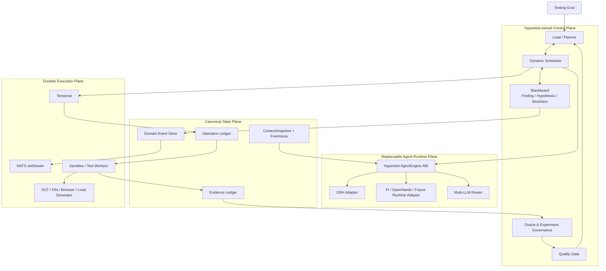
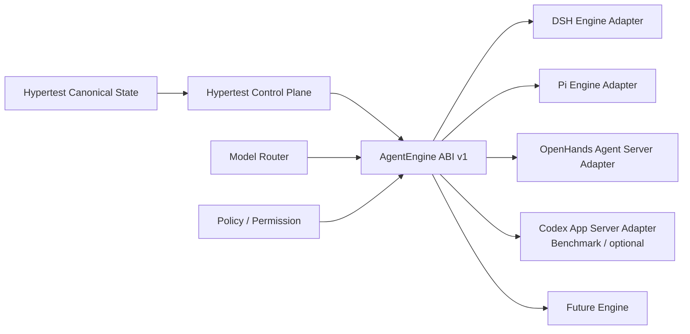
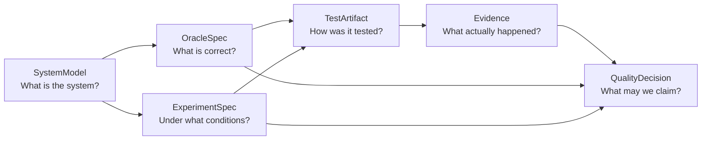
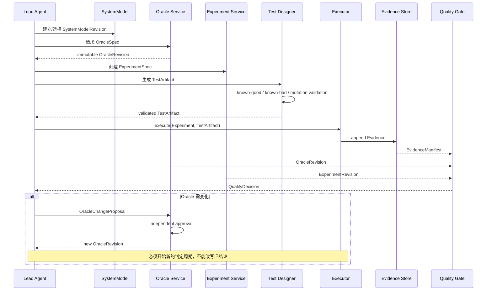
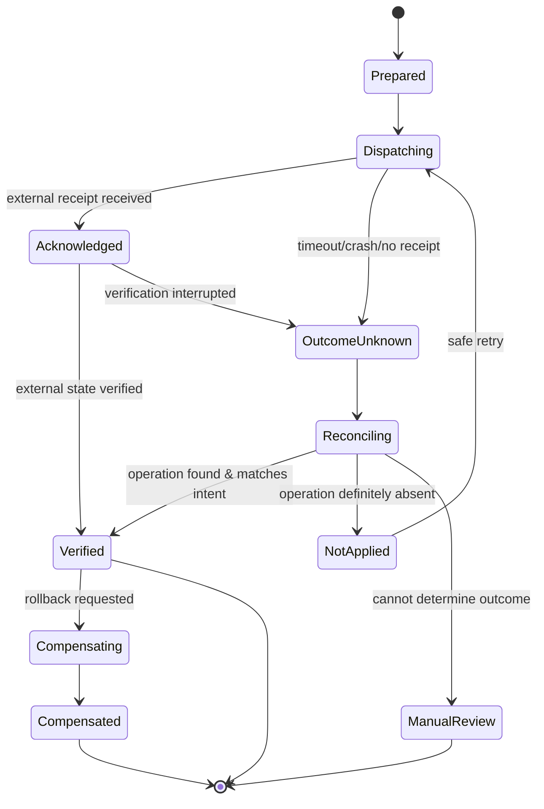
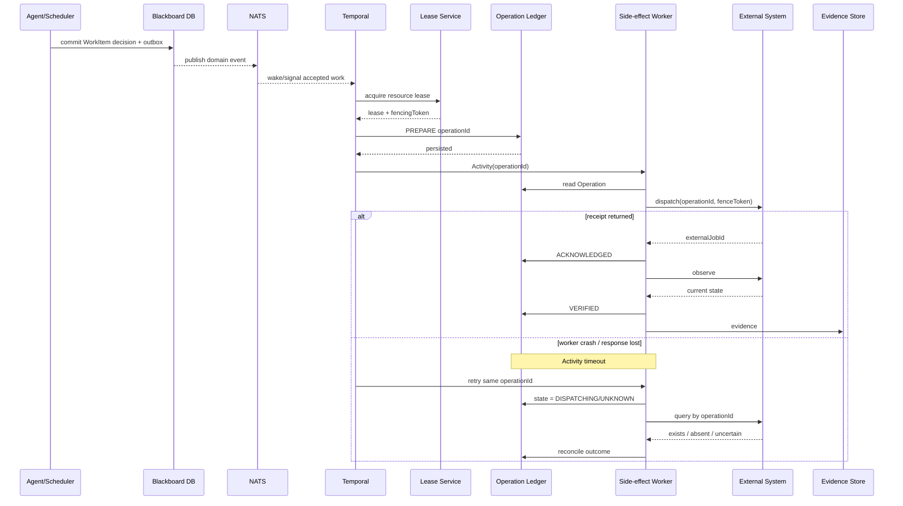
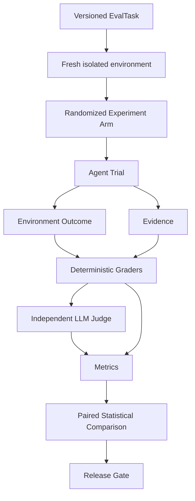

# Hypertest 自研测试开发 Agent 最终改进方案与工程设计草案

## 执行摘要

**研究基准日期：2026 年 9 月 21 日。**

结合你们当前 Hypertest 技术方案、Claude Code、Codex、Pi Agent、OpenCode、OpenHands、DeepSeek Harness、Hermes，以及 Temporal、NATS、OPA、OpenTelemetry 等基础设施的最新官方文档与源码，我的结论是：

> **Hypertest 当前方案的技术方向总体先进，尤其是 Multi-LLM、Dynamic Subagent、Blackboard/Event-driven、Temporal Durable Execution、L0–L5 Context、Evidence/BUGate 这些选择，明显不是“套一个 Coding Agent + MCP”的思路；但若按现有方案直接进入大规模实现，仍存在五个架构级缺口。**

你们现有设计已经把 Hypertest 定位为独立的 Evidence-driven Autonomous Testing Agent，并计划掌握 Runtime ABI、动态调度、Context、Evidence 与 BUGate，这是正确方向。fileciteturn0file0

截至当前，Agent 工程正在出现几个非常明确的趋势：

第一，**“Agent Runtime”正在从单个 ReAct loop 演化成可嵌入、可恢复、可版本化的运行时协议**。Codex 将核心能力通过 App Server 暴露为长生命周期、事件驱动的嵌入接口，而不是继续把 Agent 本身当成 MCP Server；OpenHands 则把 Agent SDK、Agent Server、Workspace/Runtime、Automation 分层；DeepSeek Harness 把 LLM、Subagent、Workflow、Agent Loop 都建模为独立 seam/plugin。citeturn0search5turn6search11turn11search0turn11search1turn19search5

第二，**多 Agent 已经从单纯“父 Agent 调多个 child”进入两种协作范式并存的阶段**。Claude Code 明确区分 Subagent 与 Agent Teams：前者上下文隔离、结果汇总到调用者；后者是多个独立 session、共享任务列表并支持 peer-to-peer 通信。DeepSeek Harness 也已经出现持久 mailbox 和 shared task board，但官方实现仍明确受限于单进程、共享 checkout、无自动释放 owner、无跨进程 exactly-once。citeturn21search0turn19search3turn19search4

第三，**模型切换的难点已经不再是“统一 API”，而是模型切换时上下文、provider-native continuation、缓存、工具语义和安全权限是否仍然成立**。OpenCode 当前的 Context Epoch 设计对此最明确：一个 epoch 的 baseline context 是不可变的；模型/provider 切换在安全的 provider-turn 边界生效；provider/model 不匹配时不能盲目复用 opaque continuation metadata。DeepSeek Harness 的 Pi adapter 也开始采用 immutable snapshot + per-operation resolution，确保一次请求不会在中途跨配置。citeturn7search7turn19search0

第四，**真正的 Agent 安全正在从 prompt instruction 转向独立于模型的 policy/sandbox/capability enforcement**。Claude 当前不仅在 Claude Code 中区分 hooks、permissions 和 Agent 能力，其 2026 年 Managed Agents 还进一步提供 `always_allow / always_ask / auto` 的逐工具权限策略，并把 Agent 配置做成带版本的资源；Codex 也明确把 sandbox 与 approval policy 当成不同控制面。citeturn21search0turn20search0turn20search8turn6search6

第五，也是 **Hypertest 与通用 Coding Agent 真正可以拉开差距的地方**：

> **下一代测试 Agent 的核心不应该只是“能够自主写测试和运行测试”，而必须能够证明：测试判定标准没有被 Agent 自己篡改、实验没有被并发任务污染、外部副作用没有因为恢复而重复执行、最终 Pass/Fail 可以沿证据链重放。**

这恰好是 Claude Code、Codex、DSH、Pi、OpenHands、Hermes 等通用 Agent 都不会替 Hypertest 完成的测试领域控制面。

因此，我建议对当前架构做五项关键修订：

| 当前设计方向 | 建议调整后的最终形态 | 优先级 |
|---|---|---|
| 选择性 Fork DSH，自有 Kernel ABI | **保留自有 ABI，但改为“Runtime Adapter + Surgical Fork”策略；默认 pin + adapter，只有无法通过公开 seam 实现的模块才 fork** | P0 |
| ContextSnapshot 作为共同上下文 ID | **升级为带 ReadSet、Environment Generation、Freshness Policy 的逻辑一致性契约** | P0 |
| Evidence + BUGate | **在两者之间增加 Testing Oracle / Experiment Validity / TestArtifact Governance** | P0 |
| Temporal + Lease + Idempotency | **增加 Operation Ledger、Fencing、Reconcile、Outcome Unknown 状态机** | P0 |
| Agent PoC / seeded defect | **升级为长期 Eval Platform，并严格区分 Model、Harness、Multi-Agent、Oracle、Recovery 各因素** | P0 |

最终推荐的架构核心应变成：



其中最关键的边界是：

**Agent Runtime 不拥有最终业务事实；LLM 不拥有最终业务事实；NATS 不拥有最终业务事实；Temporal 也不拥有测试业务事实。**

建议正式定义：

| 状态 | 唯一权威来源 |
|---|---|
| Agent / Workflow 执行生命周期 | Temporal |
| Finding / Hypothesis / CoverageGap / WorkItem | Blackboard / Domain DB |
| 外部副作用是否真实发生 | Operation Ledger + External Reconciliation |
| 测试判定标准 | OracleSpec |
| 测试环境与实验条件 | ExperimentSpec |
| 原始测试结果 | Evidence Store |
| 最终质量结论 | QualityDecision |
| 模型看到的世界 | ContextSnapshot，是上述事实的投影而非真相本身 |

这一调整，是我认为 Hypertest 从“先进 Agent 架构”进一步变成“专业测试 Agent 架构”的关键。

## 最新 Agent 进展与 Hypertest 架构判断

截至 2026 年 9 月，几类主流 Agent 已经形成相对清晰的分工。它们没有一个应该被 Hypertest 整体照搬，但每一个都有应该吸收的部分。

| 项目 | 当前最值得吸收的机制 | Hypertest 应学什么 | 不应直接照搬什么 |
|---|---|---|---|
| Claude Code | Subagent / Agent Team 分层；独立上下文；共享任务；peer messaging；Hooks/Skills/Permissions 明确分离 | 上下文隔离、Team 与 Subagent 双范式、确定性 guardrail | 不把 prompt rule 当权限边界 |
| Codex | 开源 CLI Core；App Server；thread start/resume/fork；sandbox/approval；subagent | Agent Runtime 应有稳定嵌入协议；session/thread 生命周期 | 不把 MCP 当 Agent Runtime API |
| DeepSeek Harness | Everything-is-plugin；LLM/Subagent/Workflow seams；Pi adapter | Runtime seam、Subagent Provider、组合式 Runtime | 不直接把实验性 Agent Team 当分布式调度器 |
| Pi | Provider abstraction；JSONL session tree；extension/tool interception；RPC | Multi-provider normalization、轻 Runtime、branch/session | 不让 extension 任意代码成为安全边界 |
| OpenCode | Context Epoch；模型切换与 provider-native metadata 边界；细粒度 permission | **Model switch contract** | 不把 provider compatibility 等同语义 compatibility |
| OpenHands | SDK / Agent Server / Workspace 分离；Event/View/Condenser；可恢复 ConversationState | 运行时与服务协议分层、Context View | 不把 Python 实现语言当复用障碍 |
| Hermes | isolated delegation；background delegate；steer/stop；memory→skill | 任务隔离、异步 delegation、经验技能闭环 | 不能让自生成 skill 未评测即影响发布决策 |

Claude Code 当前官方文档已经明确把 Skills、Subagents、Agent Teams、Hooks、MCP 定义成不同层次的能力：Subagent 使用独立 context 并向调用者返回摘要，而 Agent Teams 使用独立 session、共享任务和 peer-to-peer 消息；官方仍将 Agent Teams 标为 experimental。它还明确建议真正必须执行的 guardrail 放在 hooks，而不是仅写进 prompt。citeturn21search0

Codex 的一个特别值得 Hypertest 注意的变化，是 OpenAI 已经把 Codex 的产品嵌入边界放到 App Server：核心 Codex thread 作为长期对象运行并通过双向事件协议向客户端暴露；原 Codex MCP Server 已被移除，官方要求产品级嵌入迁移到 App Server，而 MCP 继续用于 Codex **消费外部工具**。这事实上印证了一个重要架构原则：**Tool Transport Protocol 与 Agent Runtime Protocol 不是同一件事。** citeturn0search5turn6search11

DeepSeek Harness 当前则是最适合作为 Hypertest 开源 Runtime 研究对象的项目之一。官方仍明确标记为 Developer Preview，并提醒存在 compatibility-breaking changes；另一方面，它已经提供 provider-neutral `LlmAdapter`、Pi-backed multi-provider adapter、Subagent seam 与 Workflow runtime。citeturn19search5turn19search2turn19search0

这两点放在一起意味着：

> **Hypertest 应拥有自己的 ABI，但“拥有 ABI”并不等于“必须长期维护一个大规模 DSH fork”。**

DSH 的 Agent Team 当前尤其能说明这个问题。它已有持久身份、mailbox 与 task board，但官方说明当前成员共享一个 checkout，不提供 worktree/merge/file lock；跨进程 mailbox exactly-once 并不成立；owner 失败或 idle 后不会自动释放任务。citeturn19search3turn19search4

因此 Hypertest 应复用其 **Agent runtime primitives**，而不能把它的实验性 Team 层当作 Hypertest 的生产级资源调度/协作层。

OpenCode 的 Context Epoch 是本次研究中最值得直接引入 Hypertest 设计的一项概念。它把一个上下文 epoch 的 baseline system context 视为不可变，并明确规定模型/provider 切换在 provider turn 边界发生；provider-native continuation metadata 只在兼容模型/provider 上投影，否则应退化到可移植的对话内容。citeturn7search7

Pi 则证明了 Agent Runtime 并不一定需要非常厚：其 Session 采用持久 JSONL 树，可 continue/resume/branch/compact；Extensions 可以监听生命周期、注册工具、拦截工具调用和参与 context compaction；RPC 模式还能把 AgentSession 用作无 UI 的嵌入运行时。citeturn8search3turn8search7turn8search9

OpenHands 当前更进一步把 Software Agent SDK 与 Agent Server 分开，Agent Server 通过 REST/WebSocket 管理 conversation/events/workspace；ConversationState 能基于持久事件重新构造 view。它的 benchmark 仓库甚至把 Software Agent SDK 以固定 commit submodule 的方式纳入评测环境，以避免 benchmark 与 Runtime 漂移。citeturn11search0turn11search1turn11search15turn17search0

Hermes 最新的 delegation 实现支持后台 child、查看、steer 和 stop；其 Skills 又明确承载“procedural memory/self-improvement”角色，并提供写入审批思路。Hypertest 很适合吸收这种“经验 → Candidate Skill → 审批/评测 → 发布”的路径，而不能让一次测试里的 Agent 经验直接污染长期测试标准。citeturn10search6turn1search10

基于这些变化，我建议 Hypertest 的最终分层不是“我们 Fork 哪个 Agent”，而是：

```text
                     Hypertest Product
                           │
               Hypertest Control Kernel
                           │
        ┌──────────────────┼──────────────────┐
        │                  │                  │
   Testing Domain      AgentEngine ABI   Governance
        │                  │                  │
 System/Oracle          DSH Adapter          BUGate
 Experiment             Pi Adapter           Policy
 Evidence               OpenHands Adapter    Budget
 Decision               Future Adapter       Audit
        │                  │                  │
        └──────────────────┼──────────────────┘
                           │
             Durable Side-effect Plane
        Temporal / Operation Ledger / Sandbox
```

这与当前方案相比不是降低自研程度，而是**把自研投入从通用 Agent plumbing 转向 Hypertest 真正具有长期壁垒的 Testing Control Plane。**

上游项目当前也没有替 Hypertest 明确定义以下能力，因此这些应明确标记为 **“上游未指定 / Hypertest 必须自主决策”**：

| 能力 | 上游状态 | Hypertest 决策 |
|---|---|---|
| 测试 Oracle 的权威来源与版本治理 | **未指定** | 自研 |
| Agent 是否允许修改导致当前失败的 assertion | **未指定** | 默认禁止自动批准 |
| ContextSnapshot freshness | OpenCode 有 Epoch，但没有 Hypertest 的实验世界 freshness | 自研 |
| 跨 Agent 的实验资源隔离 | DSH Team 当前共享 checkout | 自研 |
| 外部测试操作 fencing | **未指定** | 自研 |
| `outcome_unknown` 对账 | Temporal 提供 durability，但业务对账由应用承担 | 自研 |
| Evidence cryptographic lineage | **未指定** | 自研 |
| 测试结果与 QualityDecision 的强绑定 | **未指定** | 自研 |
| 多 Agent 的收敛条件 | 上游主要提供 orchestration primitives | 自研 |
| 跨模型语义兼容等级 | 各项目实现不同 | Hypertest Capability Matrix |

这就是下面四份设计草案的重点。

## Runtime 复用决策与版本策略

**目标**

建立 Hypertest 自己稳定、长期可演进的 Agent Runtime Contract，同时最大限度复用 DeepSeek Harness、Pi、OpenHands 等项目，而不让上游 Breaking Change、特定 Provider 或某个 Agent Framework 成为产品架构锁定点。

我建议把当前“选择性 Fork DeepSeek Harness”进一步收敛成：

> **Own the contract, reuse the engine, fork only the irreducible gap。**

即：**Hypertest 拥有 ABI、状态模型和行为契约；DSH 是首选 Engine 实现，但不是架构本身。**

DSH 当前仍处于 Developer Preview，这意味着不能依赖“未来 semver 一定兼容”；但其插件化架构和独立 LLM/Subagent/Workflow seam 又意味着很多能力实际上不必通过深 fork 才能复用。citeturn19search5turn19search2

### Runtime 分层



Codex App Server 与 OpenHands Agent Server 都证明了通过协议边界复用完整 Agent Runtime 的可行性；Hypertest 不应因为上游实现语言与自己不同，就默认移植内部所有代码。citeturn0search5turn11search0turn11search1

### 核心接口

建议第一版 ABI 固定在如下范围，不把 Blackboard、Oracle、QualityDecision 等测试领域对象暴露给具体 Agent Engine。

```ts
export interface AgentEngine {
  readonly capabilities: EngineCapabilities;

  createSession(req: CreateSessionRequest): Promise<EngineSessionRef>;

  runTurn(req: RunTurnRequest): Promise<RunTurnResult>;

  spawnChild(req: SpawnChildRequest): Promise<ChildRef>;

  resumeChild(req: ResumeChildRequest): Promise<RunTurnResult>;

  interrupt(req: InterruptRequest): Promise<void>;

  inspect(ref: EngineSessionRef): Promise<EngineSessionState>;

  dispose(ref: EngineSessionRef): Promise<void>;
}

export interface EngineCapabilities {
  providerSwitch: boolean;
  continuableChild: boolean;
  backgroundChild: boolean;
  peerMessaging: boolean;
  structuredOutput: boolean;
  sandboxProfiles: boolean;
  nativeCompaction: boolean;
  nativeComputerUse: boolean;
}
```

DSH 的 Subagent Runtime 本身就支持不同 child provider、one-shot 和 continuable-child 的思路，因此很适合成为该 ABI 的第一个实现来源；但 DSH-specific SessionId、Cordis service 或 TeamTaskId 不应穿透到 Hypertest domain schema。citeturn19search3

### Runtime Manifest 与版本钉死

每一次 `TestRun` 必须在创建时固定完整 Runtime BOM：

```ts
interface RuntimeManifest {
  manifestId: string; // SHA-256(canonical JSON)

  hypertest: {
    version: string;
    gitSha: string;
  };

  agentEngine: {
    kind: "dsh" | "pi" | "openhands" | "custom";
    version?: string;
    gitSha?: string;
    imageDigest?: string;
  };

  providerAdapters: Array<{
    provider: string;
    package: string;
    version: string;
  }>;

  schemas: {
    event: string;
    contextSnapshot: string;
    tool: string;
    operation: string;
    evidence: string;
  };

  policyBundleRevision: string;
  toolCatalogRevision: string;

  createdAt: string;
}
```

**运行中的 TestRun 默认不得自动升级 Runtime。**

版本状态建议为：

```text
candidate
   ↓ compatibility suite
shadow
   ↓ production replay
canary
   ↓ release gate
active
   ↓
retiring
   ↓
retired
```

这里可以直接借鉴 Anthropic 2026 Managed Agents 的思路：Agent config 是版本化对象，更新产生新版本，正在运行的 session 继续使用创建时的配置。citeturn20search8turn20search0

### Fork 决策门

建议不要在项目开始时一次性决定“Fork/不 Fork DSH”，而是在模块级执行 Gate。

| 条件 | 决策 |
|---|---|
| DSH public seam 完全覆盖需求 | Pin dependency + Adapter |
| 只需扩展 Tool/LLM/Subagent Provider | Plugin / Adapter |
| 需要稳定一个小模块但 upstream API 变化太快 | Vendor isolated package |
| 必须修改持久状态语义、安全边界或生命周期 | Surgical Fork |
| Fork 修改开始横跨大量无关 DSH package | 停止扩 fork，重做 Hypertest-native module |
| 上游能力只是 UI/CLI | 不 Fork，协议适配 |
| 测试领域逻辑 | 永远 Hypertest 自研 |

**建议门槛，属于 Hypertest 决策而非上游标准：** 如果一个 fork 需要长期追踪大量无关 upstream package，或者 Hypertest domain concept 开始进入 DSH internal state，应认为架构边界已经错误。

### Multi-LLM 与 Model Switch Contract

Hypertest 不应把：

```text
OpenAI API compatible
```

定义成：

```text
model semantics compatible
```

DSH 自身就通过 `LlmAdapter` 把 provider-neutral request 转换成具体 provider 请求；Pi-backed adapter 当前还能在请求开始前捕获完整 immutable configuration snapshot，确保运行中的请求不会受之后配置变化影响。citeturn19search2turn19search0

建议建立显式的：

```ts
interface ModelCapabilityProfile {
  routeId: string;
  provider: string;
  model: string;

  toolUse: boolean;
  parallelToolCalls: boolean;
  structuredOutput: "native" | "prompted" | "none";
  reasoning: "native" | "visible" | "opaque" | "none";
  images: boolean;
  computerUse: boolean;
  nativeSubagents: boolean;

  contextWindow: number;

  continuationCompatibilityClass: string;
  privacyClassesAllowed: string[];
}

interface ModelEpoch {
  epochId: string;
  previousEpochId?: string;

  route: string;
  capabilityProfileRevision: string;

  contextSnapshotId: string;

  switchReason:
    | "initial"
    | "policy"
    | "quality"
    | "rate_limit"
    | "cost"
    | "manual";

  startedAt: string;
}
```

**模型切换只能发生在 Safe Turn Boundary：**

```text
LLM response complete
      ↓
所有 tool call 已结算
      ↓
无 pending structured output
      ↓
ContextSnapshot 固化
      ↓
Permission/Profile re-check
      ↓
开始新的 ModelEpoch
```

不能出现：

```text
Model A:
  发出 deploy()
      ↓
中间 timeout
      ↓
Model B:
  在不知道 A continuation semantics 的情况下继续
```

OpenCode 当前的 Context Epoch 与 model/provider switch 正是这个方向：模型选择在新的 provider turn 生效；provider-native metadata 只有在兼容 route 上继续使用，否则必须降级到 provider-neutral history。citeturn7search7

Fallback 也必须 fail-closed：

```text
preferred model unavailable
          ↓
candidate fallback
          ↓
Capability check
          ↓
Data/Security check
          ↓
Tool compatibility check
          ↓
Quality floor check
          ↓
ALLOW / PAUSE
```

不能只因为“便宜模型还能返回文本”就继续执行高风险环境操作。

### ContextSnapshot 的最终语义

原方案中 `snapshotId` 的方向正确，但只做到“大家引用同一个 ID”还不够。

建议正式定义：

> **ContextSnapshot 是 Agent 在一个时间点对 Hypertest canonical world 的不可变逻辑投影；它不代表外部世界之后没有发生变化。**

```ts
interface ContextSnapshot {
  snapshotId: string;

  taskRunId: string;

  eventSeq: bigint;
  blackboardRevision: bigint;

  planRevision: number;

  runtimeManifestId: string;
  modelEpochId: string;

  systemModelRevision: string;
  oracleRevision: string;
  experimentRevision: string;
  policyRevision: string;

  environment: {
    environmentId: string;
    generation: bigint;
    buildDigest: string;
  };

  evidenceRootHash: string;

  readSet: Array<{
    resourceType: string;
    resourceId: string;
    observedVersion: string;
    observedAt: string;

    freshness:
      | { kind: "immutable" }
      | { kind: "exact_version" }
      | { kind: "max_age"; milliseconds: number };
  }>;

  createdAt: string;
}
```

于是，在执行具有副作用的操作前：

```ts
FreshnessGuard.validate(snapshot, proposedAction)
```

必须重新检查：

```text
build 是否还是同一 digest？
environment generation 是否变化？
Oracle 是否已经升级？
相关 Finding 是否已被撤销？
resource lease owner 是否变化？
指标数据是否已经超出允许时间窗口？
```

例如：

```text
git commit SHA
```

属于 immutable reference，可以长期使用；

而：

```text
当前 K8s deployment generation
```

应该在部署、故障注入等操作前进行 exact-version revalidation。

**这是 Hypertest 自研语义；Claude Code、DSH、OpenCode 等上游没有定义测试环境级 Freshness Contract，因此标记为“上游未指定 / Hypertest 决策”。**

### Blackboard、Event 与 Temporal 的职责边界

NATS JetStream 官方定义的是持久化的 **at-least-once** 消息交付：没有及时 ACK 的消息可以重新投递。它因此非常适合通知，但不能让消费一次事件等同于业务操作恰好执行一次。citeturn15view1

推荐：

```text
PostgreSQL Domain Transaction
    │
    ├─ mutate Blackboard
    └─ append Outbox
             │
             ▼
       NATS JetStream
             │
        duplicate possible
             ▼
       Inbox / dedupe
             │
             ▼
     Scheduler / Agent
```

Temporal 则只负责“决定执行之后，这件事如何可靠活下去”。Temporal 官方明确要求 Workflow 保持 deterministic，将 API、LLM 等 failure-prone/non-deterministic 工作放进 Activity。citeturn14view1

因此：

```text
Blackboard:
    What is true about collaboration?

Scheduler:
    What should happen next?

Temporal:
    How does the accepted work survive failure?

Operation Ledger:
    Did the external side effect actually happen?
```

四者不能合并成一个“大状态机”。

### 回滚与恢复

Runtime 发布失败时：

```text
停止给新 TestRun 分配 candidate manifest
        ↓
active pointer 切回上一 manifest
        ↓
已有 old-manifest TestRun 原地继续
        ↓
candidate runs 标记 quarantine
        ↓
重放 compatibility / golden suite
```

数据库 schema 必须采用 expand/contract；在 N 与 N-1 Runtime 都可能存在的窗口内禁止 destructive schema migration。

若必须迁移长期运行 TestRun，则显式执行：

```text
Checkpoint
→ Canonical ContextSnapshot
→ Operation reconciliation
→ 新 Runtime compatibility check
→ create new RuntimeEpoch
→ resume
```

禁止偷偷“原地热升级”一个正在测试中的 Agent。

### 验收标准

| 验收项 | 标准 |
|---|---|
| Runtime isolation | Hypertest domain 不 import DSH internal types |
| Engine interchangeability | 至少两个 Engine 实现通过同一 AgentEngine contract tests |
| Model switch | provider/model 切换只能发生 Safe Turn Boundary |
| Cross-model continuation | 不兼容 native metadata 不允许传播 |
| Run reproducibility | 任意 TestRun 可定位完整 RuntimeManifest |
| Upgrade | 新版本不影响已存在 run |
| Rollback | candidate 失败后不要求修改既有运行状态即可切回 |
| Context freshness | 所有 state-changing tool 必须通过 FreshnessGuard |
| Contract regression | ABI golden suite 100% 通过后才可 promotion |

### 工时与主要风险

预计 **14–20 人周**：ABI/DSH Adapter 约 4–6 人周，Model Contract/Router 约 3–4，人周，Runtime Manifest/版本控制 2–3，人周，Context Epoch/Freshness 3–4，人周，兼容性与 replay 测试 2–3 人周。这里是净工程工时，不是日历交付承诺。

主要风险是 DSH 快速变化导致 adapter 漂移、为了方便而让 DSH internal type 泄漏到 domain、不同模型 structured output/tool semantics 被误认为等价，以及 Runtime migration 与 domain migration 相互耦合。DSH 官方对当前 Developer Preview 的 breaking-change 警告意味着版本 pin 与 contract test 是硬要求，而不是工程洁癖。citeturn19search5

## 测试领域契约设计

这是我认为 **Hypertest 最需要从当前方案中提升优先级的部分**。

通用 Agent 擅长：

```text
理解代码
生成测试
调用工具
分析结果
```

但专业测试 Agent 必须多回答一个问题：

> **凭什么说这个系统是正确的？**

如果 Agent 自己：

```text
生成测试
→ 看到失败
→ 修改断言
→ 新测试通过
→ 宣布系统 Pass
```

那么 Evidence 即使全部真实，结论仍然可能完全错误。

因此建议正式把：

```text
SystemModel
OracleSpec
ExperimentSpec
TestArtifact
QualityDecision
```

从“辅助 metadata”提升为 **Hypertest 的核心领域 ABI**。

### 五个核心契约



### SystemModel

`SystemModel` 不是 README 摘要，而是一次质量决策所依赖的被测系统版本化模型。

```ts
interface SystemModel {
  systemModelId: string;
  revision: string;

  subject: {
    repoRefs: string[];
    commitDigests: string[];
    buildDigests: string[];
  };

  components: ComponentModel[];

  interfaces: InterfaceModel[];

  dependencies: DependencyEdge[];

  stateMachines: StateMachineModel[];

  invariants: InvariantRef[];

  dataAssets: DataAssetModel[];

  securityBoundaries: SecurityBoundary[];

  riskTags: string[];

  sources: ProvenanceRef[];

  createdAt: string;
}
```

它允许 Agent 回答：

```text
此次变更影响了哪个 component？
哪些状态转换可能被破坏？
哪些 API/UI/DB/消息链路形成同一业务事务？
哪些 invariant 应该跨层验证？
```

SystemModel 允许 Agent 自动提出测试假设，但不能凭空成为 Oracle 的权威来源。

### OracleSpec

这是 Hypertest 最重要的对象。

```ts
interface OracleSpec {
  oracleId: string;
  revision: string;

  systemModelRevision: string;

  scope: ScopeSpec;

  assertions: OracleAssertion[];

  authorities: Array<{
    sourceRef: string;
    authority:
      | "formal_spec"
      | "approved_requirement"
      | "business_rule"
      | "known_good_reference"
      | "differential_reference"
      | "expert_approved";
  }>;

  judgePolicy: {
    deterministicRequiredForCritical: boolean;
    allowLlmOnlyDecision: boolean;
    independentReviewerRequired: boolean;
  };

  changePolicy: {
    agentMayPropose: boolean;
    selfApprove: false;
    invalidatesPriorDecisions: boolean;
  };

  approvedBy: ActorRef[];
  approvedAt?: string;
}
```

建议把 Oracle 按强度分层：

| Oracle 类型 | 示例 | 最终 Gate 权重 |
|---|---|---|
| Deterministic invariant | 余额守恒、状态机不得非法跳转 | 最高 |
| Requirement assertion | API 必须返回指定业务状态 | 高 |
| Differential | 新旧实现/参考实现结果比较 | 高 |
| Metamorphic | 输入变换后必须保持某关系 | 中高 |
| Statistical | TPS、P99、错误率、稳定性 | 中高 |
| LLM semantic judge | UI 合理性、文本质量、复杂语义 | 辅助 |

Anthropic 的 Agent eval 实践同样建议尽量用 deterministic grader；LLM grader 更适合需要主观判断的维度，并应与人工判断持续校准。citeturn18view0

建议硬规则：

> **任何 P0/P1 质量 Gate 不允许仅由 LLM Judge 决定。**

以及更关键的一条：

> **执行当前测试的 Agent 可以提出 Oracle 修改，但不得批准一个会把“本次失败”变成“通过”的 OracleRevision。**

必须形成：

```text
failure
   ↓
OracleChangeProposal
   ↓
Independent Review / Human / Policy
   ↓
New Oracle Revision
   ↓
NEW experiment
```

而不是修改历史事实。

### ExperimentSpec

很多 Agent 测试方案容易只关注“运行了什么 test”，但真实系统测试还取决于**实验条件**。

```ts
interface ExperimentSpec {
  experimentId: string;
  revision: string;

  systemModelRevision: string;
  oracleRevision: string;

  hypothesis: string;

  subjects: Array<{
    role: "baseline" | "candidate" | "reference";
    buildDigest: string;
  }>;

  environment: {
    environmentClass: string;
    topologyRef: string;
    generation: bigint;
    dependencyDigests: string[];
  };

  fixtures: FixtureRef[];

  workload?: WorkloadSpec;
  faultPlan?: FaultSpec[];

  randomSeeds: string[];

  isolation: {
    mode:
      | "shared_readonly"
      | "exclusive_write"
      | "dedicated_environment";
    resourceClaims: ResourceClaim[];
  };

  budget: BudgetEnvelope;

  evidenceRequirements: EvidenceRequirement[];

  stopConditions: StopCondition[];

  contaminationRules: ContaminationRule[];
}
```

这让 Hypertest 能区分：

```text
产品性能回归
```

和：

```text
另一 Agent 同时在这个 namespace 做故障注入
```

否则再精确的 Prometheus Evidence 也没有实验效度。

### TestArtifact

测试用例不应该只是 repository 中的一段代码。

它本身需要 provenance：

```ts
interface TestArtifact {
  artifactId: string;
  revision: string;

  artifactDigest: string;

  sourceType:
    | "existing"
    | "generated"
    | "repaired"
    | "mutated";

  generatedBy?: {
    agentId: string;
    modelEpochId: string;
    contextSnapshotId: string;
  };

  systemModelRevision: string;
  oracleRevision: string;
  experimentRevision: string;

  runner: RunnerSpec;

  validations: {
    knownGood?: TestValidation;
    knownBad?: TestValidation;
    mutationScore?: number;
  };

  supersedes?: string;

  approvalState:
    | "draft"
    | "validated"
    | "approved"
    | "quarantined"
    | "retired";
}
```

其生命周期应是：

```text
Generated
    ↓
syntax / static validation
    ↓
Known-good should pass
    ↓
Known-bad / mutation should fail
    ↓
Oracle consistency review
    ↓
Eligible TestArtifact
```

这一步尤其重要，因为：

> **“Agent 写出了一个能跑通的测试”与“Agent 写出了一个有缺陷检出能力的测试”完全不是同一件事。**

例如生成：

```python
assert response.status_code == 200
```

并不能证明业务转账语义正确。

对于自动生成的重要测试，可以要求至少一个：

```text
seeded defect
mutation
differential oracle
metamorphic perturbation
```

证明它具有 sensitivity。

### QualityDecision

最终报告不应让 Agent 自己自由写一个“Pass”。

```ts
interface QualityDecision {
  decisionId: string;
  revision: string;

  scope: ScopeSpec;

  verdict:
    | "pass"
    | "fail"
    | "conditional"
    | "inconclusive";

  systemModelRevision: string;
  oracleRevision: string;
  experimentRevisions: string[];

  evidenceRootHash: string;

  satisfiedCriteria: CriterionResult[];
  violatedCriteria: CriterionResult[];

  unresolvedRisks: RiskRef[];

  exceptions: ApprovedException[];

  reviewerDecisions: ReviewerDecision[];

  runtimeManifestId: string;

  signedAt: string;
  supersedes?: string;
}
```

特别建议增加：

```text
inconclusive
```

状态。

真实自主测试 Agent 最危险的不是 Fail，而是在数据不足时为了完成任务强行给 Pass。

### Test Judge 与自愈治理

自愈能力必须被细分：

| 修改类型 | 是否允许自动执行 | 要求 |
|---|---:|---|
| UI locator | 是 | 保持原 Oracle，保留前后证据 |
| 测试环境准备 | 是 | 不改变被测系统语义 |
| Fixture 失效修复 | 有条件 | 验证 fixture 不改变 Oracle |
| Test implementation bug | 有条件 | Known-good + known-bad 重新验证 |
| 超时参数 | 有条件 | 不得掩盖性能 Oracle |
| Assertion | **否，默认需审批** | 新 OracleRevision |
| 性能阈值 | **否** | 独立批准 |
| 产品代码 | 按 BUGate 权限 | 新 build + 全新 Experiment |
| 删除失败测试 | **否** | 需要显式治理 |

Claude 当前官方文档强调：prompt instruction 不是确定性安全边界，需要保证执行的规则应使用 hooks/policy 等外部机制。这一原则完全适用于测试 Oracle：不能只在 System Prompt 写一句“不要随便改 assertion”。citeturn21search0

### Evidence 的不可篡改性

建议把“不可篡改 Evidence”更准确地定义成：

> **Tamper-resistant storage + cryptographically tamper-evident lineage。**

因为如果同一个超级管理员同时控制数据库、对象存储和签名根密钥，绝对意义上的“不可篡改”无法只靠应用架构保证。

Evidence Envelope：

```ts
interface EvidenceEnvelope {
  evidenceId: string;

  artifactUri: string;
  artifactSha256: string;

  metadataHash: string;

  previousRecordHash?: string;
  recordHash: string;

  traceId: string;

  taskRunId: string;
  workItemId?: string;
  operationId?: string;

  producer: {
    agentId?: string;
    workerId: string;
    imageDigest: string;
    runtimeManifestId: string;
  };

  capturedAt: string;

  signature: {
    keyId: string;
    algorithm: string;
    value: string;
  };
}
```

计算：

```text
recordHash =
  SHA256(
    canonical(metadata)
    || artifactSha256
    || previousRecordHash
  )
```

建议周期性建立：

```text
Evidence records
      ↓
Merkle root
      ↓
KMS/HSM signature
      ↓
Decision / Report
```

Artifact 则进入支持 WORM retention 的对象存储。例如 Amazon S3 Object Lock 官方明确提供 WORM 模式；在 Compliance mode 下，受保护版本在 retention 期间甚至不能由账户 root 覆盖或删除。citeturn16search0

但签名服务与 evidence writer 应角色分离：

```text
Agent:
  无 Evidence delete 权限

Worker:
  只有 append evidence 权限

Evidence Service:
  写 metadata

Signer:
  独立 KMS identity

Reporter:
  只有 read/reference 权限
```

最终报告中的关键 claim 应是：

```text
Claim
  ↓ references
Evidence Query
  ↓
Evidence Set
  ↓ hashes to
EvidenceRoot
  ↓
QualityDecision
```

### Oracle 与实验流程



### 回滚与恢复

领域对象均采用 immutable revision：

```text
SystemModel v5
不是 update v4
而是 supersedes v4
```

同理：

```text
OracleSpec v7
TestArtifact v13
QualityDecision v3
```

Oracle 误配置后不能数据库 `UPDATE` 历史规则，而是：

```text
Oracle v2 declared invalid
         ↓
Oracle v3 approved
         ↓
查找所有基于 v2 的 QualityDecision
         ↓
mark needs_reassessment
         ↓
重新执行/重新判定
```

TestArtifact 修复也不能覆盖原失败 Artifact；旧 Artifact 与 Evidence 保持可审计。

### 验收标准

| 验收项 | 标准 |
|---|---|
| Domain completeness | 所有最终 QualityDecision 都能定位五个核心 contract revision |
| Oracle governance | Agent 无法自批准 Oracle/threshold 修改 |
| Critical gate | P0/P1 不允许 LLM-only Oracle |
| Self-healing | Assertion/threshold change 自动流程必须被拒绝 |
| Test validity | 关键自动生成测试需至少有一项 sensitivity validation |
| Experiment validity | 并发写实验必须有 isolation/resource claims |
| Evidence | 所有 Critical claim 有 EvidenceRef |
| Provenance | Report → Decision → Evidence → Tool/Operation → Environment 可追踪 |
| Unknown handling | Evidence 不足必须产生 `inconclusive`，不能默认 Pass |
| Revision safety | 所有 Domain Contract history append-only |

### 工时与主要风险

预计 **16–22 人周**：领域 schema 与服务 4–5 人周，Oracle/Gate governance 4–6，人周，TestArtifact validation/mutation 3–4，人周，Evidence/Decision integration 3–4，人周，API/UI/迁移测试 2–3 人周。

最大风险不是代码量，而是 **Oracle Poisoning**：让 Agent 从被测代码本身推断“正确行为”，形成“代码说自己是对的”的循环；第二风险是过度设计统一 SystemModel，使实际项目接入成本过高。因此第一版应允许部分模型为 optional，但 `OracleSpec + ExperimentSpec + QualityDecision` 不应 optional。

## 副作用恢复、幂等与对账协议

这是现方案可靠性层最值得补强的地方。

Temporal 很适合 Hypertest，但必须明确：

> **Temporal 保证 durable orchestration，不会替 Hypertest 保证外部世界 exactly-once。**

Temporal 官方文档对此非常明确：Activity 成功完成、但 Worker 在把结果通知给 Temporal 前崩溃时，该 Activity 会再次执行；官方因此建议 Activity 设计为幂等，并指出 idempotency key 必须由被调用的服务实际执行去重。Temporal 建议可使用 Workflow Run ID 与 Activity ID 组合出稳定 key。citeturn14view0

这与 Hypertest 高度相关：

```text
start Frigate load test
deploy build
inject network fault
create Kubernetes namespace
truncate test DB
send transaction
restart service
```

这些都不能依靠：

```text
Temporal retry
```

直接得到 exactly-once。

### Operation Ledger

所有产生外部副作用的工具统一进入 Operation Protocol：

```ts
interface OperationRecord {
  operationId: string;

  taskRunId: string;
  workItemId: string;

  operationType: string;

  target: ResourceRef;

  desiredStateHash: string;
  inputHash: string;

  idempotencyKey: string;

  lease: {
    leaseId: string;
    resourceKey: string;
    fencingToken: bigint;
  };

  status:
    | "prepared"
    | "dispatching"
    | "acknowledged"
    | "verified"
    | "not_applied"
    | "outcome_unknown"
    | "reconciling"
    | "compensating"
    | "compensated"
    | "manual_review"
    | "failed";

  externalJobId?: string;
  externalReceipt?: string;

  attempt: number;

  evidenceRefs: string[];

  createdAt: string;
  updatedAt: string;
}
```

`operationId` 一旦创建，在 Temporal retry、Worker crash、Agent resume 后都必须保持稳定。

推荐生成方式：

```text
operationId =
  UUID generated once
```

随后持久化；而不是每个 retry 重新生成。

对于能够接受 client ID 的外部系统：

```text
idempotencyKey = operationId
```

直接传递给目标。

对于 K8s Job、压测任务等可以命名的资源：

```text
hypertest-operation-id=<operationId>
```

写入 label/annotation/name。

### Fencing

Lease 本身仍然不足。

典型问题：

```text
Worker A 获得 lease(token=17)
       ↓
A 网络卡死
       ↓
lease 过期
       ↓
Worker B 获得 token=18
       ↓
A 恢复并继续执行旧命令
```

这时单纯检查 TTL 已经来不及。

因此每次获得一个资源的写租约，都必须得到**单调递增 fencing token**：

```ts
interface ResourceLease {
  resourceKey: string;
  leaseId: string;

  owner: string;

  fencingToken: bigint;

  expiresAt: string;
}
```

具有副作用的 Adapter 必须携带：

```text
fence = 18
```

目标侧或统一 Side-effect Gateway 只接受：

```text
token >= currentAcceptedToken
```

从而拒绝恢复后的 stale Worker 17。

这是 Hypertest 自定义协议；所调研 Agent Harness 并未为测试环境资源定义该语义，属于 **“上游未指定 / Hypertest 必须实现”**。

### Outcome Unknown

这是整个恢复设计最重要的状态。

考虑：

```text
Worker
   │ start_load_test()
   ▼
Frigate
   │ job actually started
   ▼
Worker crash
```

Hypertest 此时不能把状态叫：

```text
failed
```

因为真实结果不是失败，而是：

```text
unknown
```

恢复流程：



Temporal retry 发生时 Activity 的第一步不是“再执行”，而应该是：

```ts
switch (operation.status) {
  case "verified":
    return cachedResult;

  case "prepared":
  case "not_applied":
    return dispatch();

  case "dispatching":
  case "acknowledged":
  case "outcome_unknown":
    return reconcile();

  default:
    ...
}
```

Temporal 官方也说明 Activity 可能执行多次，尤其存在“动作已经成功但成功结果没有提交到 server”的边缘情况，因此这种 reconciliation 不是过度设计。citeturn14view0

### Adapter 需要实现的协议

每一个 destructive/external adapter 需要明确能力：

```ts
interface SideEffectAdapter<Input, Observation> {
  prepare(
    op: OperationContext,
    input: Input
  ): Promise<PreparedOperation>;

  dispatch(
    prepared: PreparedOperation
  ): Promise<DispatchReceipt>;

  observe(
    op: OperationContext
  ): Promise<ObservationResult<Observation>>;

  verify(
    observation: Observation,
    desiredStateHash: string
  ): Promise<VerificationResult>;

  compensate?(
    op: OperationContext
  ): Promise<CompensationResult>;
}
```

Adapter 还应声明：

```ts
interface SideEffectCapabilities {
  supportsNativeIdempotency: boolean;
  supportsExternalLookupByOperationId: boolean;
  supportsFencing: boolean;
  supportsCompensation: boolean;
  reconciliationClass:
    | "deterministic"
    | "best_effort"
    | "non_reconcilable";
}
```

如果一个动作是：

```text
NON_RECONCILABLE
```

并且具有高风险，那么默认：

```text
禁止自动 retry
→ needs approval/manual reconciliation
```

不能因为 Temporal 默认 Activity 会 retry 就重做。

### Temporal、Blackboard、NATS 与 Operation Ledger

建议将整个链路固定为：



NATS JetStream 是 at-least-once，因此 `eventId` 必须经过 Inbox dedupe；NATS message 重投不能产生新 `operationId`。citeturn15view1

### 并发实验隔离

建议增加一等公民：

```ts
interface ResourceClaim {
  resourceKey: string;

  mode:
    | "read_shared"
    | "write_exclusive"
    | "fault_exclusive";

  quantity?: number;
}

interface IsolationPlan {
  claims: ResourceClaim[];

  dedicatedNamespace?: boolean;
  dedicatedDatabase?: boolean;
  dedicatedAccount?: boolean;

  contaminationChecks: ContaminationCheck[];
}
```

资源 key 可以分层：

```text
cluster/prod-test
cluster/prod-test/ns/run-123
service/payment
database/orders
account/test-wallet-pool
network/fault-domain-A
loadgen/frigate-01
```

例如：

```text
Metrics Agent
  → read_shared(service/payment)

Load Test
  → write_exclusive(loadgen/frigate-01)

Fault Injection
  → fault_exclusive(service/payment)
```

Scheduler 必须在创建 Experiment 前原子完成 Admission。

这解决的不是简单的“两个 Agent 编辑同一个文件”，而是：

> **两个完全合法的测试是否会让彼此实验结果失效。**

DSH 当前实验性 Agent Team 仍共享 checkout，并明确不提供 worktree/filesystem lock；这进一步说明实验隔离必须位于 Hypertest 自己的 Resource Plane，而不是寄希望于 Agent Team。citeturn19search4

### Budget 也是资源租约

建议统一管理：

```ts
interface BudgetEnvelope {
  maxWallClockMs: number;

  maxAgentConcurrency: number;

  maxModelTokens: number;
  maxModelCost?: number;

  maxToolCalls: number;

  maxComputeMinutes?: number;

  maxExternalQps?: number;

  maxArtifactBytes?: number;
}
```

Subagent spawn、压测启动、昂贵模型 route 都先：

```text
reserve
  ↓
execute
  ↓
settle actual usage
```

预算耗尽不能：

```text
静默切换到一个不符合质量要求的便宜模型
```

而应该：

```text
PAUSED_BUDGET
CONDITIONAL_STOP
NEEDS_APPROVAL
```

由策略决定。

### 安全与权限边界

建议 Capability Token 不是“Agent Role = admin”。

```ts
interface ActionCapability {
  subjectAgentId: string;
  workItemId: string;

  tool: string;

  resourceScopes: string[];

  allowedEffects: string[];

  credentialScopes: string[];

  maxRiskClass: string;

  expiresAt: string;
}
```

Child Agent 权限必须是：

```text
child capability
=
parent capability
∩ role policy
∩ WorkItem requirements
∩ Environment policy
```

绝不能 privilege amplification。

Claude 当前已经把 permission policy 做成每工具的显式 allow/ask/deny/auto 机制，并在事件中记录权限评估结果；这很值得 Hypertest借鉴，但 Hypertest 最终权限仍应该在独立 policy service 中执行，而不是交给任何一个 LLM provider。citeturn20search0

OPA 很适合作为低层 policy evaluator，其 Decision Logs 可以记录 policy query、input、bundle metadata 和 `decision_id`，方便之后重放权限决策。citeturn16search7

### 审计关联

所有系统统一传播：

```text
traceId
taskRunId
planRevision
workItemId
agentId
modelEpochId
contextSnapshotId
operationId
evidenceId
qualityDecisionId
policyDecisionId
```

OpenTelemetry 已经提供 spans、metrics、logs、events 的统一 semantic conventions，也定义了日志中的 trace/span 关联，因此适合做 Hypertest 的跨进程 correlation 层。citeturn16search2turn16search13

注意：

> OTel 是 observability，不是 Evidence truth store。

Trace 可以辅助取证，但发布 Gate 所引用的重要 Evidence 仍需进入独立 Evidence Ledger。

### 回滚与恢复步骤

标准恢复 runbook：

| 检测到的 Operation 状态 | 恢复动作 |
|---|---|
| `verified` | 返回已记录结果，绝不重复 |
| `prepared` | 校验 lease/fence 后首次 dispatch |
| `dispatching` | 进入 `outcome_unknown`，先 reconcile |
| `acknowledged` | 根据 externalJobId attach/observe |
| external 已存在且匹配 operationId | attach，不重新创建 |
| external 明确不存在 | `not_applied`，允许安全 retry |
| external 状态无法确定 | `manual_review`，禁止 destructive retry |
| fence 已过期 | stale Worker 立即停止 |
| compensation 失败 | 保留原 operation，单独启动 compensation operation |
| Runtime crash | Temporal resume；Operation Ledger 决定副作用状态 |

要特别避免：

```text
失败
→ rollback
```

直接等价。

只有**已经确定原动作发生**后才谈 compensation。`outcome_unknown` 期间不能同时“再执行一次”和“回滚一次”。

### 验收标准

建议建立专门 Chaos Suite：

| 注入故障 | 必须结果 |
|---|---|
| external 成功后、Operation ACK 前 kill Worker | 不产生第二份资源 |
| ACK 后、Evidence 前 kill Worker | attach 原任务并补证据 |
| Lease 过期后旧 Worker 恢复 | fencing 100% 拒绝旧写 |
| NATS duplicate | 不产生重复 Operation |
| Temporal Activity retry | operationId 不变 |
| Runtime restart | external job 不孤儿化 |
| 网络 timeout | 进入 `outcome_unknown` 而非直接 `failed` |
| target 不可查询 | 高风险操作不得盲 retry |
| 两个 fault experiment 抢同一 service | Admission 拒绝一个 |
| Budget exhaustion | 不静默降级权限或质量 |

P0 验收建议值：

```text
重复 destructive side effect：0
已知 stale-fence 写成功：0
可查询外部任务的 orphan rate：0
recovery 后证据断链：0
```

这些是 Hypertest 设计目标，而非 Temporal/NATS 的产品保证。

### 工时与主要风险

预计 **19–26 人周**：Operation Ledger/Adapter contract 5–7，人周，Lease/Fencing 4–5，人周，Reconciliation 4–6，人周，Temporal integration 3–4，人周，Chaos/Failure Injection 3–4 人周。

最大工程风险是部分已有工具无法提供查询/幂等/标签机制。对于这些工具，必须通过 Hypertest Side-effect Gateway 封装，或者明确降级为 `non_reconcilable`；不能为了“统一工具接口”虚构 exactly-once 能力。

## Agent 评测基准与对比实验设计

Hypertest 的 Eval 不应该只是：

```text
能否发现 seeded defect
```

也不能把：

```text
PlanRevision >= 2
启动了 5 个 Agent
使用了 3 个模型
```

当成产品质量指标。

这些只能验证机制存在。

真正的产品问题应该是：

> **相比单 Agent 和通用 Agent，在相同或可解释的成本下，Hypertest 是否发现更多真实问题、少错误放行、少产生副作用事故，并能稳定复现这些结果？**

Anthropic 2026 年 Agent eval 方法明确区分 **transcript** 与 **outcome**：Agent 可以声称自己完成了任务，但环境最终状态才是真正 outcome；同时强调评估的是 **model + agent harness 的组合**，并建议针对随机 Agent 行为运行多次 trial。citeturn18view0

这对 Hypertest 非常关键。

### Eval 数据模型

```ts
interface EvalTask {
  taskId: string;
  suiteRevision: string;

  systemFixture: string;
  environmentImageDigest: string;

  userGoal: string;

  hiddenFaults: HiddenFault[];

  allowedTools: string[];

  oracle: EvalOracle;

  expectedOutcomes: ExpectedOutcome[];

  safetyConstraints: SafetyConstraint[];

  maxBudget: BudgetEnvelope;
}

interface EvalTrial {
  taskId: string;

  harness: string;
  runtimeManifestId: string;
  modelRoutes: string[];

  seed: string;

  result: "pass" | "fail" | "infra_error";

  outcomeMetrics: Record<string, number>;
  trajectoryMetrics: Record<string, number>;

  evidenceRootHash: string;
}
```

### 评测套件

建议不要只使用公开 Coding Benchmark，而是采用三层结构。

**通用 Agent sanity 层**

SWE-bench / SWE-bench Pro、Terminal 类任务，用于验证代码读取、编辑、shell/tool 能力没有明显退化。OpenHands 当前的官方 benchmark repo 已覆盖 SWE-Bench、SWE-Bench Pro、GAIA、Commit0、OpenAgentSafety 等，而且通过固定 Agent SDK commit 来保持评测环境可复现，这种版本 pin 方法值得直接采用。citeturn17search0

公开 Coding Benchmark 不应该成为 Hypertest 的主 KPI，因为 Hypertest 的产品价值是**测试和质量判断**，不是 issue resolution。

**Hypertest Core Eval 层**

建议如下：

| Suite | 主要测什么 | Ground truth |
|---|---|---|
| DefectDiscovery | 白盒真实缺陷发现 | seeded bug / historical bug |
| TestGeneration | 自动生成测试是否真正有效 | known-good/known-bad |
| OracleRobustness | Agent 是否错误修改 assertion | hidden immutable oracle |
| API/UI Blackbox | 黑盒业务行为 | backend state / deterministic checker |
| Performance | TPS/P99/资源瓶颈 | fixed workload + metrics |
| FaultTolerance | 故障注入与恢复 | controlled fault + invariant |
| Recovery | Hypertest 自身 crash | operation ground truth |
| ContextFreshness | stale snapshot 是否导致错误动作 | environment generation |
| ModelSwitch | 切模型后是否出现语义断裂 | expected operation/result |
| Security | prompt injection / secret / unauthorized action | policy event + target state |
| Evidence | 证据链是否完整 | independent verifier |
| MultiAgent | 多 Agent 是否产生真实增益 | paired single-agent trial |

**客户/项目私有层**

历史真实 Bug、线上事故、回归问题、业务规则、真实发布 Gate。

这一层不能泄漏到 Agent 长期 memory，否则会产生 benchmark contamination。

### 对比实验不能只有“Hypertest vs Claude Code”

建议拆成两个实验族。

**受控因果实验**

固定同一个可用模型、同样工具权限、同样环境和预算，比较：

```text
H0  Hypertest single-agent
H1  H0 + specialized subagents
H2  H1 + dynamic scheduler
H3  H2 + Blackboard/event-driven
H4  H3 + Context Freshness
H5  H4 + Oracle Governance
H6  Full Hypertest
```

这样可以回答：

```text
Blackboard 到底带来了多少增益？
Dynamic Scheduler 是否只增加了 token？
独立 Reviewer 是否降低 false release？
Context freshness 是否真的减少事故？
```

**Frontier 产品基准**

分别按产品最佳实践运行：

```text
Claude Code
Codex
OpenHands
DeepSeek Harness baseline
OpenCode/Pi-based baseline
Hypertest
```

这一层不是因果比较，因为不同产品可能使用不同默认模型和私有 harness；其意义是回答：

> “用户直接拿成熟通用 Agent + 同样测试工具，效果是否已经足够好？”

Claude Code 当前拥有 Subagents、Agent Teams、worktree/isolated context 等成熟功能；Codex 当前也具备 subagent 和 App Server 等完整 agent runtime 能力，因此二者应作为强产品 benchmark，而不是只作为灵感来源。citeturn21search0turn6search7turn0search5

### Trial 设计

Anthropic 建议由于 Agent 非确定性，同一任务需要多个 trial，并区分 `pass@k` 与 `pass^k`：前者衡量“多次尝试至少成功一次”，后者衡量“连续多次都成功”，后者对生产可靠性尤其重要。citeturn18view0

建议 Hypertest：

| Eval 层 | Task 数 | 每任务 trial | 使用场景 |
|---|---:|---:|---|
| PR Smoke | 20–30 | 1–3 | 每次 Runtime 改动 |
| Release Core | 50–80 | 5 | Runtime/Model 发布 |
| Deep Suite | 100–200+ | 5–10 | 月度/重大架构变更 |
| Failure Recovery | 20+ fault scenarios | 10+ | Durable/Safety 发布 |

任务数属于建议初值，**需结合预算决策**。Anthropic 也指出早期 20–50 个真实任务就可以产生有价值的评测信号，而成熟系统应逐渐扩张 suite。citeturn18view0

### 核心指标

最重要的指标不是“任务完成率”，而是下面这组。

| 指标 | 定义 | 重要性 |
|---|---|---:|
| Critical False Release Rate | 存在关键缺陷却给 Pass | **最高** |
| Defect Recall | 已知真实缺陷被识别比例 | **最高** |
| False Positive Rate | 无缺陷却判 Fail | 高 |
| Independent Reproduction Rate | Finding 可被独立 Agent/runner 复现 | 高 |
| Oracle Sensitivity | 测试对 seeded/mutated defect 的检出能力 | 高 |
| Evidence Completeness | 关键 claim 可追溯比例 | 高 |
| Recovery Correctness | crash 后状态恢复正确比例 | 高 |
| Duplicate Side-effect Rate | 恢复产生重复副作用 | **必须为 0** |
| Orphan Operation Rate | 外部 job 无法被 Hypertest 接管 | 高 |
| Policy Violation Rate | 越权操作实际执行 | **必须接近 0/目标 0** |
| Stale-context Action Rate | 使用过期 state 执行 mutation | 高 |
| Cost / Confirmed Defect | 每确认缺陷总费用 | 中高 |
| Time to Evidence | 得到第一个可行动证据耗时 | 中 |
| Human Intervention | 需要人工介入次数 | 中 |
| pass¹/pass³/pass⁵ | 单次和稳定可靠性 | 高 |

`PlanRevision`、Subagent count、tokens、tool calls 等保留为解释指标，而不是最终成功指标。

### Outcome Grader 优先

评估顺序建议：

```text
Environment state checker
        ↓
Deterministic test/oracle
        ↓
Evidence consistency
        ↓
Static analysis
        ↓
LLM rubric
        ↓
Human audit sample
```

Anthropic 的现行评测建议也是优先检查 outcome，而不是强制 Agent 必须走某一条预期 tool trajectory，因为优秀 Agent 可能找到设计者没有预料到但正确的路径。citeturn18view0

因此不要写 Eval：

```text
Agent 必须先调用 git diff
再调用 grep
再启动两个 subagent
```

而应检查：

```text
是否识别真实缺陷？
是否没有破坏正常功能？
是否遵守权限？
是否给出了真实证据？
```

### LLM Judge 的治理

Judge 需要和生产 Agent 分离：

```text
Executor model
      ↓
raw outcome/evidence
      ↓
Deterministic graders
      ↓
Independent Judge route
      ↓
human calibration sample
```

Judge 不能只看 Executor 最后的文字总结。

同时建议让 Judge 支持：

```text
unknown
```

而非强制二选一。Anthropic 当前明确建议在信息不足时给 LLM grader 留出 Unknown 路径，并要求 LLM grader 与专家判断校准。citeturn18view0

### 隔离与防 benchmark 污染

每个 Trial：

```text
fresh repo/worktree
fresh database fixture
fresh namespace/container
fixed image digest
fixed model ID
fixed RuntimeManifest
fixed Tool Catalog
fixed Oracle revision
```

默认不共享长期 memory。

若需要评估自学习，则建立两个 track：

```text
COLD TRACK
无跨任务 memory

LEARNING TRACK
允许 approved experience/skills
```

绝不能让同一个 benchmark 先被 Agent 写入 memory，后面再声称能力提高。

Anthropic 也强调评测 run 应从 clean environment 开始，避免前一个 trial 的文件、cache 或 git history 泄漏到后一个 trial，造成虚假的性能提升或相关失败。citeturn18view0

### Benchmark 流程



### 发布 Gate

建议 Runtime 或模型升级至少满足：

```text
Critical False Release Rate 不恶化
Defect Recall 不显著下降
Security violation = 0
Duplicate side effect = 0
Evidence completeness = 100% for critical decisions
```

成本提升可接受与否属于产品预算，**未指定/需决策**。

统计上应采用 paired task/seed 比较，并同时报告置信区间，而不是只看：

```text
78% → 80%
```

这种单点数字。

对于二元 paired outcome 可以使用 McNemar 类比较；成本/耗时等长尾指标可以使用 paired bootstrap 或非参数检验。这属于 Hypertest 评测实现建议。

### 回滚与恢复

Eval Suite 本身也必须版本化：

```text
Suite v14
Grader v8
Oracle v6
Environment v17
```

如果 grader 有 bug：

```text
不要修改 v8
      ↓
发布 v9
      ↓
在 bridge dataset 上同时跑 v8/v9
      ↓
建立 score mapping / declare discontinuity
```

否则历史趋势图会变成不可解释。

Runtime rollout 出现 Eval regression 时：

```text
candidate Runtime blocked
→ previous active remains active
→ collect failing transcripts/evidence
→ classify model/runtime/eval infra
→ fix
→ replay same task/seed
```

### 验收标准

| 验收项 | 要求 |
|---|---|
| Reproducibility | 每个 Trial 固定 Runtime/Model/Env/Oracle revision |
| Ground truth | 每个核心 task 有 reference solution/known outcome |
| Multi-trial | Release suite 对 stochastic tasks 多次执行 |
| Fair comparison | 受控实验使用 paired task/seed/budget |
| Harness vs model | 报告中不能把 harness 提升归因给 model，反之亦然 |
| Outcome | 结果评价不能只读 final answer |
| Judge | LLM Judge 定期与专家校准 |
| Isolation | 默认每个 trial fresh environment |
| Memory leakage | Cold Track 不允许跨 task experience |
| Critical safety | 权限越权与重复 destructive effect 目标为 0 |
| Historical comparability | grader/suite revision 不覆盖历史数据 |
| Traceability | Score 可追溯到 Trial → Evidence → RuntimeManifest |

### 工时与主要风险

预计 **14–20 人周**：Eval Harness 3–4，人周，任务/Fixture/Grader schema 3–4，人周，首批 Core Suite 4–6，人周，统计/报表 2–3，人周，CI/Release Gate 2–3 人周。

最大的风险是 benchmark gaming 与 leakage；其次是把 LLM Judge 当 ground truth；第三是环境 flaky 导致 Harness 实际没退化却被错误阻断。OpenHands 当前把 benchmark 与 SDK commit 显式 pin 在一起，就是值得借鉴的工程实践。citeturn17search0

## 技术选型与最终推荐

综合当前进展，我建议对原技术选型做如下修订。

| 模块 | 候选 | 优点 | 主要问题 | 最终推荐 |
|---|---|---|---|---|
| Hypertest Control Kernel | 自研 / DSH Fork | 自研语义稳定；DSH 起步快 | 深 Fork 维护成本高 | **Build Hypertest Control Kernel** |
| Agent Execution Engine | DSH / Pi / OpenHands / custom | DSH seam 完整；Pi 轻；OpenHands server 化 | 各自 session semantics 不同 | **AgentEngine ABI + DSH 首选 Adapter** |
| DSH 复用 | direct / vendor / fork | 官方插件化、Subagent/Workflow 丰富 | Developer Preview breaking changes | **pin + adapter 默认，surgical fork 例外** |
| Multi-LLM | Pi / DSH LLM / OpenCode ref | Pi/provider coverage；DSH adapter；OpenCode switch semantics | Tool/continuation 不完全等价 | **Pi/DSH provider + Hypertest Router** |
| Model Switch | 自研 / OpenCode ref | OpenCode Context Epoch 语义先进 | 不包含测试环境 freshness | **Build ModelEpoch + ContextSnapshot** |
| Subagent | DSH / Claude pattern / Hermes pattern | DSH 可复用；Claude/Hermes 成熟模式 | 权限继承、运行时差异 | **DSH primitive + Hypertest policy** |
| Agent Team | Claude/DSH / custom | peer communication 有价值 | DSH 当前单进程/shared checkout | **Build Blackboard domain，不直接依赖 Team 状态** |
| Dynamic Workflow | DSH workflow / custom scheduler | DSH `agent/parallel/pipeline` 已成熟 | Script orchestration 不等于测试调度 | **Reuse primitive + Build Scheduler** |
| Blackboard | DSH task board / Postgres+NATS | PG 强一致 domain state；NATS 通知 | 需要 dedupe/outbox | **Build on Postgres + NATS** |
| Durable Execution | Temporal / own | Temporal retry/timer/resume 成熟 | 外部 side effect 仍需应用幂等 | **Reuse Temporal** |
| Side-effect | Temporal only / custom ledger | Ledger 可对账 | 实现复杂 | **Operation Ledger + Temporal** |
| Context L0–L2 | 自研 / OpenHands ref | OpenHands Event/View/Condenser 清晰 | Python-native | **Build TS semantics，参考 OpenHands** |
| Context L3 | FTS/LSP/vector | 多种 retrieval 互补 | 复杂 | **Hybrid：exact + symbol + semantic** |
| Context L4 | 当前 PowerContext / custom | 已在现方案考虑长期 context | 不应成为 canonical truth | **保留可插拔，定位 derived memory** |
| Oracle | 通用 LLM / 自研 | LLM 灵活 | 无法担当最终真值 | **Hypertest 原生 Oracle Service** |
| Experiment | workflow parameters / 自研 | 领域价值高 | 上游基本不负责 | **Hypertest 原生** |
| Evidence | logs / Postgres+Object Store | 可审计、可 WORM | 需 hash/signing | **Build Evidence Ledger** |
| Object immutability | S3 compatible / 普通 blob | Object Lock 可 WORM | 部署方案依供应商 | **要求 Object Lock/WORM capability** |
| Policy | prompt / hooks / OPA | OPA 独立于模型 | 需要 domain policy 层 | **BUGate + OPA** |
| Sandbox | Docker/OCI/K8s/gVisor/Firecracker | 不同风险等级可隔离 | 平台复杂度 | **分层 profile，具体高安全实现需决策** |
| Browser | Playwright / model CUA | DOM/API 更确定 | 部分 UI 只能视觉操作 | **Playwright first，CU fallback** |
| Audit | app logs / OTel | 跨服务 correlation 标准化 | 非 truth store | **OTel + domain audit ledger** |
| Eval | 通用 benchmark / 自研 core | 公共 benchmark 便于比较 | 与测试 Agent 目标不完全一致 | **Public sanity + Hypertest private core** |

DSH 官方当前已经提供独立 LLM adapter seam、Pi adapter 和 Workflow 并发/总 Agent 数限制，因此复用这些执行原语是合理的；但 DSH Agent Team 当前公开限制又说明其协作层还不适合承担 Hypertest 的分布式资源和实验一致性。citeturn19search0turn19search1turn19search3turn19search4

Claude Code 对 Subagent 与 Agent Team 的区别、Hooks 与 prompt instruction 的区别，适合用来校验 Hypertest 的执行层和 policy layer 分工。citeturn21search0

Codex 当前的 App Server 架构则支持另一个结论：**Hypertest 应让完整 Agent Engine 可以通过稳定协议嵌入，MCP 留给 tool interoperability。** citeturn0search5turn6search11

OpenHands 的 Agent Server / SDK 分层同样支持这一选择，而它的 benchmark repo 固定 SDK commit 的方式也非常适合 Hypertest Runtime versioning。citeturn11search0turn11search1turn17search0

### 推荐的最终组件边界

```text
@hypertest/domain
  SystemModel
  OracleSpec
  ExperimentSpec
  TestArtifact
  Finding
  Hypothesis
  QualityDecision

@hypertest/control
  Lead
  DynamicScheduler
  Blackboard
  Admission
  Budget

@hypertest/runtime
  AgentEngine ABI
  Session
  ModelEpoch
  ContextSnapshot

@hypertest/runtime-dsh
  DSH Adapter

@hypertest/model
  Router
  Capability Matrix
  Provider Adapters

@hypertest/context
  Event Projection
  Context Builder
  FreshnessGuard
  Condenser
  Retrieval

@hypertest/durable
  Temporal workflows
  Activities

@hypertest/operation
  OperationLedger
  Lease/Fencing
  Reconciler
  SideEffectAdapter

@hypertest/evidence
  EvidenceLedger
  ArtifactStore
  HashChain
  Signer

@hypertest/policy
  BUGate
  OPA Adapter
  CapabilityToken

@hypertest/eval
  EvalTask
  Harness
  Graders
  Experiment Comparison
```

这一 package boundary 比“所有东西都进 Kernel”更重要。

### 四份设计的合计工时

| 设计 | 净工时 |
|---|---:|
| Runtime 复用与版本策略 | 14–20 人周 |
| 测试领域契约 | 16–22 人周 |
| 副作用恢复/对账 | 19–26 人周 |
| Eval Platform | 14–20 人周 |
| **合计** | **63–88 人周** |

按 4.33 周/人月折算，大约 **14.5–20.3 人月净工程量**。

这只是本报告建议新增/重构的四个关键架构工作包，**不是整个 Hypertest 产品总工时**。你们原方案中包括 Browser/Computer Use、大量测试工具 Adapter、Sandbox、Context Retrieval、UI、白盒/黑盒测试领域 Agent、报告系统等，因此原方案给出的整体数量级不能用这 14.5–20.3 人月替代。fileciteturn0file0

### 工程优先级

我建议工程实现顺序不是先做最炫的 Multi-Agent UI，而是：

| 优先级 | 必须先稳定的契约 | 原因 |
|---|---|---|
| P0 | RuntimeManifest / AgentEngine ABI | 防止底座锁定 |
| P0 | ContextSnapshot / ModelEpoch | 防止模型切换语义失控 |
| P0 | OracleSpec / ExperimentSpec | 防止“错误测试也能 Pass” |
| P0 | Operation Ledger | 防止恢复后真实世界被重复修改 |
| P0 | Eval Harness | 后续所有架构决策必须可量化 |
| P1 | Blackboard / Dynamic Scheduler | 多 Agent 的真正协作增益 |
| P1 | Evidence hash/signing/WORM | 发布决策可信 |
| P1 | Resource Admission/Budget | 支撑规模化运行 |
| P2 | Experience → Skill learning | 在基本正确性稳定后再做自学习 |

这意味着在第一个正式架构版本里，即使只有一个 Agent，下面的路径也应该已经成立：

```text
Goal
 ↓
SystemModel
 ↓
OracleSpec
 ↓
ExperimentSpec
 ↓
ContextSnapshot
 ↓
Agent execution
 ↓
Operation Ledger
 ↓
Evidence
 ↓
QualityDecision
```

然后 Multi-Agent 只是在这个可信闭环上增加效率与探索能力，而不是让 Multi-Agent 本身成为系统正确性的基础。

## 工程交付评估清单

下面这张表可以直接作为 Hypertest 架构评审、ADR 和 Release Readiness Checklist。

| 维度 | 必须满足的工程检查项 | Go 条件 |
|---|---|---|
| Runtime ownership | Domain code 不依赖 DSH internal type | 是 |
| Runtime version | 每个 TestRun 固定 RuntimeManifest | 是 |
| Upstream change | DSH/OpenHands/Pi 升级需 compatibility suite | 通过 |
| Runtime rollback | 新版本失败不迁移旧 Run 即可回切 | 通过 |
| Multi-model | 每个 route 有 CapabilityProfile | 100% |
| Model switch | 仅 Safe Turn Boundary 切换 | 100% |
| Native continuation | incompatible provider/model 不复用 opaque state | 100% |
| Fallback | Security/Capability re-check | 100% |
| Context | ContextSnapshot immutable | 是 |
| Freshness | mutation action 前检查 ReadSet | 100% |
| Environment | environment generation 进入 Snapshot | 是 |
| Blackboard | Finding/Hypothesis/WorkItem 结构化存储 | 是 |
| Event bus | NATS 被视为 at-least-once | 是 |
| Event dedupe | Domain event 具备 eventId/inbox | 是 |
| Temporal | LLM/API/side-effect 位于 Activity | 是 |
| State authority | Temporal 与 Blackboard 无重复业务 truth | 是 |
| Operation | 所有 destructive tool 具备 operationId | 100% |
| Idempotency | 可支持目标必须透传 idempotency key | 100% |
| Unknown result | timeout 后支持 `outcome_unknown` | 是 |
| Reconciliation | queryable external jobs 可重新 attach | 100% |
| Fencing | write lease 有 monotonic fencing token | 是 |
| Stale worker | 过期 Worker 不能成功写入 | 0 成功 |
| Experiment isolation | 所有 write/fault 实验声明 ResourceClaim | 100% |
| Budget | Agent/model/tool/compute 有统一 BudgetEnvelope | 是 |
| Budget exhaustion | 不允许 silent low-quality fallback | 是 |
| System Model | build/component/interface 可版本化追踪 | 是 |
| Oracle | OracleSpec 独立于 Agent narrative | 是 |
| Oracle change | Executor 不能自批准 Oracle 修改 | 100% |
| Self healing | assertion/threshold 不能自动放宽 | 100% |
| Test validation | 关键生成测试具备 sensitivity check | 是 |
| Experiment | 记录 build/env/data/workload/fault | 是 |
| Quality Decision | 只有 Gate Service 可产生正式 verdict | 是 |
| Inconclusive | 证据不足不允许 Pass | 是 |
| Evidence | Critical claim 全部引用 Evidence | 100% |
| Evidence integrity | artifact SHA-256 | 100% |
| Evidence lineage | metadata hash chain / Merkle root | 是 |
| Evidence retention | Production verdict evidence 使用 WORM/等效能力 | 是 |
| Signing | signer 与 Agent 权限隔离 | 是 |
| Permission | Child 权限只能收缩不能放大 | 100% |
| Secrets | LLM 不直接获得长期静态 credential | 是 |
| Network | Sandbox egress 有 policy | 是 |
| Policy audit | 关键 allow/deny 决策可重放 | 100% |
| Observability | traceId 贯穿 Agent→Tool→Operation→Evidence | 是 |
| Eval | 每个 Runtime release 跑 Core Eval | 是 |
| Eval isolation | 每 Trial fresh environment | 是 |
| Eval reproducibility | model/runtime/env/oracle revision 固定 | 是 |
| Eval fairness | 受控实验采用 paired tasks | 是 |
| Critical false release | 不超过产品设定 SLO | **阈值需决策** |
| Duplicate effect | destructive duplicate | **0** |
| Security violation | 未授权 destructive action | **0** |
| Skill learning | Candidate Skill 未通过 Eval 不进入 active registry | 100% |

OPA 的 Decision Log 能提供 policy input、bundle revision 与 decision ID 级别的审计；OpenTelemetry 则负责跨进程 trace/log/metric 关联，两者很适合作为这套 Audit Plane 的基础组件。citeturn16search7turn16search2

Temporal 对 Activity 重试和 idempotency 的官方语义又意味着 `operationId/reconcile/fencing` 应被视为正式上线前的硬门槛，而不是后续可靠性优化。citeturn14view0turn14view1

最终，我建议把 Hypertest 的架构定位从原来的：

> **Evidence-driven Autonomous Testing Agent**

进一步精确定义为：

> **A versioned, multi-model, durable and evidence-verifiable autonomous testing system whose agents may explore freely, but whose truth, side effects and quality decisions are governed outside the model.**

对应中文就是：

> **Hypertest 是一个原生多模型、动态多 Agent、可持久恢复的自主测试系统；Agent 可以自由探索、规划、补测和诊断，但“什么是正确”“外部世界到底发生了什么”“是否允许宣称通过”这三件事永远由模型之外的版本化契约、可对账状态和证据驱动 Gate 控制。**

这也是与 Claude Code、Codex、Pi/OpenCode、OpenHands、DeepSeek Harness、Hermes 等通用 Agent 相比，Hypertest 最值得形成长期技术壁垒的位置：Claude Code 和 Codex 会继续迅速强化编码、多 Agent 和工具能力；DSH、Pi、OpenHands 也会持续改善通用 Runtime，因此**通用 Agent Loop 越成熟，Hypertest 越不应把主要研发资源投入“再造一个更大的 Agent Loop”**。相反，应牢牢掌握 **Testing Domain Contract、Context Freshness、Experiment Isolation、Operation Reconciliation、Evidence Integrity、Oracle Governance 和 Eval System**——这些能力即便未来底层模型与 Harness 全部替换，仍然属于 Hypertest 自己的核心资产。