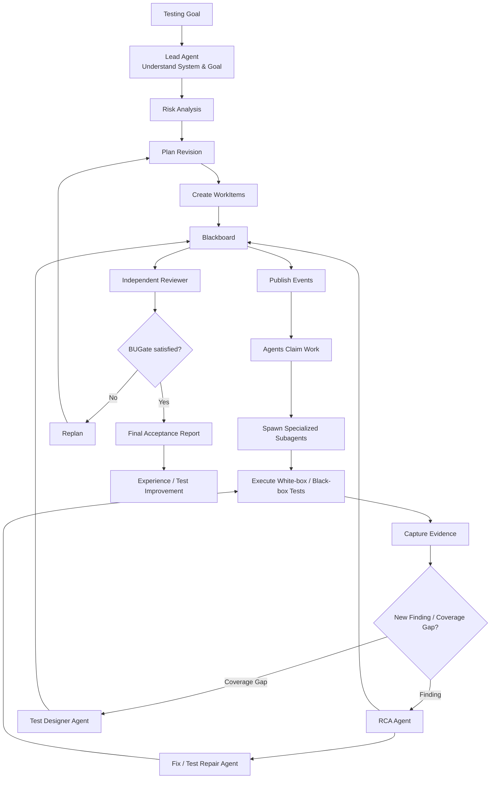
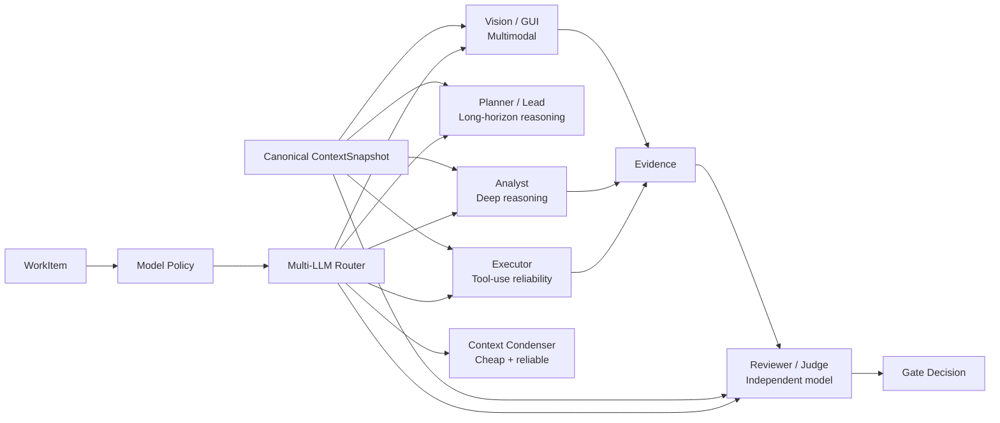
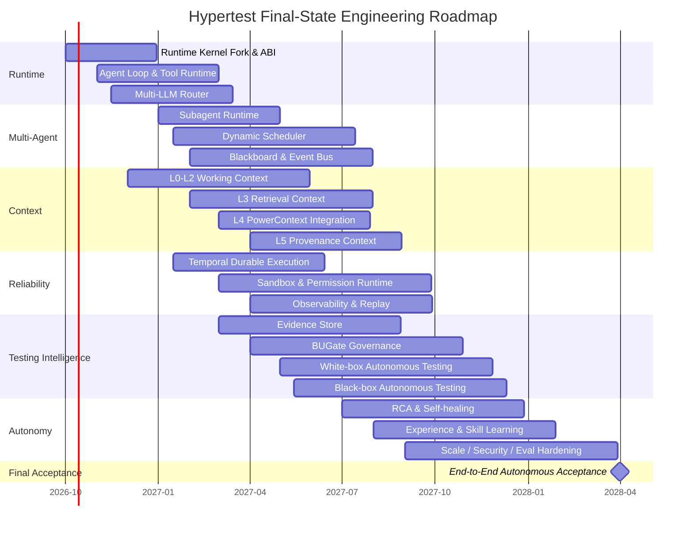
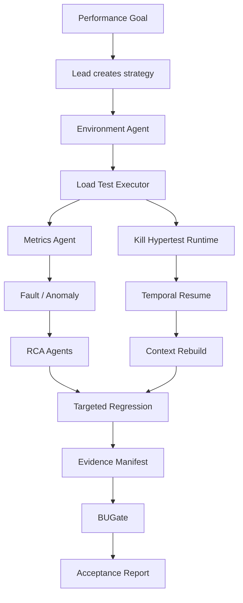

# Hypertest 最终技术选型报告

## 执行摘要

**研究基准日期：2026 年 9 月 21 日。**

本报告不讨论 MVP、中间态或「先做一个 Agent Adapter」的过渡方案，而直接定义 Hypertest 最终应呈现的产品与技术架构。

核心结论是：

> **Hypertest 应当成为一个拥有独立 Agent Runtime、原生 Multi-LLM、Dynamic Subagent Workflow、Blackboard/Event-driven 去中心化协作、Durable Execution、分层 Context Engine 和 Evidence-driven Governance 的 Autonomous Testing Agent。**

它的最终职责不是「为 Claude Code / Codex / Pi 提供测试工具」，而是自己成为能够接受测试目标，并自主完成：

**测试分析 → 风险识别 → 白盒/黑盒测试设计 → 环境准备 → 测试实现 → 测试执行 → 动态补测 → 缺陷分析 → 授权内修复 → 回归验证 → 质量验收 → 报告 → 用例/经验改进**

的独立 Agent。

### 最重要的技术选型

本次源码级研究后，建议采用下面的总体路线：

| 能力 | 最终推荐 |
|---|---|
| Runtime 主语言 | **TypeScript / Node.js**；Python 作为测试 Worker/SDK |
| Agent Runtime Kernel | **选择性 Fork DeepSeek Harness**，建立 Hypertest 自有 Kernel ABI |
| Plugin / Capability Runtime | **Fork / Reference DeepSeek Harness Cordis 模式** |
| Agent Loop | **Fork DSH 核心机制后自主掌控** |
| Multi-LLM | **Build Hypertest Router + Reuse Pi provider abstraction + Reference DSH LlmAdapter / OpenCode** |
| Subagent Runtime | **优先 Fork DeepSeek Harness Subagent Runtime** |
| Dynamic Workflow | **Fork DSH Workflow primitives + Build Hypertest Dynamic Scheduler** |
| 多 Agent 规划模式 | **Reference LangChain Deep Agents + Claude Code + Codex** |
| 去中心化协作 | **Build Blackboard + Reuse PostgreSQL + NATS JetStream** |
| Durable Execution | **Reuse Temporal TypeScript SDK** |
| Context L0-L2 | **Build + Reference OpenHands Event/View/Condenser** |
| Context L3 | **Build Hybrid Retrieval：FTS + Symbol Graph + Vector** |
| Context L4 | **Reuse/Wrap PowerContext** |
| Context L5 | **Build Evidence/Provenance projection** |
| Evidence Store | **Build domain layer + PostgreSQL + S3-compatible Object Store** |
| 权限/治理 | **Build BUGate + Reuse OPA** |
| Sandbox | **Reuse OCI/Docker/Kubernetes；高安全场景增加 gVisor/Firecracker** |
| Browser | **Reuse Playwright** |
| Computer Use | **Adapter 化，不绑定模型或单一 CUA 实现** |
| Observability | **Reuse OpenTelemetry** |
| Skills | Agent Skills 标准 + Hypertest Skill Registry |
| MCP | 作为 Tool Transport，不作为 Hypertest 架构中心 |
| ACP | 作为 Agent interoperability transport |
| Codex / Claude Code | **Reference / Benchmark，不作为运行时依赖** |
| OpenCode | **Reference Multi-provider、Context Epoch、权限体系** |
| Hermes | **Reference delegation、sandbox、memory→skill/self-improvement** |
| Pi | **Reuse LLM provider 层 + Reference minimalist loop/extensibility** |
| Pydantic AI | **Reference Durable Agent abstraction；不作为主 Runtime** |

DeepSeek Harness 当前是一个 TypeScript、MIT 许可的官方 DeepSeek Agent Harness，并明确采用 “Everything is a Plugin” 架构；其仓库于 2026 年 8 月创建，并在当前日期仍快速迭代。但官方同时明确标注为 **Developer Preview，并警告会发生 breaking changes**。因此，不建议把 Hypertest 做成一个 DSH Plugin；更合理的是**锁定一个经过验证的 commit，选择性 fork Runtime/Subagent/Workflow/LLM seam，并从第一天建立 Hypertest 自己的稳定 ABI**。fileciteturn23file0L1-L6 fileciteturn24file0L1-L12

这是本报告最重要的一项架构决策：

> **不是「Hypertest 基于 DeepSeek Harness 运行」，而是「Hypertest 吸收 DeepSeek Harness 当前最先进的开源实现，并拥有自己的 Runtime」。**

预计最终架构整体新增/改造工作量约为 **51–78 人月**。这是工程量而非日历时间；团队规模、预算和目标云平台均未指定，因此本报告不把它换算为确定交付日期。不同模块高度可并行。

---

## 目标产品定义与设计原则

Hypertest 的最终产品定义应正式确定为：

> **Hypertest — Evidence-driven Autonomous Testing Agent**
>
> 一个原生支持多 LLM、多 Agent、动态协作和持久执行，可以独立完成复杂软件系统白盒与黑盒质量验收闭环的专业自主测试 Agent。

### 产品能力边界

Hypertest 的输入应该是**目标**，而非预先编排好的 Workflow。

例如：

> 对当前 Hyperchain 版本执行完整验收。重点分析本次代码变化带来的功能、性能、稳定性和状态一致性风险，自主决定测试策略，必要时编写新测试、部署测试环境、执行 Frigate 压测、分析 Prometheus 指标、诊断失败并补充回归测试，最后给出可审计的验收结论。

用户不应该先告诉 Hypertest：

```text
Step 1: 分析 git diff
Step 2: 调用 xxx MCP
Step 3: 创建 3 个 subagent
Step 4: 执行 pytest
Step 5: 执行 frigate
Step 6: 调用 reporter
```

这些属于 Agent 自主决策。

因此，**Hypertest 的自主性边界**是：

| Hypertest 自主决定 | 外部必须约束 |
|---|---|
| 如何拆解测试目标 | 用户目标 |
| 哪些风险值得验证 | 权限边界 |
| 白盒还是黑盒 | 资源/成本预算 |
| 创建多少 Subagent | 最大并发/深度 |
| 不同任务用哪个 LLM | 模型 allowlist / 数据边界 |
| 使用什么测试工具 | 工具权限 |
| 是否补充测试 | BUGate |
| 是否重新规划 | 环境安全边界 |
| 如何诊断失败 | Product 修改授权 |
| 如何改进测试用例 | Evidence 要求 |
| 是否推荐发布 | 最终 Gate 规则 |

最终的 **Pass / Fail / Conditional Pass** 不能由 Lead Agent「感觉测试做得差不多了」来决定。

它必须来自：

```text
Agent judgment
     +
Deterministic evidence
     +
BUGate rules
     +
Reviewer/Judge
     +
Outstanding risk
```

### Hypertest 必须遵循的几个最终态原则

**Agent，而非 Toolkit。**

Skills、MCP、Hooks、Toolkit、Adapter、Plugin 都属于 Hypertest 内部扩展机制；任何一个都不代表 Hypertest 产品本身。

**Native Multi-LLM，而不是 provider adapter 后补。**

模型选择应该是 `WorkItem / AgentSpec` 的一等属性。分析师、Planner、Executor、RCA、Reviewer、Context Condenser、GUI Agent 可以使用完全不同的模型。

DeepSeek 当前 API 已同时支持 OpenAI 与 Anthropic 兼容格式，并提供 Tool Calls、JSON Output、Thinking、Responses API 等接口，这进一步说明未来 provider 差异会越来越容易接入，但 Hypertest 仍不能把「兼容 OpenAI API」等同于「模型语义完全一致」。citeturn23view0

**Dynamic Workflow，而非静态 DAG。**

测试计划是一个持续修订的 `PlanRevision`：

```text
Plan v1
   ↓ 执行发现新风险
Plan v2
   ↓ 出现 defect
Plan v3
   ↓ fix 后产生 regression risk
Plan v4
```

不能事先用 LangGraph、Temporal 或其他 Workflow Engine 写死完整 DAG。

**Hierarchical + Decentralized Collaboration。**

最终架构必须同时拥有：

```text
Lead / Scheduler
       +
Blackboard / Event-driven collaboration
```

Lead 负责全局目标、资源、预算和收敛，但不应成为 Agent 之间每一次交流的必经节点。

**Evidence is Truth。**

LLM 输出不是事实数据库。

Canonical truth 应来自：

```text
Event Store
Blackboard
Evidence Store
Execution Environment
BUGate Decisions
```

LLM 只是这些事实的解释者、规划者和行动决策者。

**Durable by design。**

真实压测可能持续数小时；环境可能重启；Subagent 可能失败；模型 API 可能 timeout；Hypertest 自身也可能升级或 crash。

Agent 的运行状态必须可恢复，而不是把整个世界寄托在 `messages[]` 中。

Pydantic AI 已经把 Durable Agent 明确定义为跨 API 失败、应用错误和进程重启保持进度，并为 Temporal、DBOS 等 Durable Runtime 提供集成；这一设计方向值得参考。fileciteturn19file0L1-L30

**Runtime ownership。**

Hypertest 可以 fork 大量代码，但必须最终掌握：

```text
Agent lifecycle
Session semantics
Context semantics
Task semantics
Subagent semantics
Workflow semantics
Model routing semantics
Permission semantics
Evidence semantics
Gate semantics
```

这些才是 Agent 工程真正核心的部分。

---

## 最终总体架构

### Hypertest Target Architecture

```mermaid
flowchart TB

    USER["User / API / CLI / Web UI<br/>Testing Goal"]
    REPORT["Acceptance Report<br/>Pass / Fail / Risk"]

    subgraph HT["Hypertest Autonomous Testing Agent"]

        subgraph CONTROL["Agent Intelligence & Control Plane"]
            LEAD["Lead Agent<br/>Goal Understanding / Planning / Replanning"]
            SCHED["Dynamic Scheduler<br/>Admission / Dependency / Budget / Convergence"]
            SUB["Subagent Runtime<br/>Spawn / Resume / Message / Interrupt / Collect"]
            ROUTER["Multi-LLM Router<br/>Capability / Quality / Cost / Security Routing"]
        end

        subgraph KERNEL["Agent Runtime Kernel"]
            LOOP["Agent Loop"]
            SESSION["Session / Activation"]
            TOOL["Tool & Capability Runtime"]
            PLUGIN["Plugin Runtime / Service Registry"]
            POLICY["Policy Interceptor"]
        end

        subgraph COLLAB["Decentralized Collaboration Plane"]
            BB["Blackboard<br/>Finding / Hypothesis / WorkItem / CoverageGap / Review"]
            BUS["NATS JetStream Event Bus"]
            CLAIM["Claim / Lease / Inbox / Outbox"]
        end

        subgraph CTX["Context Engine"]
            L0["L0 Event Store<br/>Immutable execution history"]
            L1["L1 Prompt Assembly<br/>Role / Skill / Policy / Tools"]
            L2["L2 Working Context<br/>Prune / Condense / Summarize"]
            L3["L3 Retrieval Context<br/>Code / Requirement / Test / Bug"]
            L4["L4 Durable Context<br/>Memory / Experience / Handoff"]
            L5["L5 Provenance Context<br/>Evidence / Source / Lineage"]
        end

        subgraph DURABLE["Durable Execution"]
            TEMP["Temporal<br/>Workflow / Activity / Timer / Retry / Resume"]
        end

        subgraph EVIDENCE["Evidence Plane"]
            ES["Evidence Store<br/>Immutable Metadata"]
            OBJ["Artifact Store<br/>Logs / Trace / Screenshot / Coverage / PCAP"]
        end

        subgraph GOVERN["BUGate Governance"]
            BG["BUGate Protocol"]
            OPA["Policy Engine"]
            GATE["Evidence Gate / Quality Gate"]
        end

        subgraph EXEC["Testing Execution Plane"]
            WHITE["White-box<br/>Code / Test / Coverage / Mutation"]
            BLACK["Black-box<br/>API / UI / Performance / Fault"]
            CU["Browser / Computer Use"]
            ENV["Docker / K8s / Remote Environment"]
        end
    end

    subgraph MODELS["LLM Providers"]
        M1["Reasoning / Analysis Model"]
        M2["Fast Worker Model"]
        M3["Code / Execution Model"]
        M4["Reviewer / Judge Model"]
        M5["Vision / GUI Model"]
        M6["Local / Private Model"]
    end

    USER --> LEAD
    LEAD <--> SCHED
    SCHED <--> SUB
    LEAD --> BB
    SUB <--> BB
    BB <--> CLAIM
    CLAIM <--> BUS

    LEAD --> ROUTER
    SUB --> ROUTER
    ROUTER --> M1
    ROUTER --> M2
    ROUTER --> M3
    ROUTER --> M4
    ROUTER --> M5
    ROUTER --> M6

    LEAD --> KERNEL
    SUB --> KERNEL

    KERNEL <--> CTX
    KERNEL <--> TEMP
    TEMP <--> SCHED

    TOOL --> WHITE
    TOOL --> BLACK
    TOOL --> CU
    TOOL --> ENV

    WHITE --> ES
    BLACK --> ES
    CU --> OBJ
    ENV --> OBJ
    ES <--> OBJ

    ES --> L5
    BB --> L3
    L0 --> L1
    L2 --> L1
    L3 --> L1
    L4 --> L1
    L5 --> L1

    BG --> OPA
    OPA --> POLICY
    BG --> GATE
    ES --> GATE
    GATE --> SCHED

    GATE --> REPORT
```



这张图有两个非常关键的设计点。

第一，**Dynamic Scheduler 与 Blackboard/Event Bus 同时存在。**

Scheduler 负责：

```text
谁可以运行
现在是否运行
依赖是否满足
预算是否允许
并发是否超限
是否进入 convergence
```

Blackboard/Event Bus 负责：

```text
发生了什么
谁发现了什么
谁对什么感兴趣
哪些工作可以被认领
哪些假设被证伪
哪些 coverage gap 新出现
```

所以：

> **Scheduler 是控制平面，Blackboard/Event Bus 是协作平面。**

NATS JetStream 适合做这里的事件交付层，而不能成为 domain truth；NATS Server 当前采用 Apache-2.0 许可并持续维护。fileciteturn22file0L1-L13

第二，**Temporal 也不是 Scheduler。**

Temporal 负责：

```text
保证已经决定要执行的任务可靠地执行
```

Lead/Scheduler 负责：

```text
决定接下来应该执行什么
```

Temporal TypeScript SDK 本身采用 MIT 许可，并明确定位为 durable execution/orchestration SDK，因此与 TypeScript Kernel 的技术栈天然一致。fileciteturn21file0L1-L13

### 最终测试闭环



这里没有一个固定的：

```text
分析 → 用例 → 执行 → 报告
```

四节点 Workflow。

例如 Executor 发布：

```text
finding.created
```

后，RCA Agent 可以因为事件订阅主动申请调查；Test Designer 可以同时因为该 Finding 暴露了 Coverage Gap 而创建补测工作；Reviewer 则可以对新的 Evidence 进行验证。

Lead Agent 无须成为每次交互的中间人。

### 最终多 LLM 执行模式



**Multi-LLM 的一致性不是让不同模型拥有完全相同的 messages。**

正确的一致性单位应是：

> **Canonical Context Snapshot。**

例如：

```ts
interface ContextSnapshot {
  snapshotId: string
  taskRunId: string

  eventSeq: bigint
  blackboardRevision: bigint
  planRevision: number
  policyRevision: string

  evidenceManifestHash: string

  requirementRefs: string[]
  codeRefs: string[]
  findingRefs: string[]
  evidenceRefs: string[]

  createdAt: string
}
```

不同模型可以得到不同投影：

```text
Analyst:
  requirements + diff + architecture + historical bugs

Executor:
  WorkItem + code slice + tool state + test environment

Reviewer:
  expected criteria + evidence + finding + plan
```

但是所有投影必须引用同一个 `snapshotId`。

这解决了一个多 Agent 系统很容易出现的问题：

> Analyst 基于世界状态 A 做判断，Executor 已经进入状态 B，而 Reviewer 又基于过时状态 C 做验收。

LLM 永远不是 canonical state owner。

---

## 核心模块技术选型与数据契约

下面给出每一个核心模块的最终态选型。

### Agent Runtime Kernel

**功能定位**

Kernel 是 Hypertest 自主 Agent 的根。

它负责：

```text
Agent creation
Agent Loop
Session
Activation
Inbox
Tool Runtime
Capability Registry
Plugin Lifecycle
Cancellation
Interception
Event emission
Context assembly hooks
```

DeepSeek Harness 是目前最值得直接参考甚至选择性 fork 的开源 Runtime。其官方文档把 Subagent 设计成独立 capability seam，而不是塞进 Agent Loop；同一个 runtime 允许注册多个 Subagent Provider。fileciteturn2file0L1-L2

**推荐：Fork。**

具体不是长期追随 upstream：

```text
deepseek-harness master
        │
        │ pinned commit
        ▼
Hypertest upstream snapshot
        │
        ▼
Hypertest Runtime ABI v1
        │
        ├── Agent
        ├── Session
        ├── Capability
        ├── Tool
        ├── Context
        ├── Subagent
        ├── Workflow
        └── Model
```

DeepSeek Harness 官方明确警告当前 Developer Preview 会存在兼容性破坏，因此直接作为运行时依赖反而会损害 Hypertest 的长期架构稳定性。fileciteturn24file0L1-L12

**核心接口**

```ts
interface AgentRuntime {
  createAgent(spec: AgentSpec): Promise<AgentHandle>
  resumeAgent(agentId: AgentId): Promise<AgentHandle>
  interrupt(agentId: AgentId, reason: InterruptReason): Promise<void>
  dispose(agentId: AgentId): Promise<void>
}

interface AgentSpec {
  role: AgentRole
  objective: string
  modelPolicy: ModelPolicy
  contextPolicy: ContextPolicy
  toolPolicy: ToolPolicy
  permissionProfile: PermissionProfile
  outputSchema?: JSONSchema
  parentAgentId?: AgentId
}
```

**关键难点**

不是 Agent Loop 本身，而是：

```text
状态归属
lifecycle ownership
cancellation propagation
工具副作用
event ordering
session persistence
nested-agent cleanup
```

性能上必须避免每个 capability 复制完整上下文；安全上所有 Tool Invocation 必须进入统一 `PolicyInterceptor`；审计上每个 turn、tool、model route、state transition 都产生事件。

### Multi-LLM Router

这是 Hypertest 必须**自主 Build** 的模块。

Pi 当前本身就是 unified LLM API + agent loop + CLI 的 TypeScript 工程，采用 MIT 许可且仍非常活跃，因此特别适合复用其 provider normalization 思路/代码，而不是重新维护十几家 provider API。fileciteturn6file0L1-L13

DeepSeek Harness 的 `LlmRuntime` 则进一步把 provider backend 定义为 `LlmAdapter`，并已有 Pi AI adapter；其核心包直接导出 `LlmRuntime`、抽象 `LlmAdapter` 和流组装组件。fileciteturn4file3L61-L72 fileciteturn4file4L79-L90

但 Hypertest 的 Router 不应该只负责：

```text
provider/model
```

而应该负责：

```ts
interface ModelRequest {
  role: AgentRole
  taskType: TaskType

  requiredCapabilities: ModelCapability[]
  structuredOutput?: JSONSchema

  riskLevel: "low" | "medium" | "high" | "critical"
  privacyClass: DataClassification

  contextTokensEstimate: number
  latencyBudgetMs?: number
  costBudget?: Money

  preferredRoutes?: ModelRouteHint[]
  prohibitedProviders?: string[]

  contextSnapshotId: string
}

interface ModelRoute {
  provider: string
  model: string
  reasoningEffort?: string

  fallbackChain: Route[]
  selectedByPolicy: string

  capabilityProfileRevision: string
}
```

路由顺序应当是：

```text
Security / Data Boundary
          ↓
Capability match
          ↓
Role suitability
          ↓
Quality / Eval score
          ↓
Latency
          ↓
Cost
```

**绝不能 cost-first。**

尤其不能：

```text
Claude timeout
→ 自动换 DeepSeek
→ DeepSeek timeout
→ 自动换 local model
```

然后继续执行高权限动作。

Fallback 必须重新经过 security + capability validation。

OpenCode 很值得参考的一点，是它把 provider/model switch 和 Context Epoch 分开管理：模型变化应用于安全的 provider-turn 边界，而不是在一半 tool loop 中偷偷换模型。其源码设计记录还明确处理了 context epoch、provider cache prefix 与模型切换。fileciteturn13file0L1-L34

Claude Code 当前则已经允许 Subagent 级模型选择，并具有 per-invocation model → subagent definition → global default → parent model 的模型选择优先级；同时模型还受到组织 allowlist 约束。citeturn24view2

这是 Hypertest Router 很值得吸收的设计。

推荐 Agent Role：

| Role | 模型特征 |
|---|---|
| Lead | 强 reasoning、长上下文、稳定 tool planning |
| Analyst | 强代码/架构分析 |
| Test Designer | 强组合推理、structured output |
| Executor | 高 tool-call reliability，速度优先 |
| RCA | reasoning + code + telemetry |
| Reviewer | 与生产模型尽量异构 |
| Context Condenser | 低成本、长输入、事实保真 |
| Vision Agent | GUI/截图理解 |
| Local Agent | 私有数据、高敏 workload |

这里应采用**角色策略**而不是硬编码某个厂商型号，因为模型迭代速度远快于 Hypertest Runtime。

### Subagent Runtime 与 Dynamic Scheduler

这两个模块必须区分。

**Subagent Runtime：负责 Agent 如何存在。**

**Scheduler：负责为什么、何时、以何种拓扑让 Agent 存在。**

DeepSeek Harness 的 Subagent Runtime 是目前本次调研中最接近 Hypertest 需求的开源实现。

其源码明确实现了：

> named provider registry、one-shot runs、durable discovery、continuable-child operations。fileciteturn1file0L1-L10

其 Provider 体系包括：

```text
spawn-in-process
fork-in-process
ACP
Codex
Claude Code
DSH SDK
```

并把 continuable child、冷恢复、消息、interrupt 和 child discovery 放在独立 Runtime seam 中。fileciteturn2file0L1-L2

**推荐 Subagent Runtime：Fork。**

Hypertest 在其上增加：

```text
WorkItem binding
Event subscription
Blackboard claims
ModelPolicy
BUGate policy
Evidence requirements
Resource budget
```

接口：

```ts
interface SpawnRequest {
  parent: AgentId

  workItemId: WorkItemId
  role: AgentRole

  modelPolicy: ModelPolicy
  toolPolicy: ToolPolicy
  permissionProfile: PermissionProfile

  contextSnapshotId: string

  outputSchema?: JSONSchema

  continuable: boolean
  background: boolean

  maxDepth: number
  budget: AgentBudget
}
```

Claude Code 当前同样证明了成熟 Subagent 应该具有独立 context、system prompt、tools 和权限，并且支持 background、resume、嵌套 Subagent、per-subagent model 以及 worktree isolation。citeturn24view0turn24view1turn24view3

**Dynamic Scheduler：Build。**

DSH Dynamic Workflow 非常值得 fork 它的执行 primitive。

目前 DSH 的 workflow body 可以获得：

```text
agent()
parallel()
pipeline()
phase()
log()
args
```

并设有 concurrent agent 和 total agent 上限来抑制 runaway agent creation。fileciteturn3file0L1-L14 fileciteturn3file1L16-L31 fileciteturn3file3L40-L55

但是 Hypertest 不应该把全局 Scheduler 等同于 `eval(generated JavaScript)`。

更安全的设计是：

```text
LLM proposes topology
        ↓
Typed Plan IR
        ↓
Policy validation
        ↓
Scheduler admission
        ↓
Workflow Runtime
```

而非：

```text
LLM → arbitrary JS → production runtime
```

核心 IR：

```ts
interface PlanRevision {
  planId: string
  revision: number
  parentRevision?: number

  objectives: Objective[]
  workItems: WorkItem[]
  dependencies: Dependency[]

  assumptions: Assumption[]
  createdFromSnapshot: string
}

interface WorkItem {
  id: string
  objective: string

  role: AgentRole

  capabilityRequirements: CapabilityRequirement[]
  modelPolicy: ModelPolicy
  toolPolicy: ToolPolicy

  inputRefs: Ref[]
  expectedOutput: JSONSchema
  evidenceRequirements: EvidenceRequirement[]

  dependsOn: string[]

  budget: WorkBudget
  priority: number

  state: WorkItemState
}
```

LangChain Deep Agents 当前的 Subagent middleware 已经支持动态 task invocation 以及针对 raw SubAgent spec 的动态 response schema，这一机制特别值得参考 Typed Dynamic Delegation。fileciteturn8file0L1-L18

它的 MIT 许可也意味着参考/选择性吸收代码法律风险较低。fileciteturn20file0L1-L13

### Blackboard / Event-driven Collaboration

**推荐：Build domain model；Reuse PostgreSQL + NATS JetStream。**

Blackboard 不应该是：

```text
shared.md
```

更不能是：

```text
所有 Agent 共用一条 messages[]
```

而应该是结构化、版本化的协作空间：

```text
Blackboard
├── WorkItems
├── Findings
├── Hypotheses
├── CoverageGaps
├── TestStrategies
├── Reviews
├── Decisions
├── Claims / Leases
└── EvidenceReferences
```

核心契约：

```ts
interface BlackboardRecord<T> {
  recordId: string
  recordType: string

  revision: bigint

  taskRunId: string
  createdBy: ActorId

  payload: T

  evidenceRefs: string[]

  createdAt: string
  supersedes?: string
}
```

Event：

```ts
interface DomainEvent<T> {
  eventId: string
  eventType: string

  aggregateType: string
  aggregateId: string

  correlationId: string
  causationId?: string

  actorId: string
  taskRunId: string

  schemaVersion: string
  payload: T

  occurredAt: string
}
```

典型事件：

```text
work.created
work.claimed
work.completed

finding.created
finding.confirmed
finding.rejected

hypothesis.created
hypothesis.refuted

coverage.gap_detected

evidence.attached

test.failed
test.recovered

review.requested
review.completed

gate.failed
gate.passed
```

关键机制是：

```text
PostgreSQL
   │
Transactional Outbox
   ↓
NATS JetStream
   ↓
Agent subscribers
   ↓
Claim / Lease
```

不能让事件传输系统成为 canonical state。

这样即使 Event Bus 重复投递：

```text
finding.created
finding.created
```

Claim/Idempotency 也不会导致两个 Agent 都对生产环境执行同一个破坏性操作。

### Context Engine

Hypertest 最终不能有一个万能的 `ContextManager`。

应该正式采用 **L0–L5**：

| Layer | 内容 | 主要技术 |
|---|---|---|
| L0 | Event Store | PostgreSQL append-only |
| L1 | Prompt Assembly | Hypertest Build |
| L2 | Working Context | OpenHands-inspired condenser |
| L3 | Retrieval Context | FTS + code graph + vectors |
| L4 | Durable Context | PowerContext |
| L5 | Provenance Context | Evidence projection |

**L0 — Event Store**

保存不可变执行历史。

```text
Agent created
LLM routed
Tool called
Tool completed
Finding emitted
Plan revised
Context compacted
Gate evaluated
```

它是 Context 重建的根。

**L1 — Prompt Assembly**

动态装配：

```text
role
objective
current WorkItem
BUGate policy
relevant skills
available tools
working memory
retrieved knowledge
evidence references
```

**L2 — Working Context**

这是 OpenHands 最值得 Hypertest借鉴的部分。

OpenHands SDK 把 Condensation 分为 HARD 与 SOFT：SOFT 用于控制上下文规模，在无法安全压缩时可以推迟；HARD 表示没有压缩就无法继续。fileciteturn5file0L1-L22 fileciteturn5file1L24-L35

其 `LLMSummarizingCondenser` 直接面向 Event View 工作，而不是简单对聊天字符串截断。fileciteturn5file2L36-L62

**推荐：Reference + Build TypeScript port。**

Hypertest 不能把：

```text
100 MB pytest log
Prometheus series
Frigate output
screenshots
large git diff
```

塞进 message history。

应首先把大结果 Artifact 化：

```text
Tool Result
   ↓
Artifact Store
   ↓
Structured digest
   ↓
Context View
```

然后才做 conversation condensation。

**L3 — Retrieval Context**

采用：

```text
Exact search        ripgrep / FTS
Symbol retrieval    tree-sitter / LSP / SCIP
Semantic retrieval  embeddings + pgvector
Evidence retrieval  structured SQL
```

代码 Agent 的 retrieval 不能只靠 vector RAG。

例如查：

```text
Who writes AccountState.version?
```

Symbol/Call Graph 通常比向量检索更合适。

**L4 — Durable Context**

这是 PowerContext 最值得直接复用的位置。

PowerContext 当前是 Apache-2.0 开源 Python 项目，项目主题明确涵盖 context compression、handoff、long-term memory 和 multi-agent。fileciteturn9file0L1-L13

其 Context Pack 长期定位就是：

> provider-neutral、task-relevant、bounded、preserve provenance 的 Agent context deliverable。fileciteturn10file1L28-L39

其 API 已有：

```python
prepare_context(request) -> PreparedContext
```

作为「为一次 Agent turn 准备最终 bounded context」的接口。fileciteturn10file8L215-L226

PowerContext 还特别重视 Handoff 访问控制和 scope-level RBAC。fileciteturn10file5L115-L126

因此推荐：

> **PowerContext 作为独立 Context Service Reuse，而不是把它 fork 进 Kernel。**

这样 TS Kernel 与 Python Context Service 之间通过 OpenAPI/gRPC 对接。

但必须注意 PowerContext 自己的 RFC 也明确指出部分 Context Pack 能力仍有范围限制，例如早期版本没有把 Experience/RAG/Skill/dynamic orchestration 全部纳入 Context Pack。fileciteturn10file0L1-L12

所以它不是整个 Context Engine，只负责 L4。

**L5 — Provenance Context**

这里不保存 blob。

它回答：

```text
这个结论来自哪条证据？
这条 evidence 来自哪个 tool execution？
tool 在哪个 environment 上执行？
使用的是哪个 version / commit？
报告中的这个数字能否追溯到原始数据？
```

这也是 BUGate 最需要的 Context。

### Durable Execution

**最终推荐：Temporal TypeScript SDK。**

Pydantic AI 的 Durable Execution 特别适合作为设计参考：它明确把 durable agent 与普通 Agent Runtime 解耦，并支持多种 Durable backend。fileciteturn19file0L1-L30

但 Hypertest 最终 Kernel 推荐 TypeScript，因此没有必要为了 Durable Execution 把主 Runtime 迁移到 Python。

核心原则：

```text
Temporal Workflow
   = deterministic lifecycle state

Temporal Activity
   = LLM/API/tool/DB/environment side effect
```

不要在 deterministic Workflow body 中直接调用 LLM。

建议层级：

```text
TestRunWorkflow
 ├── AnalyzeActivity
 ├── SchedulerActivity
 ├── AgentTurnActivity
 ├── ToolActivity
 ├── WaitEnvironment
 ├── ApprovalSignal
 ├── GateActivity
 └── ReportActivity
```

需要 Durable 的不是每一个 token streaming event，而是：

```text
task lifecycle
work ownership
waiting
retry
timeout
approval
checkpoint
recovery
```

这可以避免 Temporal History 成为另一套 Agent Event Store。

权威数据边界必须固定：

| 数据 | 权威来源 |
|---|---|
| 执行生命周期 | Temporal |
| Agent/domain events | Hypertest Event Store |
| 协作状态 | Blackboard/Postgres |
| 原始测试证据 | Evidence Store |
| 二进制 Artifact | Object Store |
| 长期经验 | PowerContext |
| 事件传播 | NATS |
| 质量结论 | BUGate Decision Store |

这是避免「五个系统都认为自己是真相」的关键。

### Evidence Store 与 BUGate Governance

**Evidence Store：Build。**

核心数据：

```ts
interface EvidenceRecord {
  evidenceId: string
  evidenceType: EvidenceType

  taskRunId: string
  workItemId?: string
  agentId?: string
  toolRunId?: string

  artifactRef: string
  sha256: string
  size: number
  mimeType: string

  environmentSnapshotId?: string

  parentEvidenceIds: string[]

  capturedAt: string

  classification: DataClassification
  retentionPolicy: string

  provenance: Provenance
}
```

Evidence 类型包括：

```text
test-result
stdout
stderr
metric
trace
log
screenshot
video
pcap
coverage
mutation-result
git-diff
database-snapshot
api-response
environment-manifest
```

所有大 Artifact 使用 Content Address / Hash Manifest。

Report 不直接写：

> 平均 TPS 为 103,215。

而应该是逻辑上的：

```text
Claim:
  avg_tps = 103215

Evidence:
  metric-set://evidence-8432

Query:
  ...
```

然后 BUGate 能自动验证。

**BUGate：Build；底层 Policy Reuse OPA。**

OPA 当前是 Apache-2.0 的通用 Policy Engine，可以作为 Hypertest 的低层 authorization/policy evaluator，而测试语义仍由 BUGate 自己定义。fileciteturn26file0L1-L13

核心契约：

```ts
interface GateSpec {
  gateId: string

  appliesTo: string

  requirements: EvidenceRequirement[]
  invariants: Invariant[]
  unresolvedRiskPolicy: RiskPolicy

  reviewerPolicy?: ReviewerPolicy
}

interface GateDecision {
  gateId: string

  decision:
    | "pass"
    | "fail"
    | "conditional"
    | "needs_review"

  evidenceRefs: string[]
  violatedRules: RuleViolation[]

  reviewerDecisions: ReviewerDecision[]

  policyRevision: string
}
```

权限调用：

```ts
interface ActionPermit {
  decision: "allow" | "deny" | "approval_required"

  constraints?: {
    allowedPaths?: string[]
    allowedHosts?: string[]
    allowedCommands?: string[]
    credentialScope?: string[]
    maxDuration?: number
  }
}
```

BUGate 需要覆盖四个时点：

```text
Before action
    → 能不能做？

After action
    → 产生了什么证据？

Before state transition
    → 能不能进入下一阶段？

Before final acceptance
    → 有没有资格声称测试通过？
```

Reviewer LLM 可以判断：

```text
这个失败是不是产品 Bug？
这个异常是否具有同一根因？
这个证据是否支持假设？
```

但是它不能绕过：

```text
coverage < threshold
critical test failed
missing required evidence
unresolved P0/P1
environment invalid
```

这些 deterministic gate。

### Tool Runtime、Sandbox 与 Computer Use

这部分决定 Hypertest 是否真正是一个独立测试 Agent。

最终 Tool Runtime 至少应支持：

```text
Native Tool
MCP Tool
CLI Tool
HTTP/gRPC Tool
ACP Agent
Remote Worker
Browser Tool
Computer Use Tool
```

但 MCP 只是 transport。

Tool Contract：

```ts
interface ToolExecutionRequest {
  toolId: string
  agentId: string
  workItemId: string

  args: unknown

  permissionToken: string

  environmentId: string
  idempotencyKey: string

  timeoutMs: number
}

interface ToolExecutionResult {
  status: "success" | "failed" | "timeout"

  structured?: unknown

  artifactRefs: string[]
  evidenceRefs: string[]

  stdoutRef?: string
  stderrRef?: string
}
```

白盒能力：

```text
Git
filesystem
shell
tree-sitter
LSP
coverage
mutation testing
unit/integration framework
build tools
static analysis
database introspection
```

黑盒能力：

```text
HTTP/gRPC
Playwright
Computer Use
Frigate/load generator
Kubernetes
Prometheus
OpenTelemetry
log systems
fault injection
network inspection
```

OpenHands SDK 是一个很有价值的 sandbox/runtime 参考；其当前官方 Software Agent SDK 采用 MIT 许可，保持积极开发。fileciteturn25file0L1-L13

Claude Code 当前采用 worktree isolation 并对 working directory 和部分 Git escape path 进行约束，这对 Hypertest 的代码修改 Agent 有直接借鉴价值。citeturn24view3

建议：

```text
read-only analyzer
      ↓
shared snapshot

mutation/testing agent
      ↓
isolated worktree/container

high-risk executor
      ↓
separate sandbox + network policy
```

而不是让所有 Agent 共用宿主机 `$HOME` 和主 repository。

---

## 开源项目比较与 Build/Fork/Reuse 决策

### 核心参考对象比较

| 项目 | 本次研究认为最值得借鉴的能力 | 对 Hypertest 的定位 |
|---|---|---|
| DeepSeek Harness | Plugin Kernel、LLM seam、Subagent、continuable child、Dynamic Workflow | **最重要的 Fork 来源** |
| Pi | 极简 Agent Loop、统一 LLM Provider、Extension | **Provider Reuse / Runtime Reference** |
| OpenHands SDK | Event/View/Condenser、sandbox、conversation runtime | **Context/Sandbox Reference** |
| LangChain Deep Agents | task-based subagent、structured output、dynamic delegation | **Dynamic orchestration Reference** |
| PowerContext | PreparedContext、Memory、Experience、Handoff、Provenance | **L4 Reuse** |
| Pydantic AI | typed agent + Durable Agent backend abstraction | **Durability Reference** |
| OpenCode | Multi-provider、model switch、Context Epoch、permissions | **Multi-LLM Reference** |
| Hermes | isolated delegation、terminal backend、memory/skill learning | **Learning + delegation Reference** |
| Claude Code | mature subagents、agent teams、permissions、background、worktree | **Frontier Reference / Benchmark** |
| Codex | multi-agent、sandbox、computer use、SDK/orchestration | **Frontier Reference / Benchmark** |
| DeepSeek API | OpenAI/Anthropic compatibility、tool/JSON/reasoning API | **LLM Provider** |
| Temporal | deterministic durable execution | **Direct Reuse** |
| NATS JetStream | event distribution | **Direct Reuse** |
| OPA | policy evaluation | **Direct Reuse** |

DeepSeek Harness 现在不仅是一个 Agent Loop，而是已经把 Subagent 和 Workflow 拆成独立 runtime seams。Dynamic workflow 支持 `agent()`、`parallel()` 和 `pipeline()`；Subagent Runtime 则把 one-shot 与 continuable child 分离。这是当前最值得 Hypertest 源码级吸收的架构。fileciteturn3file0L1-L14 fileciteturn2file0L1-L2

Hermes 则提供了另一种很值得借鉴的产品实践：delegate 工具启动具有独立 context 和 terminal session 的 child agent，background 模式以 delegation ID 异步返回，而父 Agent 最终只接收 summary，从而避免 child tool trace 污染 parent context。fileciteturn17file6L140-L151 fileciteturn17file11L255-L266

Hermes 还明确强调跨任务 memory、自动 skill creation/self-improvement 以及多种 terminal backend，这非常适合 Hypertest 后续的「测试经验 → 可复用测试技能」闭环参考。fileciteturn16file1L17-L34

OpenCode 则已经把 background subagent/event system 纳入发展方向，同时其核心实现对 provider/model switching、Context Epoch 与 prompt cache 有明确建模；因此它比单纯作为 coding agent 更值得研究的是 **multi-provider runtime semantics**。fileciteturn13file0L1-L34 fileciteturn13file1L36-L60

Codex 当前官方体系已经包含 multi-agent、Agents API/SDK、sandbox、MCP、Computer Use、Shell、background/state/compaction 等能力；因此它适合作为 Hypertest 的产品能力 benchmark，而不是只作为「coding agent」看待。citeturn23view2

### 模块级最终决策

这里定义：

**Reuse**：直接依赖或部署。  
**Fork**：复制源码后由 Hypertest 自己维护。  
**Build**：Hypertest 自研。  
**Reference**：吸收架构思想，不建立运行时依赖。

| 模块 | 决策 | 优先项目 | 理由 | 许可证风险 | 维护 | 工期 |
|---|---|---|---|---|---|---:|
| Runtime Kernel | **Fork** | DeepSeek Harness | 当前开源结构最接近目标 | 低，MIT | 高 | 4–6 PM |
| Multi-LLM Router | **Build + Reuse** | Pi + DSH LLM | Router 是 Hypertest 核心语义 | 低，MIT | 中 | 3–4 |
| Subagent Runtime | **Fork** | DSH Subagent | continuable/background/provider seam 完整 | 低，MIT | 中高 | 3–4 |
| Dynamic Scheduler | **Build** | DSH + Deep Agents reference | 测试任务/收敛逻辑是差异化核心 | 低 | 高 | 5–7 |
| Blackboard/Event | **Build + Reuse** | Postgres + NATS | 当前 Agent harness 普遍缺此层 | 低，Apache/MIT 类宽松许可 | 中 | 4–6 |
| Context Engine | **Build + Reuse** | OpenHands + PowerContext | 必须跨多层整合 | 低 | 高 | 6–9 |
| Durable Execution | **Reuse** | Temporal | 不应自造可靠分布式 workflow | 低，TS SDK MIT | 中 | 3–5 |
| Evidence Store | **Build** | Postgres/S3/OTel | 测试证据模型属于核心 IP | 低 | 中 | 4–6 |
| Sandbox/Tool Runtime | **Reuse + Build Adapter** | OCI/K8s/Playwright/OpenHands ref | 基础隔离不值得重造 | 低/中 | 中高 | 5–8 |
| BUGate Governance | **Build + Reuse** | OPA | BUGate 是产品核心；OPA 做低层 policy | 低，Apache-2.0 | 中高 | 5–8 |
| Observability/Eval | **Reuse + Build** | OTel + custom eval | Agent 特有指标需自己定义 | 低 | 中 | 3–5 |
| Autonomous Testing Domain | **Build** | pytest/Frigate/etc. adapters | 专业测试 Agent 的核心差异化 | 取决于工具 | 高 | 6–10 |

**总净工程量：约 51–78 人月。**

这不是说 Hypertest 要自己写 51–78 人月的基础设施。

恰恰相反，这个数字已经建立在：

```text
Temporal
NATS
PostgreSQL
PowerContext
DSH source
Pi provider
Playwright
OPA
OpenTelemetry
OCI/Kubernetes
```

大量开源复用之上。

### 为什么不直接 Fork 一个完整 Agent 然后改 Prompt？

因为最终 Hypertest 的区别不是 system prompt。

真正需要变化的是：

```text
Agent state model
Task state model
Evidence model
Blackboard model
Dynamic scheduler
Context layers
Model routing
Permission policy
Testing convergence
BUGate
```

如果这些都只能通过 plugin/hooks 添加：

> Hypertest 最终还是会退回到你所说的 BUGate 1.0 时代——方法论 + Tool + Skills + MCP + Hooks 的集合。

所以最合理的 fork 层级是：

```text
                Upstream OSS
                     │
       ┌─────────────┴─────────────┐
       ▼                           ▼
Reusable Infrastructure     Architectural Source
       │                           │
 Temporal                    DeepSeek Harness
 NATS                        OpenHands
 Postgres                    Deep Agents
 PowerContext                OpenCode
 OPA                         Hermes
 Playwright                  Claude Code
 OTel                        Codex
       │                           │
       └─────────────┬─────────────┘
                     ▼
             Hypertest-owned ABI
                     ▼
              Hypertest Runtime
```

### 许可证策略

目前重点项目许可证整体友好：

DeepSeek Harness、Pi、OpenCode、Hermes、OpenHands SDK、Deep Agents、Pydantic AI 和 Temporal TypeScript SDK 均为 MIT；PowerContext、NATS Server、OPA 为 Apache-2.0。fileciteturn23file0L1-L6 fileciteturn6file0L1-L13 fileciteturn12file0L1-L13 fileciteturn15file0L1-L13 fileciteturn25file0L1-L13 fileciteturn20file0L1-L13 fileciteturn18file0L1-L13 fileciteturn21file0L1-L13 fileciteturn9file0L1-L13 fileciteturn22file0L1-L13 fileciteturn26file0L1-L13

但最终仍应建立自动化：

```text
SBOM
license scanner
dependency provenance
vulnerability scanning
fork patch tracking
```

尤其需要注意「主项目 MIT，但插件/模型/驱动/SDK 并非相同条款」的问题。

---

## 实施路线、风险与验收

这里的「阶段」只表示工程依赖关系。

**每个阶段都朝上文最终架构前进，不存在一个最终产品叫 Hypertest Adapter 的阶段。**

### Runtime ownership

**产出**

```text
Hypertest Runtime Kernel
Session/Event model
Tool Runtime
Plugin ABI
Multi-LLM Router
Base Context Snapshot
Agent Loop
```

DeepSeek Harness 固定 commit 后选择性 fork，不允许业务代码直接 import 任意 DSH internal package；所有依赖通过：

```text
@hypertest/runtime
@hypertest/model
@hypertest/tool
@hypertest/context
```

进入。

**验收**

同一测试目标能够分别通过至少三类模型 provider 运行 Agent；中途切换模型不会丢失 canonical task state；所有 model/tool invocation 都产生审计事件。

### Dynamic multi-agent runtime

**产出**

```text
Subagent Runtime
Dynamic Scheduler
PlanRevision
WorkItem
Role-based models
background / continuable agents
nested delegation
```

**验收**

Lead 能动态：

```text
分析项目
→ 创建 3 个分析 Subagent
→ 汇总风险
→ 动态增加 Test Designer
→ 并行生成测试
→ 执行
→ 根据结果重新规划
```

而流程中不存在硬编码的固定 agent count。

### Decentralized collaboration

**产出**

```text
Blackboard
NATS
Outbox/Inbox
Claim/Lease
Event subscription
Causal tracing
```

**验收**

Executor 发现 defect 后：

```text
finding.created
```

无需 Lead 逐一调用，RCA Agent 和 Test Designer Agent 能分别接收相关事件、竞争/申请 WorkItem、完成自己的工作并把结果写回 Blackboard。

对 Event Bus 注入 duplicate delivery，不产生重复副作用。

### Durable context and execution

**产出**

```text
Temporal
L0-L5 Context Engine
OpenHands-style condenser
PowerContext integration
Artifact offloading
```

**验收**

在一个至少数十分钟的测试任务运行中强制：

```text
kill Hypertest process
restart
```

恢复后：

```text
Plan revision 不丢
Subagent identity 可恢复
Evidence 不丢
已经完成的 destructive action 不重放
Waiting state 正确恢复
Working context 能继续
```

### Evidence-driven autonomous testing

**产出**

```text
Evidence Store
BUGate
white-box domain agents
black-box domain agents
RCA
fix/regression
reporting
```

**验收**

Hypertest 不允许仅根据 Agent 文本：

> “测试全部成功。”

输出 Pass。

必须从 Evidence Manifest 和 GateDecision 得到最终结果。

### Learning and optimization

**产出**

```text
Experience distillation
Test case improvement
Skill generation
Model routing eval
Agent policy optimization
```

PowerContext 当前已经认识到直接：

```text
distill → merge → store
```

存在治理风险，因此把生成与确认分离；pending experience 未批准前不会进入正常检索/PreparedContext。这对 Hypertest 的自主学习非常值得直接采用。fileciteturn10file10L289-L300 fileciteturn10file11L311-L322

Hypertest 应采用：

```text
Execution
   ↓
Candidate Experience
   ↓
Review / Eval
   ↓
Approved Experience
   ↓
Candidate Skill/Test Pattern
   ↓
Validation
   ↓
Published Skill
```

绝不能：

```text
Agent hallucination
→ persistent memory
→ future testing policy
```

### 关键风险与缓解

| 风险 | 严重性 | 缓解 |
|---|---|---|
| DeepSeek Harness breaking changes | 高 | pinned fork；自有 ABI；选择性 cherry-pick |
| Fork 与 upstream 长期分叉 | 中高 | upstream tracking branch + patch review |
| Multi-LLM tool semantics 不一致 | 高 | normalized tool IR + provider capability matrix |
| Model fallback 静默降级 | 高 | fail-closed；fallback 重新授权 |
| Agent 数量爆炸 | 高 | max depth/count/concurrency/token/cost budget |
| Blackboard 出现重复工作 | 中高 | Claim/Lease + fingerprint + idempotency |
| Event-driven 系统 livelock | 高 | convergence monitor + TTL + escalation |
| Temporal/NATS/Postgres 多源状态冲突 | 高 | 明确 authority boundaries |
| Context summary 丢失关键事实 | 高 | immutable L0 + Evidence refs + reversible compaction |
| Persistent memory 被污染 | 高 | candidate/review/version/quarantine |
| Tool prompt injection | 高 | trust label + typed result + policy boundary |
| Agent 越权修改代码/环境 | 高 | capabilities + sandbox + temporary credentials |
| Secret 泄露 | 高 | secret broker + egress policy + redaction |
| GUI/Computer Use 非确定性 | 中高 | DOM/API first，CU fallback；全程 screenshot/record |
| Evidence 被修改或伪造 | 高 | hash/content address/signature/retention |
| Durable replay 重复 LLM/tool side effect | 高 | side effects 只做 Temporal Activities + idempotency key |
| Reviewer 与 Executor 共模偏差 | 中 | heterogeneous model review + deterministic gate |
| 模型价格/限流突然变化 | 中 | Model Catalog + budgets + circuit breaker |
| 开源项目供应链风险 | 高 | lockfile/SBOM/signature/CVE scan |
| 自动 fix 引入更大风险 | 高 | permission tier + worktree + mandatory regression |
| Agent Eval 缺少真实 ground truth | 高 | seeded defect + mutation testing + replay suite |
| 大量 telemetry 压垮 Context | 高 | Artifact offload + structured query |
| 不同 Agent 对同一事实发生分歧 | 中 | Blackboard version + evidence-backed claims |
| 去中心化后失去全局收敛 | 高 | Scheduler/Lead 保留 convergence authority |
| 过度依赖单一商业模型 | 高 | native multi-provider + capability-based routing |

这里尤其需要把「去中心化协作」和「无治理的 swarm」分开。

Hypertest 最终不是：

```text
100 个 Agent 随便互相聊天
```

而是：

```text
Decentralized discovery
        +
Structured Blackboard
        +
Claim / Lease
        +
Global Budget
        +
BUGate
        +
Scheduler Convergence
```

即：

> **bounded decentralization。**

---

## 时间线与首批 PoC

由于团队规模、预算和云平台均为**未指定**，下面的 Gantt 表示**逻辑工程依赖和推荐并行窗口**，不是日历交付承诺。日期以 2026 年 10 月开始，仅用于把最终态工作包放到同一坐标系。



真正影响日历周期的是团队并发人数。上面的 51–78 人月，如果只有一个人承担，就绝不是一年工程；如果多个专业方向并行，日历时间可以显著缩短。

### 首批 PoC：Multi-LLM 白盒自主回归

**目的**

一次验证：

```text
Multi-LLM
Dynamic Subagent
Context isolation
White-box testing
Evidence
BUGate
```

准备一个带已知 seeded regression 的真实 repository。

用户只输入：

> 分析本次版本变化并判断是否满足发布条件。

期望动态产生：

```text
Lead Agent
    │
    ├── Code Change Analyst
    ├── Architecture Analyst
    └── Historical Bug Analyst
             │
             ▼
         Risk Model
             │
      ┌──────┴──────┐
      ▼             ▼
Test Designer A  Test Designer B
      │             │
      └──────┬──────┘
             ▼
          Executor
             │
             ▼
           RCA
             │
             ▼
         Reviewer
```

至少配置三种不同 `ModelPolicy`，证明 Agent role 与 provider/model 解耦。

**验收**

| 项 | 标准 |
|---|---|
| Seeded defect | 必须被检测 |
| Dynamic planning | 实际 PlanRevision ≥ 2 |
| Subagent | 至少存在并行 child |
| Multi-LLM | 至少 3 类 role 使用独立 route policy |
| Context | child 不继承无关 parent trace |
| Evidence | defect claim 必须引用真实 execution evidence |
| Review | Reviewer 不读取 Executor 自述作为唯一证据 |
| BUGate | seeded defect 未解决时不得 Pass |
| Audit | 可以还原每个 route/tool/gate decision |

### 首批 PoC：Event-driven 黑盒缺陷闭环

**目的**

验证最重要的新架构：

> **Blackboard/Event-driven decentralized collaboration。**

准备一个包含 API/UI 隐藏问题的测试系统。

Executor 执行黑盒测试：

```text
test.failed
      ↓
finding.created
      ↓
NATS
   ┌──┴─────────────┐
   ▼                ▼
RCA Agent      Test Designer
   │                │
Hypothesis      Regression Test
   │                │
   └───────┬────────┘
           ▼
       Blackboard
           │
           ▼
        Reviewer
```

Lead 不手工逐个调用这些 Agent。

**验收**

| 项 | 标准 |
|---|---|
| Event-driven | RCA/Test Designer 由事件驱动产生工作 |
| Blackboard | Finding/Hypothesis/TestCase 分离建模 |
| Duplicate event | 不产生重复副作用 |
| Claim | 同一 WorkItem 只存在有效 lease owner |
| Causal chain | Finding → Hypothesis → Test → Evidence 可追踪 |
| Decentralized | 不要求所有 Agent message 经过 Lead |
| Convergence | Scheduler 能识别何时结束扩散 |
| Evidence | 最终结论能追溯原始 HTTP/UI evidence |

这是验证 Hypertest 是否真的超越「Lead + Subagent tree」的关键 PoC。

### 首批 PoC：长时压测与故障恢复闭环

这是最接近 Hypertest 实际价值的 PoC。

可以直接采用类似你现有：

```text
Hyperchain
+
Frigate
+
Prometheus
+
Kubernetes
```

的真实环境。

目标：

> 验证目标版本在规定 TPS 下的稳定性，并自主调查所有异常，最终给出验收结论。

执行期间主动制造：

```text
Hypertest process crash
model API timeout
worker restart
K8s pod restart
duplicate NATS event
large context overflow
```

期望：



**验收**

| 项 | 标准 |
|---|---|
| Durable | 强制重启后任务恢复 |
| Idempotency | 已完成破坏性 action 不重复 |
| Context | 超长输出不会直接进入 LLM messages |
| Metrics | 报告指标引用原始监控 Evidence |
| RCA | 异常自动生成 Hypothesis/WorkItem |
| Multi-Agent | RCA、Metrics、Executor 可并行 |
| Multi-LLM | 可根据 role 自动选择不同 ModelPolicy |
| Evidence | 所有关键数字具备 provenance |
| Gate | 数据不足时只能 `needs_review`/Fail，不能猜 Pass |
| Report | 用户可以从最终报告追溯至原始 evidence |
| Recovery audit | 能解释 crash 前后恢复了什么、重跑了什么、为何重跑 |

这三个 PoC 实际上分别测试了 Hypertest 最重要的三根支柱：

```text
PoC A
Multi-LLM + Dynamic Subagent

PoC B
Blackboard + Event-driven Collaboration

PoC C
Durable Execution + Evidence-driven Acceptance
```

它们全部成功后，我们才能说 Hypertest 已经建立了自己的 Agent architecture，而不是拥有了一批测试工具。

最终推荐的技术骨架可以压缩为下面这张图：

```text
                         Hypertest
              Autonomous Testing Agent
                            │
              ┌─────────────┴─────────────┐
              │                           │
        Agent Intelligence          Testing Intelligence
              │                           │
     Lead / Scheduler                 White-box
     Dynamic Workflow                Black-box
     Subagent Runtime                   RCA
     Blackboard/Event                  Fix
     Multi-LLM                       Regression
              │                           │
              └─────────────┬─────────────┘
                            │
                    Hypertest Runtime
                            │
     ┌──────────┬───────────┼──────────┬────────────┐
     │          │           │          │            │
  Context    Durable     Evidence    Policy      Sandbox
  L0-L5     Temporal       Store     BUGate       Tools
     │          │           │          │            │
 OpenHands   Temporal   Postgres/S3    OPA     OCI/K8s/
 PowerContext                                   Playwright
     │
     └───────────────────────────────────────────────┐
                                                     │
                    Open-source architectural DNA    │
                                                     ▼
        DeepSeek Harness / Pi / OpenHands / Deep Agents
        PowerContext / Pydantic AI / OpenCode / Hermes
                      │
                      ▼
             Closed frontier benchmark
                 Claude Code / Codex
```

**因此，本次最终技术选型的核心不是「选 DeepSeek Harness、Pi 还是 OpenHands 作为 Hypertest」；真正的选择是：以 DeepSeek Harness 当前先进的开源 Runtime 设计作为主要源码起点，以 Pi、OpenHands、PowerContext、Deep Agents、OpenCode、Hermes、Pydantic AI 分别补充 Multi-LLM、Context、Memory、Dynamic Delegation、Provider Runtime、Learning 和 Durable Agent 设计，以 Temporal/NATS/PostgreSQL/OPA 等成熟基础设施承担不值得自造的分布式能力，最终形成一个拥有自己 Runtime ABI、自己的 Dynamic Scheduler、自己的 Context Engine、自己的 Blackboard、自己的 Evidence Model 和 BUGate Governance 的 Hypertest。**

这条路线同时满足两个目标：

**工程上，不重复制造已经成熟的通用基础设施；Agent 工程能力上，又真正掌握 Agent Runtime 最重要的控制面，而不是停留在 Skills/MCP/Adapter 层。**

最终 Hypertest 的验收标准也因此非常明确：

> **给 Hypertest 一个真实软件系统和一个质量目标，它能够在没有 Claude Code、Codex 或其他通用 Agent 作为实际执行主体的情况下，自主选择模型、自主创建和协调专业 Subagent、自主发现和扩展测试工作、自主操作代码与测试环境、自主完成白盒和黑盒验证、自主诊断与回归，并最终只依据可审计证据和 BUGate 规则给出质量验收结论。**